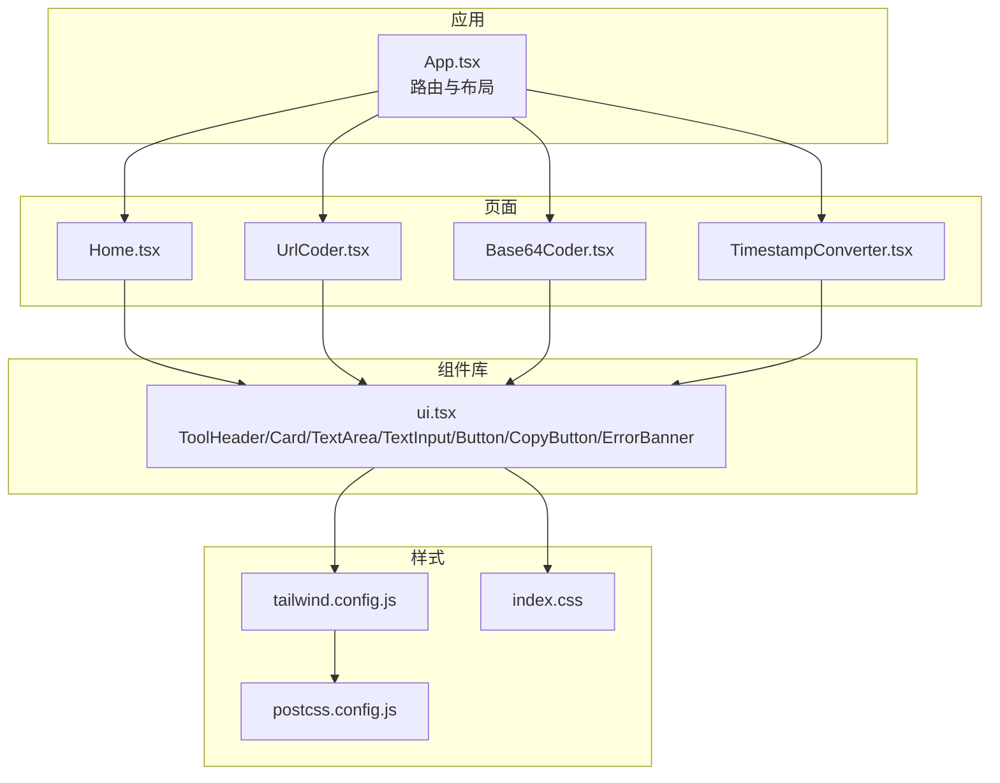
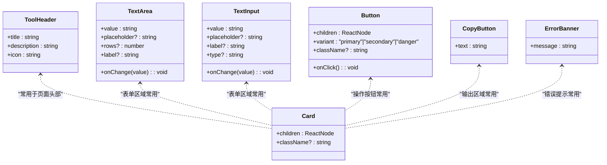
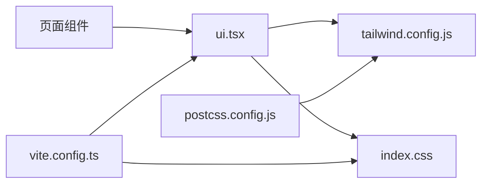
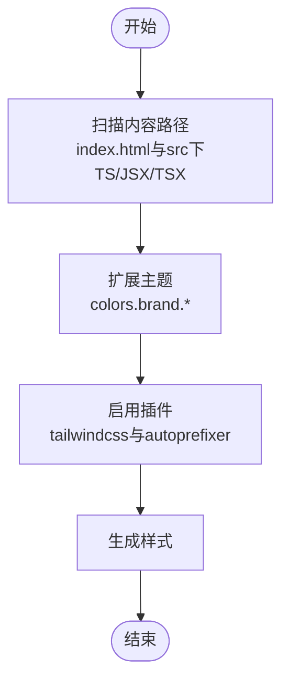
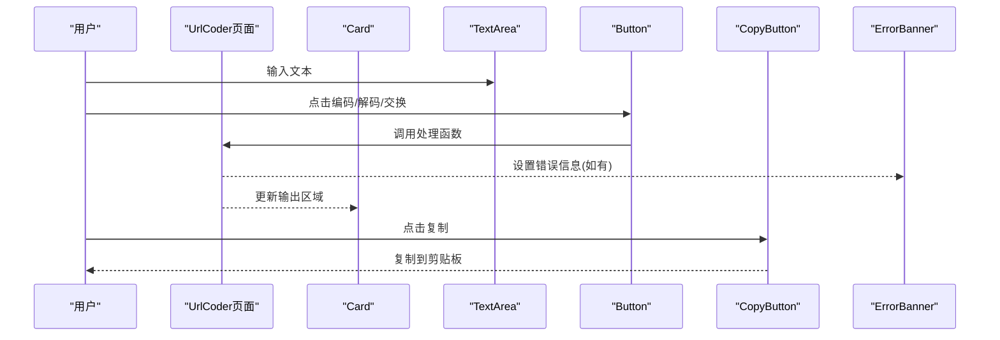

# UI组件

<cite>
**本文引用的文件**   
- [src/components/ui.tsx](file://src/components/ui.tsx)
- [tailwind.config.js](file://tailwind.config.js)
- [postcss.config.js](file://postcss.config.js)
- [package.json](file://package.json)
- [vite.config.ts](file://vite.config.ts)
- [src/index.css](file://src/index.css)
- [src/App.tsx](file://src/App.tsx)
- [src/pages/Home.tsx](file://src/pages/Home.tsx)
- [src/pages/UrlCoder.tsx](file://src/pages/UrlCoder.tsx)
- [src/pages/Base64Coder.tsx](file://src/pages/Base64Coder.tsx)
- [src/pages/TimestampConverter.tsx](file://src/pages/TimestampConverter.tsx)
</cite>

## 目录
1. [简介](#简介)
2. [项目结构](#项目结构)
3. [核心组件](#核心组件)
4. [架构总览](#架构总览)
5. [详细组件分析](#详细组件分析)
6. [依赖关系分析](#依赖关系分析)
7. [性能与可访问性](#性能与可访问性)
8. [样式与主题定制](#样式与主题定制)
9. [使用示例与组合模式](#使用示例与组合模式)
10. [故障排查指南](#故障排查指南)
11. [结论](#结论)

## 简介
本技术文档围绕仓库中的UI组件系统，系统化阐述自定义UI组件的设计模式、属性接口、事件处理与样式定制方案。重点说明基于Tailwind CSS的样式架构、响应式策略与主题扩展方法；并提供组件的使用示例、组合模式与扩展方式。同时覆盖状态管理、动画效果、可访问性支持、性能优化建议以及跨浏览器兼容性注意事项，帮助开发者快速集成并高效扩展该组件体系。

## 项目结构
本项目采用Vite + React + TypeScript构建，样式层基于Tailwind CSS与PostCSS。UI组件集中在单一文件中，页面组件通过组合这些基础组件完成业务界面。整体结构清晰、职责明确：
- 组件层：提供通用UI能力（头部、卡片、输入、按钮、复制、错误提示等）
- 页面层：组合组件实现具体工具功能
- 应用层：路由与布局（侧边栏、主内容区）
- 样式层：Tailwind配置、全局样式与滚动条定制

图表来源
- [src/App.tsx:1-142](file://src/App.tsx#L1-L142)
- [src/pages/Home.tsx:1-37](file://src/pages/Home.tsx#L1-L37)
- [src/pages/UrlCoder.tsx:1-93](file://src/pages/UrlCoder.tsx#L1-L93)
- [src/pages/Base64Coder.tsx:1-96](file://src/pages/Base64Coder.tsx#L1-L96)
- [src/pages/TimestampConverter.tsx:1-150](file://src/pages/TimestampConverter.tsx#L1-L150)
- [src/components/ui.tsx:1-142](file://src/components/ui.tsx#L1-L142)
- [tailwind.config.js:1-25](file://tailwind.config.js#L1-L25)
- [postcss.config.js:1-7](file://postcss.config.js#L1-L7)
- [src/index.css:1-34](file://src/index.css#L1-L34)

章节来源
- [src/App.tsx:1-142](file://src/App.tsx#L1-L142)
- [package.json:1-29](file://package.json#L1-L29)
- [vite.config.ts:1-10](file://vite.config.ts#L1-L10)
- [tailwind.config.js:1-25](file://tailwind.config.js#L1-L25)
- [postcss.config.js:1-7](file://postcss.config.js#L1-L7)
- [src/index.css:1-34](file://src/index.css#L1-L34)

## 核心组件
本节对UI组件进行系统性梳理，包括设计模式、属性接口、事件处理与样式策略。

- ToolHeader
  - 职责：展示工具标题、描述与图标，统一页面头部风格
  - 属性：标题、描述、图标
  - 样式：深色背景、品牌色强调、间距与排版一致
  - 可访问性：语义化标题层级，便于屏幕阅读器识别

- Card
  - 职责：容器型组件，用于包裹内容区块，提供统一的边框、背景与内边距
  - 属性：子节点、可选类名
  - 样式：圆角、半透明背景、边框颜色与阴影层次
  - 可扩展：通过className注入额外样式，支持悬停态与交互反馈

- TextArea
  - 职责：多行文本输入，带标签与占位符
  - 属性：值、变更回调、占位符、行数、标签
  - 事件：onChange传递新值
  - 样式：聚焦时品牌色边框与光晕，提升可发现性

- TextInput
  - 职责：单行文本输入，支持类型与标签
  - 属性：值、变更回调、占位符、标签、类型
  - 事件：onChange传递新值
  - 样式：与TextArea一致的焦点态与配色

- Button
  - 职责：通用按钮，支持多种变体
  - 属性：子节点、点击回调、变体（主要/次要/危险）、可选类名
  - 事件：onClick
  - 样式：不同变体的背景与文字颜色，过渡动效

- CopyButton
  - 职责：一键复制文本到剪贴板，具备降级兼容
  - 属性：待复制文本
  - 事件：内部处理点击复制逻辑
  - 兼容性：优先使用现代API，失败时回退至传统方法

- ErrorBanner
  - 职责：错误信息展示，条件渲染
  - 属性：消息文本
  - 样式：红色系警告样式，边框与背景对比度良好

章节来源
- [src/components/ui.tsx:1-142](file://src/components/ui.tsx#L1-L142)

## 架构总览
UI组件系统遵循“原子化+组合”的设计思路：
- 原子组件：Card、Button、Input、TextArea等基础控件
- 复合组件：ToolHeader、ErrorBanner等由原子组件组合而成
- 页面组件：将复合组件与业务逻辑结合，形成完整功能页
- 样式系统：Tailwind原子类为主，辅以少量全局样式与主题扩展

图表来源
- [src/components/ui.tsx:1-142](file://src/components/ui.tsx#L1-L142)

## 详细组件分析

### ToolHeader
- 设计要点：图标、标题、描述三要素对齐，视觉层次清晰
- 样式策略：使用固定尺寸图标容器、品牌色与中性色搭配
- 可访问性：使用语义化标题元素，利于导航与阅读顺序

章节来源
- [src/components/ui.tsx:1-21](file://src/components/ui.tsx#L1-L21)

### Card
- 设计要点：作为通用容器，提供一致的边框、背景与内边距
- 样式策略：半透明背景与边框增强层次感，支持外部className覆盖
- 组合模式：常与TextArea、Button、CopyButton、ErrorBanner组合使用

章节来源
- [src/components/ui.tsx:23-34](file://src/components/ui.tsx#L23-L34)

### TextArea
- 设计要点：标签与输入框垂直排列，支持占位符与行数控制
- 事件处理：onChange回调接收字符串值，便于受控组件模式
- 样式策略：聚焦态使用品牌色边框与光晕，提升可用性

章节来源
- [src/components/ui.tsx:36-57](file://src/components/ui.tsx#L36-L57)

### TextInput
- 设计要点：与TextArea一致的交互与样式规范，支持不同类型
- 事件处理：onChange回调接收字符串值
- 样式策略：与TextArea保持一致的焦点态与配色

章节来源
- [src/components/ui.tsx:59-80](file://src/components/ui.tsx#L59-L80)

### Button
- 设计要点：通过变体区分主要/次要/危险操作，保持视觉一致性
- 事件处理：onClick触发用户动作
- 样式策略：不同变体对应不同背景与文字颜色，包含过渡动效

章节来源
- [src/components/ui.tsx:82-103](file://src/components/ui.tsx#L82-L103)

### CopyButton
- 设计要点：封装剪贴板复制逻辑，提供降级兼容
- 事件处理：内部处理点击复制，禁用态避免空文本复制
- 兼容性：优先使用现代API，失败时回退至传统方法

章节来源
- [src/components/ui.tsx:105-132](file://src/components/ui.tsx#L105-L132)

### ErrorBanner
- 设计要点：条件渲染错误信息，避免无意义DOM
- 样式策略：红色系警告样式，高对比度确保可读性

章节来源
- [src/components/ui.tsx:134-142](file://src/components/ui.tsx#L134-L142)

## 依赖关系分析
- 组件与页面依赖
  - 页面组件通过导入UI组件完成界面搭建
  - 组件之间低耦合，通过props传递数据与行为
- 样式与构建依赖
  - Tailwind通过PostCSS处理，Vite负责打包与开发体验
  - 全局样式在入口CSS中引入Tailwind指令与自定义滚动条样式

图表来源
- [src/components/ui.tsx:1-142](file://src/components/ui.tsx#L1-L142)
- [tailwind.config.js:1-25](file://tailwind.config.js#L1-L25)
- [postcss.config.js:1-7](file://postcss.config.js#L1-L7)
- [src/index.css:1-34](file://src/index.css#L1-L34)
- [vite.config.ts:1-10](file://vite.config.ts#L1-L10)

章节来源
- [package.json:1-29](file://package.json#L1-L29)
- [vite.config.ts:1-10](file://vite.config.ts#L1-L10)
- [postcss.config.js:1-7](file://postcss.config.js#L1-L7)
- [tailwind.config.js:1-25](file://tailwind.config.js#L1-L25)

## 性能与可访问性

### 性能优化建议
- 组件粒度与复用
  - 将重复的UI片段抽象为独立组件，减少冗余代码与渲染开销
- 条件渲染
  - 如ErrorBanner仅在存在错误时渲染，避免不必要的DOM
- 事件处理
  - 使用受控组件模式，避免频繁读取DOM属性
- 样式计算
  - 尽量使用Tailwind原子类，减少运行时样式计算

### 可访问性支持
- 语义化标签
  - 使用标题、段落、按钮等语义元素，提升屏幕阅读器体验
- 焦点态与键盘交互
  - 输入框与按钮具备清晰的焦点指示，支持键盘操作
- 对比度与可读性
  - 文本与背景对比度满足WCAG要求，确保可读性

[本节为通用指导，不直接分析具体文件]

## 样式与主题定制

### Tailwind样式架构
- 内容扫描路径
  - 配置中包含HTML与源码路径，确保按需生成样式
- 主题扩展
  - 定义品牌色系，供组件与页面统一使用
- 插件与PostCSS
  - 启用autoprefixer以增强兼容性

图表来源
- [tailwind.config.js:1-25](file://tailwind.config.js#L1-L25)
- [postcss.config.js:1-7](file://postcss.config.js#L1-L7)

### 响应式设计策略
- 栅格与间距
  - 使用Tailwind断点与网格类实现移动端到桌面端的自适应布局
- 侧边栏与顶部栏
  - 移动端显示遮罩与汉堡菜单，桌面端常驻侧边栏
- 组件适配
  - 输入框、按钮、卡片在不同断点下保持合理的尺寸与间距

章节来源
- [src/App.tsx:1-142](file://src/App.tsx#L1-L142)
- [src/pages/Home.tsx:1-37](file://src/pages/Home.tsx#L1-L37)

### 主题定制选项
- 品牌色扩展
  - 通过tailwind.config.js扩展brand色系，组件与页面可直接使用
- 全局样式
  - 在index.css中引入Tailwind指令与自定义滚动条样式
- 暗色模式
  - 配置darkMode为class，可通过切换class实现主题切换

章节来源
- [tailwind.config.js:1-25](file://tailwind.config.js#L1-L25)
- [src/index.css:1-34](file://src/index.css#L1-L34)

## 使用示例与组合模式

### 首页卡片组合
- 使用Card包裹工具入口，配合链接与悬停态
- 栅格布局在不同屏幕下自动调整列数

章节来源
- [src/pages/Home.tsx:1-37](file://src/pages/Home.tsx#L1-L37)

### URL编解码流程
- 输入：TextArea承载原始文本
- 操作：多个Button执行编码/解码/交换
- 输出：只读textarea与CopyButton组合
- 错误：ErrorBanner条件渲染错误信息

图表来源
- [src/pages/UrlCoder.tsx:1-93](file://src/pages/UrlCoder.tsx#L1-L93)
- [src/components/ui.tsx:1-142](file://src/components/ui.tsx#L1-L142)

### Base64编解码流程
- 输入：TextArea承载文本或Base64字符串
- 操作：编码/解码/交换按钮
- 输出：只读textarea与CopyButton组合
- 错误：ErrorBanner条件渲染错误信息

章节来源
- [src/pages/Base64Coder.tsx:1-96](file://src/pages/Base64Coder.tsx#L1-L96)
- [src/components/ui.tsx:1-142](file://src/components/ui.tsx#L1-L142)

### 时间戳转换流程
- 实时时钟：每秒刷新当前时间戳
- 输入：时间戳与日期选择器
- 操作：转换与使用当前按钮
- 输出：格式化结果与CopyButton组合

章节来源
- [src/pages/TimestampConverter.tsx:1-150](file://src/pages/TimestampConverter.tsx#L1-L150)
- [src/components/ui.tsx:1-142](file://src/components/ui.tsx#L1-L142)

## 故障排查指南

### 常见问题与定位
- 样式未生效
  - 检查Tailwind内容路径是否包含相关文件
  - 确认PostCSS与Autoprefixer已正确配置
- 复制功能异常
  - 在非安全上下文（非HTTPS）或旧浏览器中可能受限，注意降级逻辑
- 输入框焦点态不明显
  - 检查focus样式是否被覆盖，确认品牌色变量可用

章节来源
- [tailwind.config.js:1-25](file://tailwind.config.js#L1-L25)
- [postcss.config.js:1-7](file://postcss.config.js#L1-L7)
- [src/components/ui.tsx:105-132](file://src/components/ui.tsx#L105-L132)

## 结论
本UI组件系统以原子化与组合为核心，借助Tailwind CSS实现一致的视觉语言与高效的样式开发。组件职责清晰、接口简洁，易于扩展与复用。通过合理的路由与布局组织，页面组件能够灵活组合基础组件完成复杂功能。建议在后续迭代中持续完善主题定制、动画与可访问性细节，并关注性能优化与跨浏览器兼容性，以提升整体用户体验与开发效率。