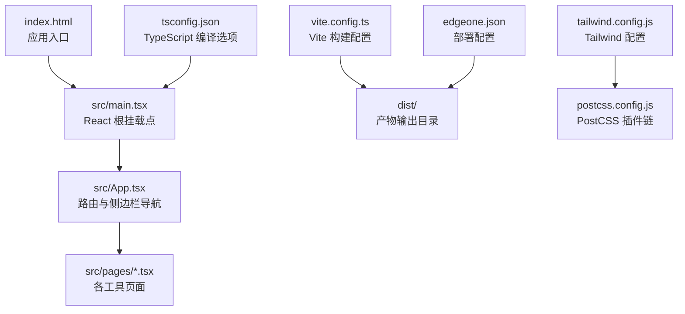
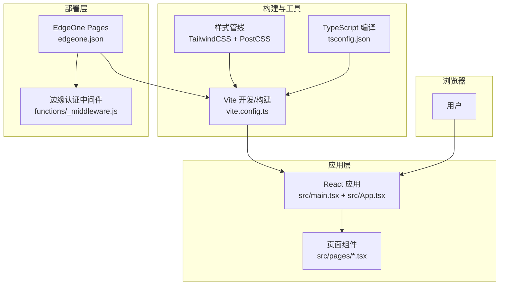
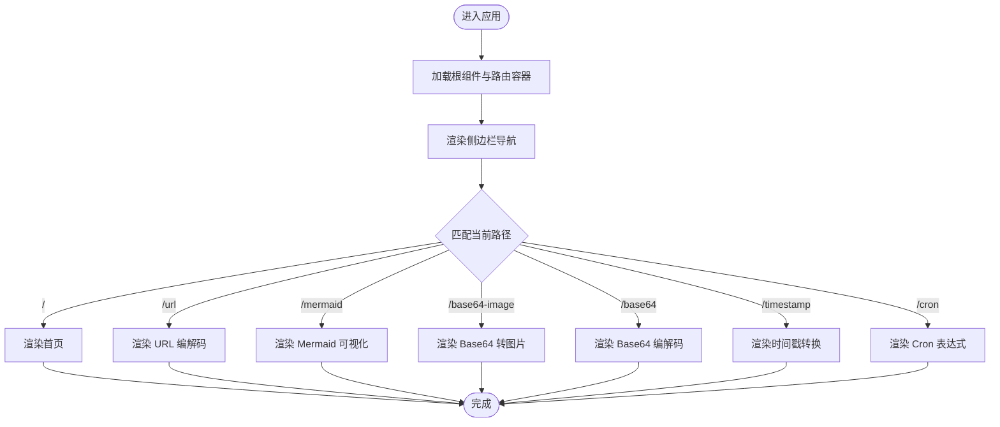
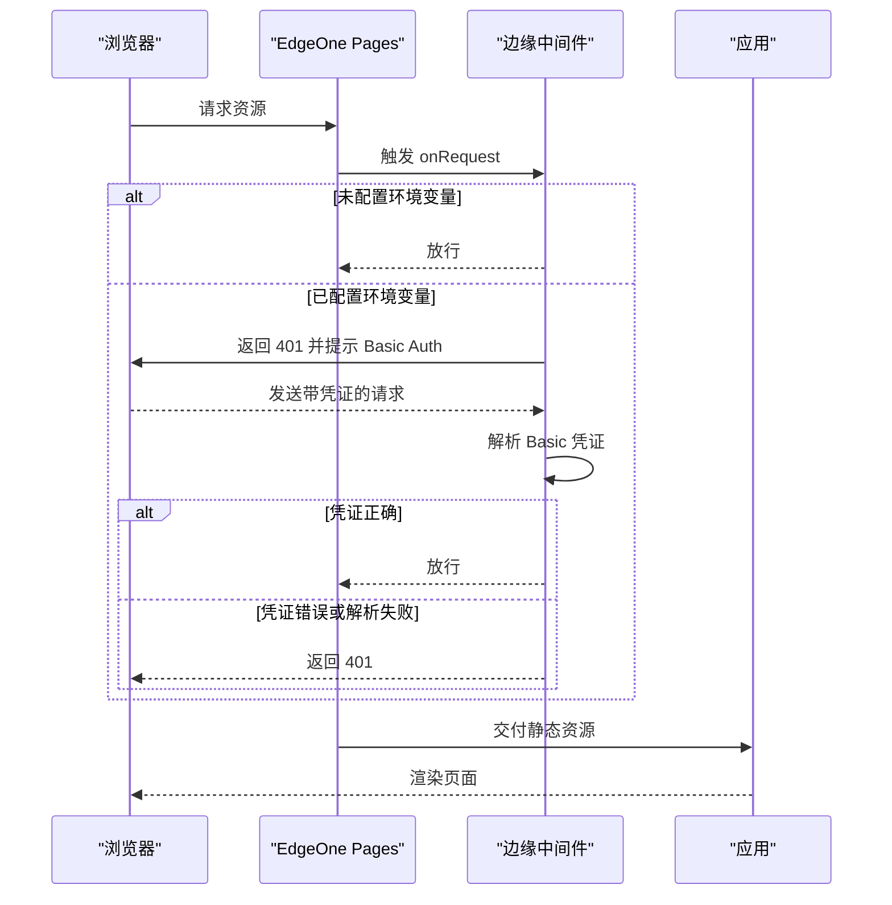
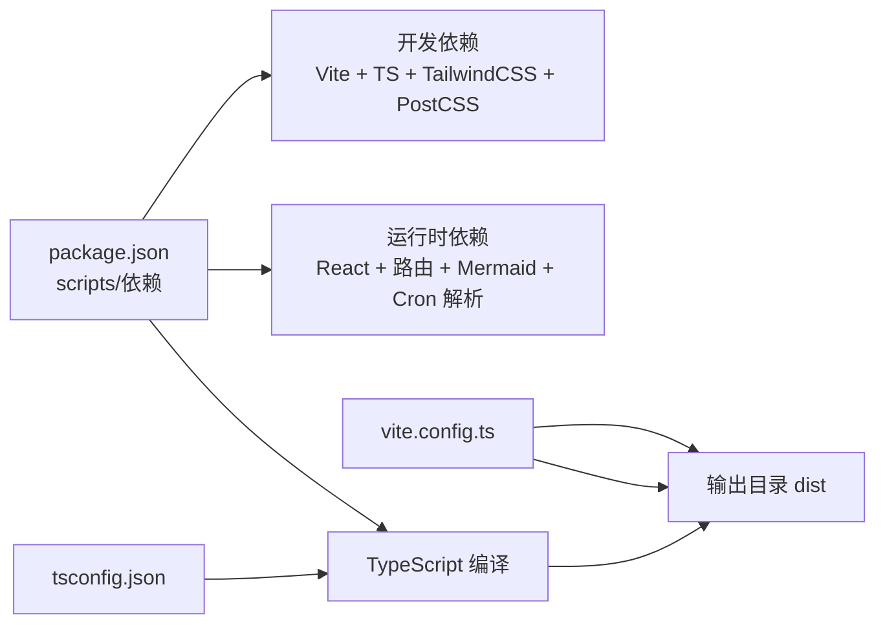

# 快速开始

<cite>
**本文引用的文件**
- [package.json](file://package.json)
- [vite.config.ts](file://vite.config.ts)
- [tsconfig.json](file://tsconfig.json)
- [tailwind.config.js](file://tailwind.config.js)
- [postcss.config.js](file://postcss.config.js)
- [edgeone.json](file://edgeone.json)
- [functions/_middleware.js](file://functions/_middleware.js)
- [index.html](file://index.html)
- [src/main.tsx](file://src/main.tsx)
- [src/App.tsx](file://src/App.tsx)
</cite>

## 目录
1. [简介](#简介)
2. [项目结构](#项目结构)
3. [核心组件](#核心组件)
4. [架构总览](#架构总览)
5. [详细组件分析](#详细组件分析)
6. [依赖分析](#依赖分析)
7. [性能考虑](#性能考虑)
8. [故障排查指南](#故障排查指南)
9. [结论](#结论)
10. [附录](#附录)

## 简介
本指南面向首次接触该 Web 工具箱项目的用户，目标是在最短时间内完成环境准备、安装依赖、启动开发服务器，并了解如何进行生产构建与部署。项目基于 React + Vite + TypeScript 技术栈，采用 TailwindCSS 进行样式管理，并通过 EdgeOne Pages 提供静态托管与可选的边缘认证中间件。

## 项目结构
该项目采用“前端单页应用”组织方式，核心入口为 HTML 模板与 React 根组件，页面路由由 React Router 管理；构建与打包通过 Vite 完成；样式通过 TailwindCSS 与 PostCSS 自动前缀插件处理；TypeScript 编译配置集中于 tsconfig.json；部署相关配置位于 edgeone.json。

图表来源
- [index.html:1-14](file://index.html#L1-L14)
- [src/main.tsx:1-14](file://src/main.tsx#L1-L14)
- [src/App.tsx:1-142](file://src/App.tsx#L1-L142)
- [vite.config.ts:1-10](file://vite.config.ts#L1-L10)
- [tsconfig.json:1-21](file://tsconfig.json#L1-L21)
- [tailwind.config.js:1-25](file://tailwind.config.js#L1-L25)
- [postcss.config.js:1-7](file://postcss.config.js#L1-L7)
- [edgeone.json:1-7](file://edgeone.json#L1-L7)

章节来源
- [index.html:1-14](file://index.html#L1-L14)
- [src/main.tsx:1-14](file://src/main.tsx#L1-L14)
- [src/App.tsx:1-142](file://src/App.tsx#L1-L142)
- [vite.config.ts:1-10](file://vite.config.ts#L1-L10)
- [tsconfig.json:1-21](file://tsconfig.json#L1-L21)
- [tailwind.config.js:1-25](file://tailwind.config.js#L1-L25)
- [postcss.config.js:1-7](file://postcss.config.js#L1-L7)
- [edgeone.json:1-7](file://edgeone.json#L1-L7)

## 核心组件
- 应用入口与挂载：HTML 入口负责加载根组件脚本，根组件负责创建 React 根实例并包裹路由容器。
- 路由与导航：App 组件定义了侧边栏导航项与主内容区域的路由映射，支持移动端抽屉与桌面端固定侧边栏。
- 页面模块：每个工具页面以独立组件形式存在，通过路由按需渲染。
- 构建与打包：Vite 负责开发服务器与生产构建，TypeScript 编译与类型检查由 tsc 驱动，配合 Vite 的预构建与热更新。
- 样式系统：TailwindCSS 与 PostCSS 自动前缀插件共同工作，content 范围覆盖模板与源码目录。
- 部署配置：edgeone.json 指定安装命令、构建命令、输出目录与框架类型，便于在 EdgeOne Pages 上一键部署。

章节来源
- [index.html:1-14](file://index.html#L1-L14)
- [src/main.tsx:1-14](file://src/main.tsx#L1-L14)
- [src/App.tsx:1-142](file://src/App.tsx#L1-L142)
- [vite.config.ts:1-10](file://vite.config.ts#L1-L10)
- [tsconfig.json:1-21](file://tsconfig.json#L1-L21)
- [tailwind.config.js:1-25](file://tailwind.config.js#L1-L25)
- [postcss.config.js:1-7](file://postcss.config.js#L1-L7)
- [edgeone.json:1-7](file://edgeone.json#L1-L7)

## 架构总览
下图展示了从浏览器到应用、再到构建与部署的整体路径，以及可选的边缘认证中间件位置。

图表来源
- [src/main.tsx:1-14](file://src/main.tsx#L1-L14)
- [src/App.tsx:1-142](file://src/App.tsx#L1-L142)
- [vite.config.ts:1-10](file://vite.config.ts#L1-L10)
- [tsconfig.json:1-21](file://tsconfig.json#L1-L21)
- [tailwind.config.js:1-25](file://tailwind.config.js#L1-L25)
- [postcss.config.js:1-7](file://postcss.config.js#L1-L7)
- [edgeone.json:1-7](file://edgeone.json#L1-L7)
- [functions/_middleware.js:1-56](file://functions/_middleware.js#L1-L56)

## 详细组件分析

### 开发环境与运行流程
- 启动开发服务器：执行开发脚本，Vite 将启动本地开发服务器并启用热更新。
- 构建生产包：先进行 TypeScript 增量编译，再由 Vite 打包生成 dist 目录产物。
- 预览生产包：使用 Vite 的预览命令在本地查看生产构建效果。
- 关键命令参考：
  - 开发：参见 [package.json:6-10](file://package.json#L6-L10)
  - 构建：参见 [package.json:6-10](file://package.json#L6-L10)
  - 预览：参见 [package.json:6-10](file://package.json#L6-L10)

章节来源
- [package.json:6-10](file://package.json#L6-L10)

### 路由与页面导航
- 路由定义集中在 App 组件中，包含首页与多个工具页面的路由映射。
- 侧边栏导航项与当前激活状态联动，移动端支持抽屉展开/收起。
- 页面组件按需加载，无需额外路由懒加载配置。

图表来源
- [src/App.tsx:126-134](file://src/App.tsx#L126-L134)

章节来源
- [src/App.tsx:1-142](file://src/App.tsx#L1-L142)

### 样式与主题
- TailwindCSS 内容扫描范围覆盖模板与源码目录，确保按需生成样式。
- 支持暗色模式切换，通过类名控制。
- PostCSS 使用 TailwindCSS 与 Autoprefixer 插件链自动处理兼容性。

章节来源
- [tailwind.config.js:1-25](file://tailwind.config.js#L1-L25)
- [postcss.config.js:1-7](file://postcss.config.js#L1-L7)
- [index.html](file://index.html#L2)

### 部署与边缘认证
- 部署配置：edgeone.json 指定安装命令、构建命令、输出目录与框架类型，适配 EdgeOne Pages。
- 边缘认证中间件：functions/_middleware.js 实现 Basic Auth，支持从环境变量读取用户名与密码；若未配置则跳过认证，便于本地开发。

图表来源
- [edgeone.json:1-7](file://edgeone.json#L1-L7)
- [functions/_middleware.js:1-56](file://functions/_middleware.js#L1-L56)

章节来源
- [edgeone.json:1-7](file://edgeone.json#L1-L7)
- [functions/_middleware.js:1-56](file://functions/_middleware.js#L1-L56)

## 依赖分析
- 运行时依赖：React 生态、路由、Mermaid 图表库、Cron 解析库。
- 开发依赖：Vite、React 插件、TypeScript、TailwindCSS、PostCSS、Autoprefixer。
- 构建脚本：通过 npm scripts 调用 Vite 与 tsc，实现 TS 增量编译与打包。

图表来源
- [package.json:1-29](file://package.json#L1-L29)
- [vite.config.ts:1-10](file://vite.config.ts#L1-L10)
- [tsconfig.json:1-21](file://tsconfig.json#L1-L21)

章节来源
- [package.json:1-29](file://package.json#L1-L29)
- [vite.config.ts:1-10](file://vite.config.ts#L1-L10)
- [tsconfig.json:1-21](file://tsconfig.json#L1-L21)

## 性能考虑
- 开发阶段：Vite 的热更新与按需模块加载可显著提升开发体验。
- 构建阶段：利用 Vite 的原生 ES 模块生态与 Tree-shaking，结合 Tailwind 的按需扫描，减少产物体积。
- 样式优化：TailwindCSS 与 Autoprefixer 的组合有助于生成更精简的 CSS。
- 部署阶段：EdgeOne Pages 提供全球分发与边缘缓存，结合静态资源优化可获得更快的首屏加载速度。

## 故障排查指南
- 无法启动开发服务器
  - 检查 Node.js 版本是否满足项目需求（建议使用 LTS 版本），并确认网络可访问 npm registry。
  - 确认已安装依赖后再尝试启动。
  - 参考命令：参见 [package.json:6-10](file://package.json#L6-L10)
- 构建失败或产物异常
  - 确保 TypeScript 编译通过后再执行 Vite 构建。
  - 检查 tsconfig.json 的编译选项与模块解析策略。
  - 参考：[tsconfig.json:1-21](file://tsconfig.json#L1-L21)
- 样式未生效或 Tailwind 未生成
  - 确认 tailwind.config.js 的 content 范围包含实际使用的模板与源码文件。
  - 参考：[tailwind.config.js:1-25](file://tailwind.config.js#L1-L25)
- 预览生产包与本地行为不一致
  - 使用 Vite 预览命令在本地验证生产构建效果。
  - 参考命令：参见 [package.json:6-10](file://package.json#L6-L10)
- 部署后访问受限
  - 若配置了边缘认证中间件，请在 EdgeOne Pages 控制台设置环境变量 AUTH_USERNAME 与 AUTH_PASSWORD。
  - 若未配置，中间件将放行请求，便于本地开发。
  - 参考：[functions/_middleware.js:1-56](file://functions/_middleware.js#L1-L56)，[edgeone.json:1-7](file://edgeone.json#L1-L7)

章节来源
- [package.json:6-10](file://package.json#L6-L10)
- [tsconfig.json:1-21](file://tsconfig.json#L1-L21)
- [tailwind.config.js:1-25](file://tailwind.config.js#L1-L25)
- [functions/_middleware.js:1-56](file://functions/_middleware.js#L1-L56)
- [edgeone.json:1-7](file://edgeone.json#L1-L7)

## 结论
通过本快速开始指南，您可以在本地快速搭建开发环境、启动应用、理解路由与页面结构，并掌握生产构建与部署的基本流程。如需进一步扩展功能，可在现有 Vite + React + TypeScript + Tailwind 的基础上添加更多页面与工具模块，并根据需要调整构建与部署配置。

## 附录

### 环境要求
- Node.js：建议使用官方长期支持版本（LTS），以确保与 Vite、TypeScript、TailwindCSS 等工具链兼容。
- 包管理器：推荐使用 npm（与脚本保持一致）。也可使用 yarn 或 pnpm，但请确保与脚本中的命令对应。

章节来源
- [package.json:1-29](file://package.json#L1-L29)

### 安装步骤
- 克隆仓库后，在项目根目录安装依赖。
- 参考命令：参见 [package.json:6-10](file://package.json#L6-L10)

章节来源
- [package.json:6-10](file://package.json#L6-L10)

### 开发环境配置
- 启动开发服务器：执行开发脚本，浏览器打开默认地址即可看到应用。
- 参考命令：参见 [package.json:6-10](file://package.json#L6-L10)
- 根组件与入口：HTML 模板与根组件分别位于 [index.html:1-14](file://index.html#L1-L14) 与 [src/main.tsx:1-14](file://src/main.tsx#L1-L14)。
- 路由与导航：参见 [src/App.tsx:1-142](file://src/App.tsx#L1-L142)。

章节来源
- [package.json:6-10](file://package.json#L6-L10)
- [index.html:1-14](file://index.html#L1-L14)
- [src/main.tsx:1-14](file://src/main.tsx#L1-L14)
- [src/App.tsx:1-142](file://src/App.tsx#L1-L142)

### 本地开发服务器启动方法
- 执行开发脚本，等待浏览器自动打开或手动访问本地地址。
- 参考命令：参见 [package.json:6-10](file://package.json#L6-L10)

章节来源
- [package.json:6-10](file://package.json#L6-L10)

### 生产环境构建流程
- 先进行 TypeScript 增量编译，再由 Vite 打包生成 dist 目录。
- 输出目录与构建命令由 vite.config.ts 与 edgeone.json 共同决定。
- 参考命令：参见 [package.json:6-10](file://package.json#L6-L10)
- 构建配置：参见 [vite.config.ts:1-10](file://vite.config.ts#L1-L10)，[edgeone.json:1-7](file://edgeone.json#L1-L7)

章节来源
- [package.json:6-10](file://package.json#L6-L10)
- [vite.config.ts:1-10](file://vite.config.ts#L1-L10)
- [edgeone.json:1-7](file://edgeone.json#L1-L7)

### 部署到 EdgeOne Pages
- 安装命令与构建命令已在 edgeone.json 中配置，输出目录为 dist。
- 如需启用边缘认证，请在 EdgeOne Pages 控制台设置环境变量 AUTH_USERNAME 与 AUTH_PASSWORD。
- 参考：[edgeone.json:1-7](file://edgeone.json#L1-L7)，[functions/_middleware.js:1-56](file://functions/_middleware.js#L1-L56)

章节来源
- [edgeone.json:1-7](file://edgeone.json#L1-L7)
- [functions/_middleware.js:1-56](file://functions/_middleware.js#L1-L56)