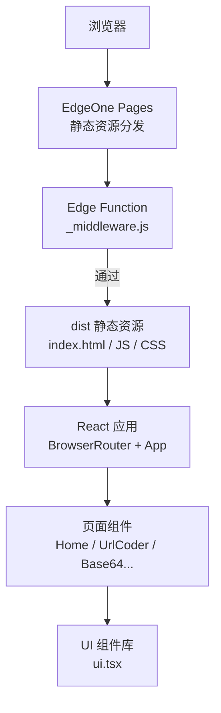
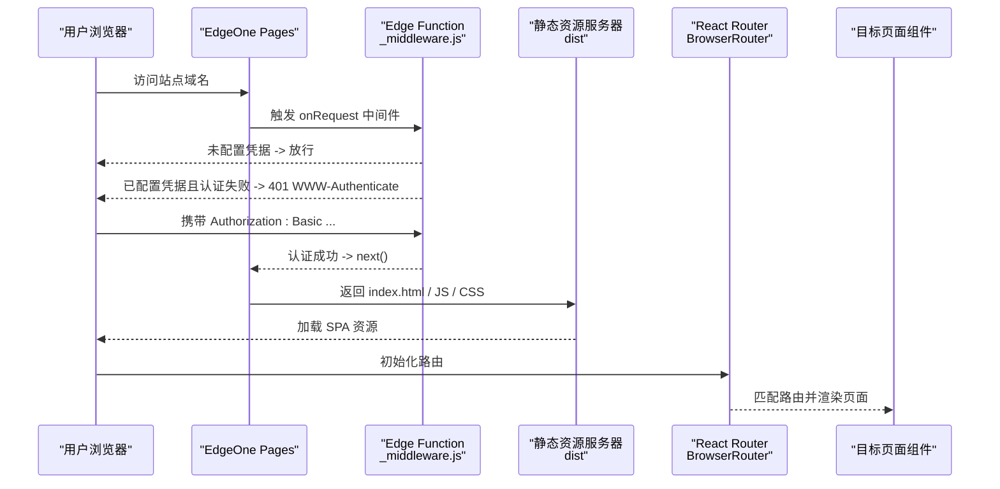
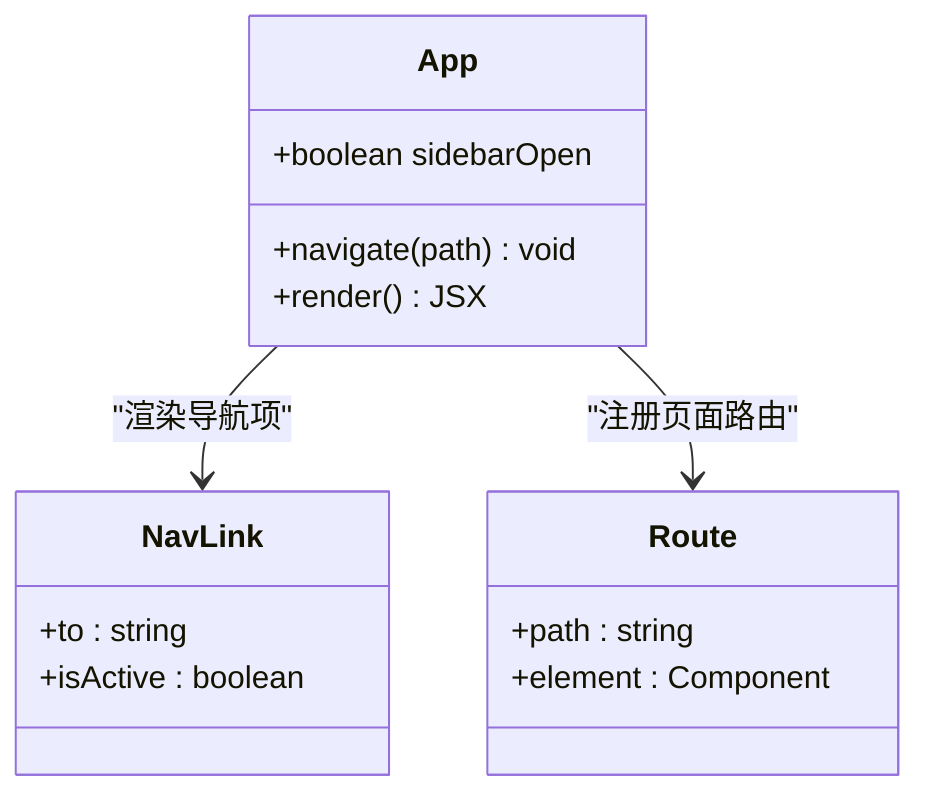
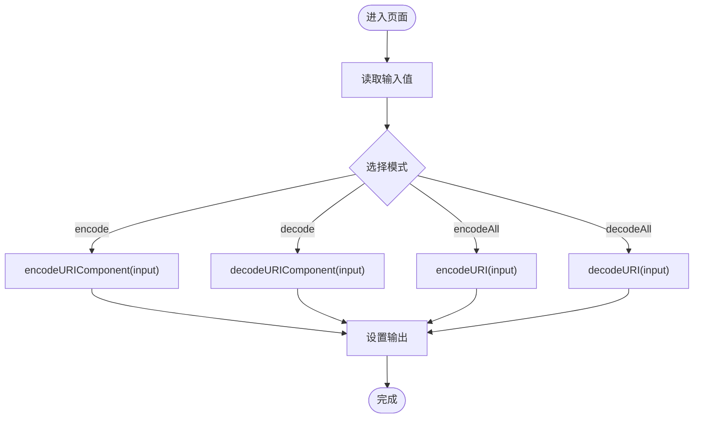
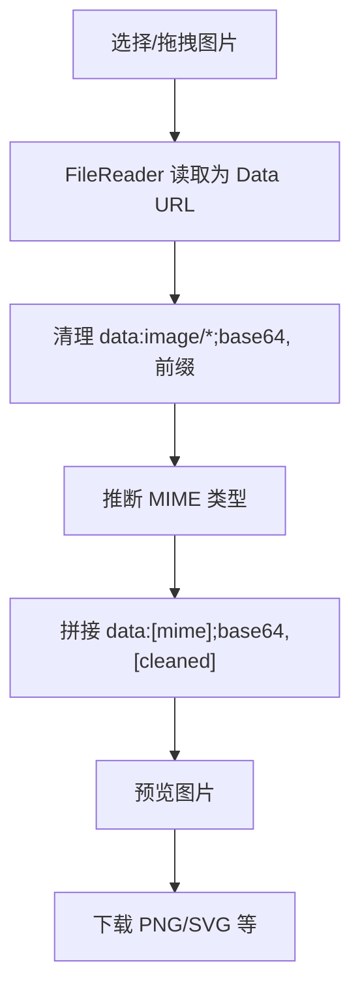
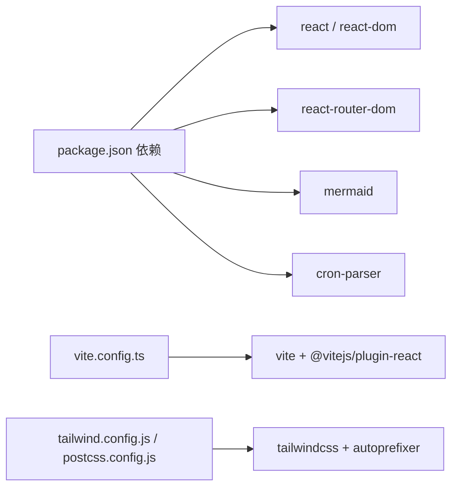

# 架构设计

<cite>
**本文引用的文件**   
- [package.json](file://package.json)
- [vite.config.ts](file://vite.config.ts)
- [edgeone.json](file://edgeone.json)
- [DEPLOYMENT.md](file://DEPLOYMENT.md)
- [src/main.tsx](file://src/main.tsx)
- [src/App.tsx](file://src/App.tsx)
- [src/components/ui.tsx](file://src/components/ui.tsx)
- [src/pages/Home.tsx](file://src/pages/Home.tsx)
- [src/pages/UrlCoder.tsx](file://src/pages/UrlCoder.tsx)
- [src/pages/Base64Coder.tsx](file://src/pages/Base64Coder.tsx)
- [src/pages/Base64Image.tsx](file://src/pages/Base64Image.tsx)
- [src/pages/TimestampConverter.tsx](file://src/pages/TimestampConverter.tsx)
- [src/pages/CronParser.tsx](file://src/pages/CronParser.tsx)
- [src/pages/MermaidViewer.tsx](file://src/pages/MermaidViewer.tsx)
- [functions/_middleware.js](file://functions/_middleware.js)
</cite>

## 目录
1. [引言](#引言)
2. [项目结构](#项目结构)
3. [核心组件](#核心组件)
4. [架构总览](#架构总览)
5. [详细组件分析](#详细组件分析)
6. [依赖关系分析](#依赖关系分析)
7. [性能考虑](#性能考虑)
8. [故障排查指南](#故障排查指南)
9. [结论](#结论)
10. [附录](#附录)

## 引言
本架构设计文档面向架构师与高级开发者，系统化阐述基于 React + Vite 的前端应用、路由与组件层次、状态管理策略，以及 Edge Functions 中间件在边缘侧的鉴权与部署架构。文档同时覆盖技术选型权衡、系统边界、组件交互关系与数据流设计，并提供架构图与组件分解图，帮助读者快速理解并扩展该工具箱 Web 应用。

## 项目结构
本项目采用“功能页面 + 公共 UI 组件”的模块化组织方式：
- 构建与运行：Vite 作为开发与构建工具，React 插件启用 JSX/TSX 支持；输出目录为 dist。
- 入口与路由：main.tsx 挂载根节点并注入 BrowserRouter；App.tsx 定义全局布局与路由表。
- 页面层：pages 下按工具划分独立页面组件，每个页面自管输入、处理与输出状态。
- 通用 UI：components/ui.tsx 提供可复用的基础控件（卡片、按钮、文本框、复制、错误提示等）。
- 边缘函数：functions/_middleware.js 实现 Basic Auth 鉴权，由 EdgeOne Pages 在边缘执行。
- 部署配置：edgeone.json 声明框架、安装与构建命令；DEPLOYMENT.md 提供完整部署与安全说明。

图表来源
- [edgeone.json:1-7](file://edgeone.json#L1-L7)
- [vite.config.ts:1-10](file://vite.config.ts#L1-L10)
- [src/main.tsx:1-14](file://src/main.tsx#L1-L14)
- [src/App.tsx:1-142](file://src/App.tsx#L1-L142)
- [functions/_middleware.js:1-56](file://functions/_middleware.js#L1-L56)

章节来源
- [package.json:1-29](file://package.json#L1-L29)
- [vite.config.ts:1-10](file://vite.config.ts#L1-L10)
- [edgeone.json:1-7](file://edgeone.json#L1-L7)
- [DEPLOYMENT.md:143-173](file://DEPLOYMENT.md#L143-L173)

## 核心组件
- 应用入口与路由容器
  - main.tsx：创建 React 根节点，注入 StrictMode 与 BrowserRouter，渲染 App。
  - App.tsx：定义侧边栏导航、移动端遮罩与顶部标题、Routes 路由映射，集中维护导航项元信息。
- 公共 UI 组件
  - ui.tsx：封装 ToolHeader、Card、TextArea、TextInput、Button、CopyButton、ErrorBanner，统一样式与交互语义。
- 工具页面（示例）
  - Home.tsx：工具入口卡片网格，使用 Link 跳转至各工具页。
  - UrlCoder.tsx：URL/URI 编解码，提供多模式操作与结果复制。
  - Base64Coder.tsx：文本 Base64 编解码，支持 UTF-8 编码转换。
  - Base64Image.tsx：Base64 与图片互转，支持拖拽上传、预览与下载。
  - TimestampConverter.tsx：时间戳与日期互转，含实时时钟与单位切换。
  - CronParser.tsx：Cron 表达式校验与下次执行时间计算，内置常用预设。
  - MermaidViewer.tsx：Mermaid 代码编辑与实时渲染，支持 SVG 下载。

章节来源
- [src/main.tsx:1-14](file://src/main.tsx#L1-L14)
- [src/App.tsx:1-142](file://src/App.tsx#L1-L142)
- [src/components/ui.tsx:1-142](file://src/components/ui.tsx#L1-L142)
- [src/pages/Home.tsx:1-37](file://src/pages/Home.tsx#L1-L37)
- [src/pages/UrlCoder.tsx:1-93](file://src/pages/UrlCoder.tsx#L1-L93)
- [src/pages/Base64Coder.tsx:1-96](file://src/pages/Base64Coder.tsx#L1-L96)
- [src/pages/Base64Image.tsx:1-180](file://src/pages/Base64Image.tsx#L1-L180)
- [src/pages/TimestampConverter.tsx:1-150](file://src/pages/TimestampConverter.tsx#L1-L150)
- [src/pages/CronParser.tsx:1-232](file://src/pages/CronParser.tsx#L1-L232)
- [src/pages/MermaidViewer.tsx:1-119](file://src/pages/MermaidViewer.tsx#L1-L119)

## 架构总览
整体采用“边缘鉴权 + 静态 SPA”的架构模式：
- 边缘侧：EdgeOne Pages 托管静态资源，并在请求入口处执行 _middleware.js 进行 Basic Auth 鉴权。未配置凭据时放行（便于本地开发），生产环境通过控制台环境变量注入用户名与密码。
- 前端侧：纯客户端 SPA，路由由 react-router-dom 管理，页面组件各自维护局部状态，无跨页面共享状态需求，因此未引入全局状态库。
- 构建与部署：Vite 负责打包到 dist；edgeone.json 声明构建流程；DEPLOYMENT.md 提供从 GitHub 到 EdgeOne 的 CI/CD 与变量配置指引。

图表来源
- [functions/_middleware.js:1-56](file://functions/_middleware.js#L1-L56)
- [src/main.tsx:1-14](file://src/main.tsx#L1-L14)
- [src/App.tsx:126-134](file://src/App.tsx#L126-L134)
- [edgeone.json:1-7](file://edgeone.json#L1-L7)

## 详细组件分析

### 应用外壳与路由（App.tsx）
- 职责
  - 维护侧边栏展开状态与当前工具高亮。
  - 根据 location.pathname 动态显示移动端顶部标题。
  - 集中声明导航项元数据（路径、标签、图标、描述），驱动 NavLink 渲染。
  - 使用 Routes/Route 将路径映射到具体页面组件。
- 设计要点
  - 导航与路由解耦：NAV_ITEMS 作为单一事实源，避免硬编码重复。
  - 响应式布局：移动端侧边栏以遮罩+滑出形式呈现，桌面端常驻。
  - 可扩展性：新增工具只需在 NAV_ITEMS 与 Routes 中追加条目。

图表来源
- [src/App.tsx:12-26](file://src/App.tsx#L12-L26)
- [src/App.tsx:126-134](file://src/App.tsx#L126-L134)

章节来源
- [src/App.tsx:1-142](file://src/App.tsx#L1-142)

### 公共 UI 组件（ui.tsx）
- 组件清单
  - ToolHeader：工具标题与描述的统一头部。
  - Card：内容容器，提供一致的边框与背景。
  - TextArea/TextInput：受控输入控件，支持 label 与 placeholder。
  - Button：主/次/危险三种变体，统一过渡动效。
  - CopyButton：剪贴板复制，包含降级方案。
  - ErrorBanner：错误消息展示。
- 设计要点
  - 全受控：所有输入组件均通过 value/onChange 暴露受控接口，便于上层组合。
  - 样式一致性：基于 Tailwind 原子类，减少自定义样式复杂度。
  - 可复用性：页面仅关注业务逻辑，UI 细节下沉至组件层。

章节来源
- [src/components/ui.tsx:1-142](file://src/components/ui.tsx#L1-L142)

### URL 编解码（UrlCoder.tsx）
- 功能
  - 提供 encodeURIComponent/decodeURIComponent 与 encodeURI/decodeURI 四种模式。
  - 支持交换输入输出，错误提示与结果复制。
- 数据流
  - 输入 state → 点击事件 → 调用浏览器 API → 更新输出 state → 错误捕获与提示。

图表来源
- [src/pages/UrlCoder.tsx:9-48](file://src/pages/UrlCoder.tsx#L9-L48)

章节来源
- [src/pages/UrlCoder.tsx:1-93](file://src/pages/UrlCoder.tsx#L1-L93)

### Base64 编解码（Base64Coder.tsx）
- 功能
  - 文本 Base64 编码/解码，使用 TextEncoder/TextDecoder 确保 UTF-8 正确性。
  - 支持模式切换与交换输入输出。
- 关键点
  - 编码：TextEncoder → btoa。
  - 解码：atob → Uint8Array → TextDecoder。

章节来源
- [src/pages/Base64Coder.tsx:1-96](file://src/pages/Base64Coder.tsx#L1-L96)

### Base64 转图片（Base64Image.tsx）
- 功能
  - 拖拽或选择图片文件，生成 data URL 与纯净 Base64。
  - 自动识别 MIME 类型，支持预览与下载。
- 数据流
  - 文件输入 → FileReader.readAsDataURL → 清理前缀 → 推断 MIME → 构造 data URL → 预览/下载。

图表来源
- [src/pages/Base64Image.tsx:16-75](file://src/pages/Base64Image.tsx#L16-L75)

章节来源
- [src/pages/Base64Image.tsx:1-180](file://src/pages/Base64Image.tsx#L1-180)

### 时间戳转换（TimestampConverter.tsx）
- 功能
  - 秒/毫秒级时间戳与日期互转，支持“使用当前时间”。
  - 实时时钟每秒刷新。
- 关键点
  - 单位切换影响转换逻辑。
  - 输入校验与无效值提示。

章节来源
- [src/pages/TimestampConverter.tsx:1-150](file://src/pages/TimestampConverter.tsx#L1-L150)

### Cron 表达式解析（CronParser.tsx）
- 功能
  - 校验标准 5 段 Cron 表达式，计算接下来 5 次执行时间（北京时间）。
  - 内置常用预设，自动生成中文含义描述。
- 外部依赖
  - cron-parser 用于解析与迭代下一次执行时间。

章节来源
- [src/pages/CronParser.tsx:1-232](file://src/pages/CronParser.tsx#L1-L232)

### Mermaid 可视化（MermaidViewer.tsx）
- 功能
  - 左侧编辑 Mermaid 源码，右侧实时渲染 SVG。
  - 支持重置示例与下载 SVG。
- 关键点
  - mermaid.initialize 关闭自动渲染，按需 render。
  - 防抖渲染（setTimeout）降低频繁重绘开销。

章节来源
- [src/pages/MermaidViewer.tsx:1-119](file://src/pages/MermaidViewer.tsx#L1-L119)

### 首页（Home.tsx）
- 功能
  - 展示工具卡片网格，点击跳转对应页面。
- 设计要点
  - 使用 Link 进行客户端导航，保持 SPA 体验。

章节来源
- [src/pages/Home.tsx:1-37](file://src/pages/Home.tsx#L1-L37)

## 依赖关系分析
- 运行时依赖
  - react/react-dom：UI 框架与渲染。
  - react-router-dom：客户端路由。
  - mermaid：图表渲染。
  - cron-parser：Cron 表达式解析。
- 开发依赖
  - vite/@vitejs/plugin-react：构建与热更新。
  - tailwindcss/autoprefixer/postcss：样式体系。
  - typescript：类型检查与编译。

图表来源
- [package.json:11-27](file://package.json#L11-L27)
- [vite.config.ts:1-10](file://vite.config.ts#L1-L10)

章节来源
- [package.json:1-29](file://package.json#L1-L29)
- [vite.config.ts:1-10](file://vite.config.ts#L1-L10)

## 性能考虑
- 构建与体积
  - Vite 默认对依赖进行预构建与按需打包，建议开启生产压缩与分包策略（可通过 vite.config.ts 扩展）。
  - 大体积第三方库（如 mermaid）可按需引入或在首屏延迟加载，以降低初始包体。
- 渲染优化
  - 页面内状态尽量局部化，避免不必要的重渲染。
  - Mermaid 渲染已使用延时防抖，可在高频输入场景进一步节流。
- 网络与缓存
  - EdgeOne Pages 提供 CDN 缓存与 HTTP 缓存头，合理设置静态资源版本化以提升缓存命中率。
- 内存与 I/O
  - Base64 图片处理避免超大文件直接入内存，必要时限制文件大小与尺寸。
  - 剪贴板操作存在降级方案，注意异常分支的性能与用户体验。

[本节为通用指导，不直接分析具体文件]

## 故障排查指南
- 访问被拒绝（401）
  - 确认已在 EdgeOne 控制台配置 AUTH_USERNAME 与 AUTH_PASSWORD，并完成重新部署。
  - 浏览器需发送 Authorization: Basic base64(username:password)。
  - 若本地开发未配置环境变量，中间件会放行，属于预期行为。
- 路由不生效
  - 确认 BrowserRouter 已包裹应用，且 Routes 中存在对应 path 与 element。
- 页面报错
  - 各页面内部均有 try/catch 与 ErrorBanner 展示错误信息，优先查看错误文案定位问题。
- 构建失败
  - 检查 edgeone.json 的 buildCommand 与 outputDirectory 是否与本地一致。
  - 确认 Node 与 npm 版本满足依赖要求。

章节来源
- [functions/_middleware.js:14-55](file://functions/_middleware.js#L14-L55)
- [src/main.tsx:7-13](file://src/main.tsx#L7-L13)
- [src/App.tsx:126-134](file://src/App.tsx#L126-L134)
- [edgeone.json:1-7](file://edgeone.json#L1-L7)

## 结论
本项目采用“边缘鉴权 + 静态 SPA”的轻量架构，具备以下优势：
- 安全可控：Basic Auth 在边缘执行，凭据不进仓库，配合 HTTPS 保障传输安全。
- 简洁高效：前端无服务端渲染与复杂状态管理，构建产物小、首屏快。
- 易于扩展：新增工具仅需添加页面与路由，UI 组件可复用，部署流程标准化。
建议在后续演进中：
- 引入路由级懒加载与关键资源预取策略。
- 对大体积库进行按需加载与版本隔离。
- 完善错误监控与日志上报，提升线上可观测性。

[本节为总结性内容，不直接分析具体文件]

## 附录
- 部署与安全参考
  - 参见 DEPLOYMENT.md 中的 GitHub 关联、EdgeOne 构建配置、环境变量配置与验证步骤。
  - 安全要点包括：公开仓库安全、环境变量加密存储、HTTPS 与边缘函数运行环境。

章节来源
- [DEPLOYMENT.md:1-194](file://DEPLOYMENT.md#L1-L194)