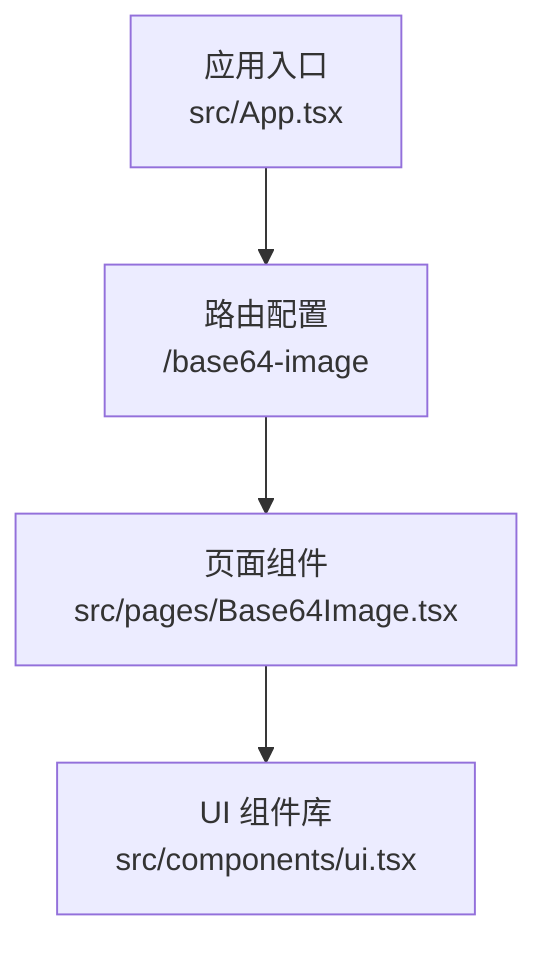
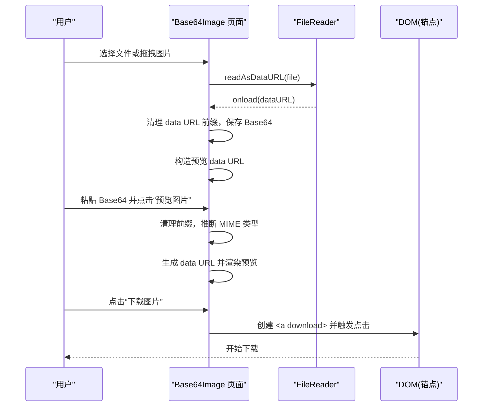
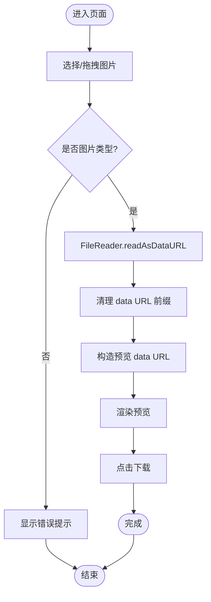
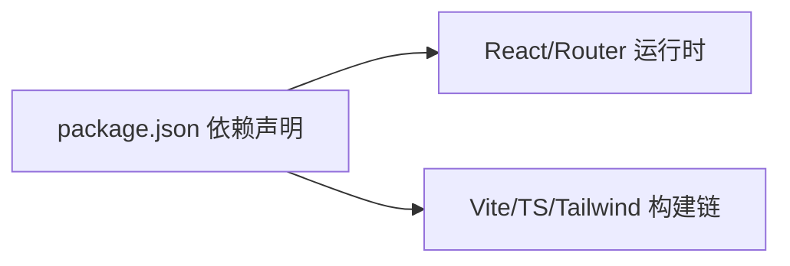

# Base64图片处理器

<cite>
**本文引用的文件**
- [src/pages/Base64Image.tsx](file://src/pages/Base64Image.tsx)
- [src/components/ui.tsx](file://src/components/ui.tsx)
- [src/App.tsx](file://src/App.tsx)
- [package.json](file://package.json)
</cite>

## 目录
1. [简介](#简介)
2. [项目结构](#项目结构)
3. [核心组件](#核心组件)
4. [架构总览](#架构总览)
5. [详细组件分析](#详细组件分析)
6. [依赖关系分析](#依赖关系分析)
7. [性能与限制](#性能与限制)
8. [故障排查指南](#故障排查指南)
9. [结论](#结论)
10. [附录](#附录)

## 简介
本模块提供“Base64 与图片互转”的在线工具，支持从本地选择或拖拽图片文件，将其转换为 Base64 字符串；也支持粘贴 Base64 字符串进行预览与下载。该功能完全在浏览器端运行，不上传数据到服务器，适合快速查看、复制和导出图片的 Base64 表示。

当前实现聚焦于：
- 图片文件读取并转为 data URL（含 Base64）
- Base64 字符串清洗与 MIME 类型推断
- 图片预览与下载
- 基础错误提示与用户交互

注意：当前版本未使用 Canvas API 进行尺寸调整、格式转换或质量控制；如需这些能力，可在后续扩展中引入。

## 项目结构
与本功能直接相关的代码位于页面组件与通用 UI 组件中，路由由应用入口挂载。

图表来源
- [src/App.tsx:126-134](file://src/App.tsx#L126-L134)
- [src/pages/Base64Image.tsx:1-10](file://src/pages/Base64Image.tsx#L1-L10)
- [src/components/ui.tsx:1-20](file://src/components/ui.tsx#L1-L20)

章节来源
- [src/App.tsx:126-134](file://src/App.tsx#L126-L134)
- [src/pages/Base64Image.tsx:1-10](file://src/pages/Base64Image.tsx#L1-L10)
- [src/components/ui.tsx:1-20](file://src/components/ui.tsx#L1-L20)

## 核心组件
- Base64Image 页面组件
  - 负责文件选择/拖拽、Base64 输入、预览、下载、清空等交互逻辑
  - 通过 FileReader 将图片文件读取为 data URL
  - 对 Base64 字符串进行前缀清理与 MIME 类型推断
- UI 组件库
  - ToolHeader、Card、Button、ErrorBanner、CopyButton 等用于构建界面

章节来源
- [src/pages/Base64Image.tsx:1-10](file://src/pages/Base64Image.tsx#L1-L10)
- [src/components/ui.tsx:1-20](file://src/components/ui.tsx#L1-L20)

## 架构总览
下图展示了从用户操作到结果输出的关键流程：

图表来源
- [src/pages/Base64Image.tsx:16-30](file://src/pages/Base64Image.tsx#L16-L30)
- [src/pages/Base64Image.tsx:44-67](file://src/pages/Base64Image.tsx#L44-L67)
- [src/pages/Base64Image.tsx:69-75](file://src/pages/Base64Image.tsx#L69-L75)

## 详细组件分析

### Base64Image 页面组件
职责与行为
- 文件处理
  - 校验是否为图片类型
  - 使用 FileReader.readAsDataURL 读取为 data URL
  - 自动去除 data:image/...;base64, 前缀，仅保留纯 Base64 文本
- Base64 预览
  - 若输入包含 data URL 前缀，则解析出 MIME 类型
  - 若无前缀，尝试根据前几个字符推断常见图片类型（JPEG/PNG/GIF/WebP/BMP）
  - 拼接标准 data URL 供 img 标签预览
- 下载
  - 基于当前预览 data URL 创建临时 a 元素并触发下载
- 状态管理
  - base64、imageUrl、error、dragOver 等状态驱动界面更新

支持的图片格式
- 前端接受 image/* 类型文件
- 文档提示支持 PNG / JPEG / GIF / WebP / BMP / SVG
- 预览时 MIME 推断覆盖 JPEG、PNG、GIF、WebP、BMP

文件大小限制
- 当前未实现显式大小限制
- 实际限制受浏览器内存与 FileReader 能力影响

压缩与质量
- 当前未实现压缩与质量参数控制
- 下载固定以 .png 命名，但实际内容仍为原图 data URL

Canvas API 应用
- 当前未使用 Canvas API 进行缩放、裁剪、格式转换或质量控制
- 如需扩展，可参考“概念性扩展建议”一节

图表来源
- [src/pages/Base64Image.tsx:16-30](file://src/pages/Base64Image.tsx#L16-L30)
- [src/pages/Base64Image.tsx:44-67](file://src/pages/Base64Image.tsx#L44-L67)
- [src/pages/Base64Image.tsx:69-75](file://src/pages/Base64Image.tsx#L69-L75)

章节来源
- [src/pages/Base64Image.tsx:11-14](file://src/pages/Base64Image.tsx#L11-L14)
- [src/pages/Base64Image.tsx:16-30](file://src/pages/Base64Image.tsx#L16-L30)
- [src/pages/Base64Image.tsx:44-67](file://src/pages/Base64Image.tsx#L44-L67)
- [src/pages/Base64Image.tsx:69-75](file://src/pages/Base64Image.tsx#L69-L75)
- [src/pages/Base64Image.tsx:103-111](file://src/pages/Base64Image.tsx#L103-L111)

### UI 组件库
- ToolHeader：展示标题与描述
- Card：卡片容器
- Button：按钮（主/次/危险样式）
- ErrorBanner：错误信息横幅
- CopyButton：复制文本到剪贴板（含降级方案）

章节来源
- [src/components/ui.tsx:1-20](file://src/components/ui.tsx#L1-L20)
- [src/components/ui.tsx:23-34](file://src/components/ui.tsx#L23-L34)
- [src/components/ui.tsx:82-103](file://src/components/ui.tsx#L82-L103)
- [src/components/ui.tsx:105-132](file://src/components/ui.tsx#L105-L132)
- [src/components/ui.tsx:134-142](file://src/components/ui.tsx#L134-L142)

### 路由与应用入口
- 应用入口定义导航项与路由映射，其中 /base64-image 对应 Base64 图片工具

章节来源
- [src/App.tsx:19-26](file://src/App.tsx#L19-L26)
- [src/App.tsx:126-134](file://src/App.tsx#L126-L134)

## 依赖关系分析
- 运行时依赖
  - React、React DOM、react-router-dom 用于组件化与路由
- 开发依赖
  - Vite、TypeScript、TailwindCSS 等用于构建与样式

图表来源
- [package.json:11-17](file://package.json#L11-L17)
- [package.json:18-27](file://package.json#L18-L27)

章节来源
- [package.json:11-17](file://package.json#L11-L17)
- [package.json:18-27](file://package.json#L18-L27)

## 性能与限制
- 内存占用
  - 大图片会显著增加内存占用（data URL 体积约为原始二进制约 33% 增长）
- 预览与下载
  - 预览直接使用 data URL，无需额外解码
  - 下载通过 a.download 触发，文件名固定为时间戳 + .png，但实际内容为原图 data URL
- 批量处理
  - 当前不支持批量上传与批量转换
- 压缩与质量控制
  - 当前未实现压缩与质量参数控制
- 尺寸调整与格式转换
  - 当前未使用 Canvas API，无法在客户端进行缩放、裁剪或格式转换

优化建议（概念性）
- 添加文件大小上限校验，避免超大文件导致卡顿
- 引入 Canvas 进行缩略图预览与按需压缩
- 支持指定输出格式与质量参数
- 实现队列式批量处理，避免阻塞主线程

[本节为通用指导，不直接分析具体文件]

## 故障排查指南
常见问题与定位
- 非图片文件被选中
  - 现象：提示请选择图片文件
  - 原因：file.type 不以 image/ 开头
  - 解决：确保选择的是图片文件
- 读取失败
  - 现象：读取文件失败
  - 原因：FileReader.onerror 触发
  - 解决：检查文件权限、路径或浏览器兼容性
- 粘贴 Base64 无法预览
  - 现象：无预览或报错
  - 原因：未输入 Base64 或 MIME 类型推断失败
  - 解决：确认已粘贴完整 Base64，必要时附带 data URL 前缀
- 下载文件后缀与实际不符
  - 现象：下载文件名为 .png，但内容可能不是 PNG
  - 原因：下载时固定后缀名
  - 解决：根据实际 MIME 类型动态设置后缀

章节来源
- [src/pages/Base64Image.tsx:16-30](file://src/pages/Base64Image.tsx#L16-L30)
- [src/pages/Base64Image.tsx:44-67](file://src/pages/Base64Image.tsx#L44-L67)
- [src/pages/Base64Image.tsx:69-75](file://src/pages/Base64Image.tsx#L69-L75)

## 结论
当前 Base64 图片处理器实现了基础的“图片转 Base64”与“Base64 转图片预览/下载”的核心流程，具备拖拽上传、MIME 类型推断与错误提示等实用特性。由于未使用 Canvas API，尚不具备尺寸调整、格式转换与质量控制能力。建议在后续迭代中引入 Canvas 处理、批量任务队列、文件大小限制与更完善的错误反馈，以提升用户体验与性能表现。

[本节为总结性内容，不直接分析具体文件]

## 附录

### 概念性扩展建议（不涉及现有源码）
- 尺寸调整与格式转换
  - 使用 Canvas 绘制图像，调用 toDataURL 指定目标格式与质量
- 批量处理
  - 使用 Promise.all 或任务队列串行处理多张图片，避免主线程阻塞
- 错误处理
  - 捕获 FileReader 错误、Canvas 跨域问题、无效 Base64 等情况，给出明确提示
- 性能优化
  - 对大图生成缩略图预览，按需加载全尺寸
  - 使用 OffscreenCanvas 在 Worker 中执行重采样与编码

[本节为概念性说明，不包含具体源码引用]