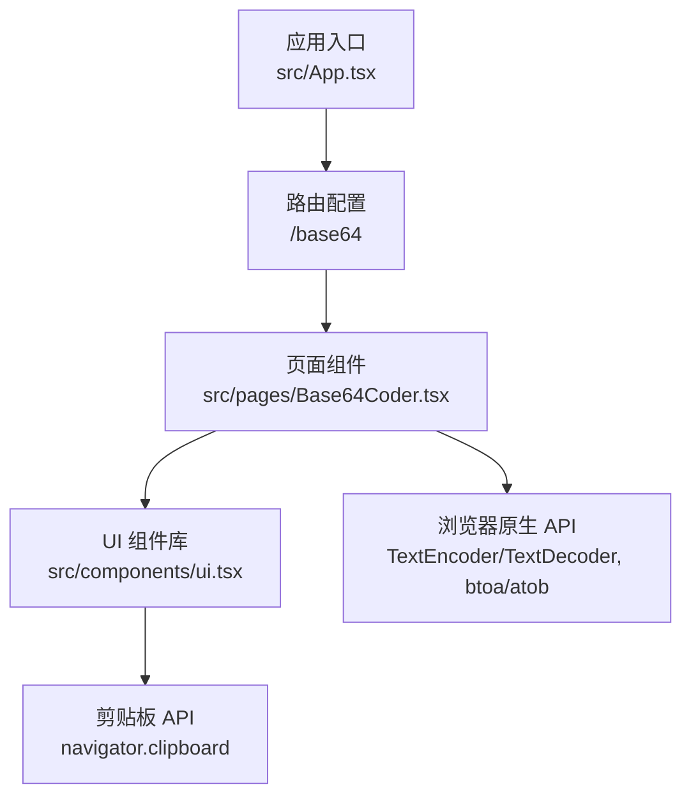
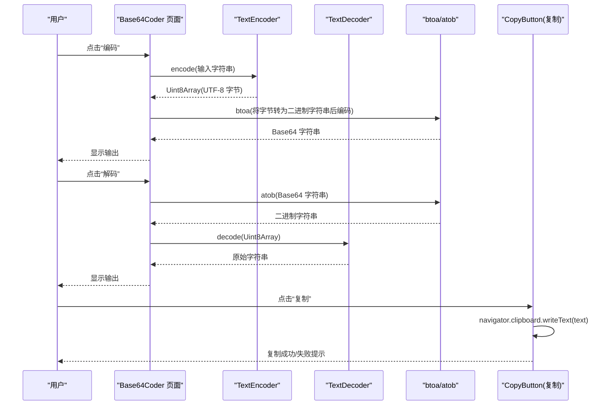
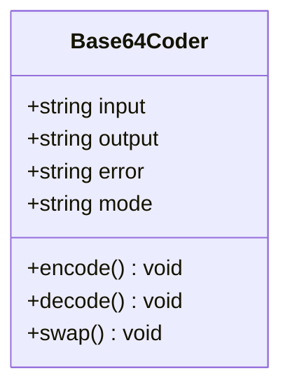
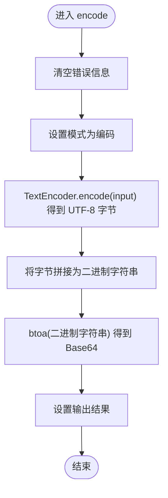
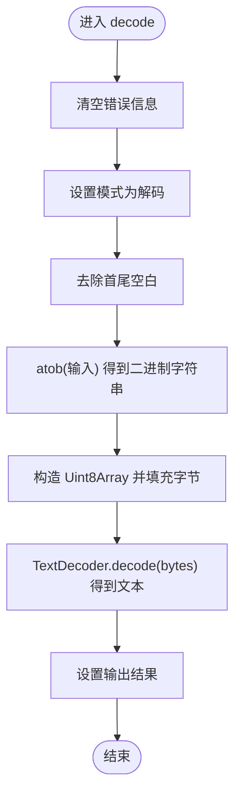
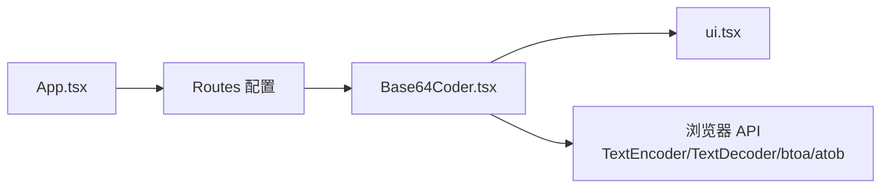

# Base64编解码器

<cite>
**本文引用的文件**
- [Base64Coder.tsx](file://src/pages/Base64Coder.tsx)
- [ui.tsx](file://src/components/ui.tsx)
- [App.tsx](file://src/App.tsx)
</cite>

## 目录
1. [简介](#简介)
2. [项目结构](#项目结构)
3. [核心组件](#核心组件)
4. [架构总览](#架构总览)
5. [详细组件分析](#详细组件分析)
6. [依赖关系分析](#依赖关系分析)
7. [性能考虑](#性能考虑)
8. [故障排查指南](#故障排查指南)
9. [结论](#结论)
10. [附录：使用示例与最佳实践](#附录使用示例与最佳实践)

## 简介
本文件面向“文本 Base64 编解码”功能，系统性阐述其实现原理、操作流程、输入输出规范、错误处理机制，以及针对中文、emoji 等 UTF-8 字符的支持方式。文档同时覆盖编码/解码模式切换与交换功能的逻辑，并提供性能优化建议与最佳实践指导。

该功能基于浏览器原生 API 实现，包括：
- TextEncoder/TextDecoder：用于在字符串与 UTF-8 字节序列之间安全转换
- btoa/atob：用于二进制字符串与 Base64 之间的编解码
- React 状态管理：驱动 UI 的输入、输出与模式切换

所有操作均在浏览器本地完成，数据不会上传至服务器。

## 项目结构
Base64 文本编解码功能位于页面级组件中，并通过路由挂载到应用主入口。UI 组件库提供通用表单与展示控件。

图表来源
- [App.tsx:126-134](file://src/App.tsx#L126-L134)
- [Base64Coder.tsx:1-96](file://src/pages/Base64Coder.tsx#L1-96)
- [ui.tsx:109-132](file://src/components/ui.tsx#L109-L132)

章节来源
- [App.tsx:126-134](file://src/App.tsx#L126-L134)
- [Base64Coder.tsx:1-96](file://src/pages/Base64Coder.tsx#L1-96)
- [ui.tsx:1-142](file://src/components/ui.tsx#L1-142)

## 核心组件
- Base64Coder 页面组件：负责用户交互、调用编解码逻辑、错误提示与结果复制。
- UI 组件库：提供工具头、卡片、文本域、按钮、复制按钮与错误横幅等基础控件。

关键职责划分
- 页面组件：业务逻辑（UTF-8 编解码、模式切换、交换）
- UI 组件：渲染与交互细节（输入框、按钮、复制、错误提示）

章节来源
- [Base64Coder.tsx:1-96](file://src/pages/Base64Coder.tsx#L1-96)
- [ui.tsx:1-142](file://src/components/ui.tsx#L1-142)

## 架构总览
下图展示了从用户点击到最终输出的完整调用链，涵盖编码与解码两条路径。

图表来源
- [Base64Coder.tsx:10-37](file://src/pages/Base64Coder.tsx#L10-L37)
- [ui.tsx:109-132](file://src/components/ui.tsx#L109-L132)

## 详细组件分析

### Base64Coder 页面组件
- 状态字段
  - input/output：输入与输出文本
  - error：错误信息
  - mode：当前模式（encode/decode）
- 核心方法
  - encode：将输入文本按 UTF-8 编码为字节，再转换为 Base64
  - decode：将 Base64 字符串还原为字节，再按 UTF-8 解码为文本
  - swap：交换输入与输出并翻转模式
- 错误处理
  - 编码异常：捕获并显示友好提示
  - 解码异常：当输入不是合法 Base64 时给出明确提示

#### 类图（组件内方法与状态）

图表来源
- [Base64Coder.tsx:4-43](file://src/pages/Base64Coder.tsx#L4-L43)

#### 编码流程（算法流程图）

图表来源
- [Base64Coder.tsx:10-22](file://src/pages/Base64Coder.tsx#L10-L22)

#### 解码流程（算法流程图）

图表来源
- [Base64Coder.tsx:24-37](file://src/pages/Base64Coder.tsx#L24-L37)

#### 模式切换与交换逻辑
- 模式切换：通过 mode 状态控制占位符与按钮行为
- 交换功能：将当前输出置入输入，原输入置入输出，并反转模式

章节来源
- [Base64Coder.tsx:4-43](file://src/pages/Base64Coder.tsx#L4-L43)

### UI 组件库
- ToolHeader/Card/TextArea/Button/CopyButton/ErrorBanner：提供一致的视觉风格与交互体验
- CopyButton：优先使用现代剪贴板 API，回退到兼容方案

章节来源
- [ui.tsx:1-142](file://src/components/ui.tsx#L1-142)

## 依赖关系分析
- 页面组件依赖 UI 组件进行渲染
- 页面组件依赖浏览器原生 API 完成编解码
- 应用入口通过路由将页面挂载到 /base64

图表来源
- [App.tsx:126-134](file://src/App.tsx#L126-L134)
- [Base64Coder.tsx:1-96](file://src/pages/Base64Coder.tsx#L1-96)
- [ui.tsx:1-142](file://src/components/ui.tsx#L1-142)

章节来源
- [App.tsx:126-134](file://src/App.tsx#L126-L134)
- [Base64Coder.tsx:1-96](file://src/pages/Base64Coder.tsx#L1-96)
- [ui.tsx:1-142](file://src/components/ui.tsx#L1-142)

## 性能考虑
- 大文本处理
  - 避免在循环中进行大量字符串拼接；可考虑分块处理或减少中间对象创建
  - 对超大输入可考虑节流/防抖触发，降低频繁重渲染
- 内存占用
  - 尽量复用 TypedArray，避免重复分配
  - 及时释放中间变量引用，避免长时间持有大对象
- I/O 与剪贴板
  - 复制操作异步执行，注意失败回退与用户体验反馈
- 兼容性
  - 现代浏览器均支持 TextEncoder/TextDecoder、btoa/atob 与 navigator.clipboard；如需更广泛兼容，可在构建阶段引入 polyfill

[本节为通用性能建议，不直接分析具体文件]

## 故障排查指南
- 解码报错：输入不是合法 Base64
  - 现象：点击“解码”后出现错误提示
  - 原因：atob 遇到非法字符或格式不正确
  - 处理：检查输入是否包含换行、空格或非 Base64 字符；必要时先 trim 清理
- 编码报错：内部异常
  - 现象：点击“编码”后出现错误提示
  - 原因：极端情况下浏览器 API 抛出异常
  - 处理：捕获并展示错误信息，引导用户修正输入
- 复制失败
  - 现象：点击“复制”无响应或失败
  - 原因：剪贴板权限受限或环境不支持
  - 处理：组件已内置回退方案；若仍失败，提示用户手动复制

章节来源
- [Base64Coder.tsx:19-36](file://src/pages/Base64Coder.tsx#L19-L36)
- [ui.tsx:109-132](file://src/components/ui.tsx#L109-L132)

## 结论
该 Base64 文本编解码器以最小依赖实现了完整的 UTF-8 支持，具备清晰的输入输出界面、友好的错误提示与便捷的复制能力。通过 TextEncoder/TextDecoder 确保多语言字符的正确处理，结合 btoa/atob 完成高效的 Base64 编解码。整体架构简洁、耦合度低，易于扩展与维护。

[本节为总结性内容，不直接分析具体文件]

## 附录：使用示例与最佳实践

### 输入与输出格式要求
- 编码输入
  - 任意 Unicode 文本（含中文、emoji、表情符号等）
  - 输出为标准 Base64 字符串（仅包含 A-Z/a-z/0-9/+/=）
- 解码输入
  - 标准 Base64 字符串（允许前后空白将被自动忽略）
  - 输出为原始 Unicode 文本

### 特殊字符处理要点
- 中文与 emoji
  - 通过 TextEncoder 将文本转为 UTF-8 字节后再编码，确保多字节字符正确表示
  - 解码时使用 TextDecoder 将字节按 UTF-8 解析，保证还原准确
- 大小写与换行
  - Base64 标准不区分大小写；但建议保持统一
  - 某些场景下 Base64 会插入换行，解码前建议去除空白

### 使用步骤
- 编码
  - 在输入区粘贴或键入文本
  - 点击“编码”，查看输出区的 Base64 结果
  - 点击“复制”保存结果
- 解码
  - 在输入区粘贴 Base64 字符串
  - 点击“解码”，查看输出区的原始文本
  - 点击“复制”保存结果
- 交换
  - 点击“交换”，快速互换输入与输出并切换模式

### 最佳实践
- 始终使用 UTF-8 编解码路径（TextEncoder/TextDecoder），避免直接使用 window.btoa/atob 处理含非 ASCII 字符的字符串
- 对超长输入采用分批处理或延迟计算，避免阻塞 UI
- 对用户输入做必要清洗（如 trim），提升解码成功率
- 在需要跨平台一致性的场景中，校验 Base64 字符集与长度是否为 4 的倍数

[本节为概念性与指导性内容，不直接分析具体文件]