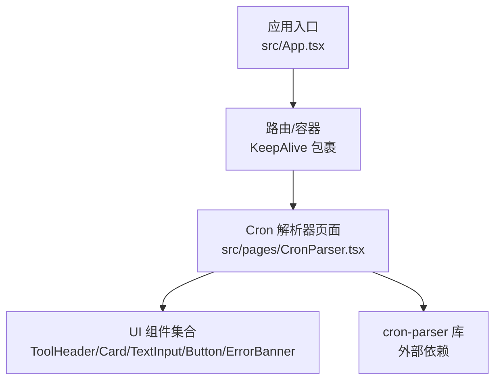
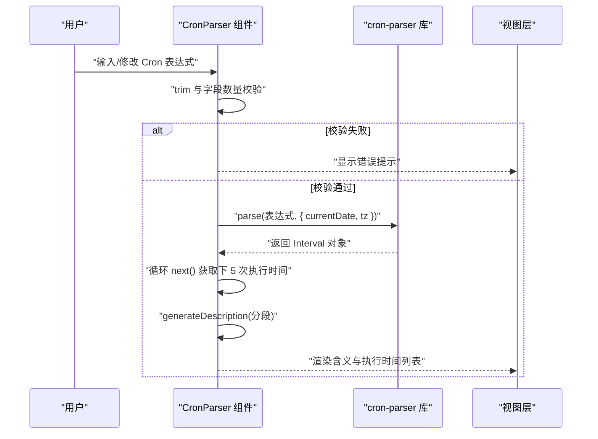
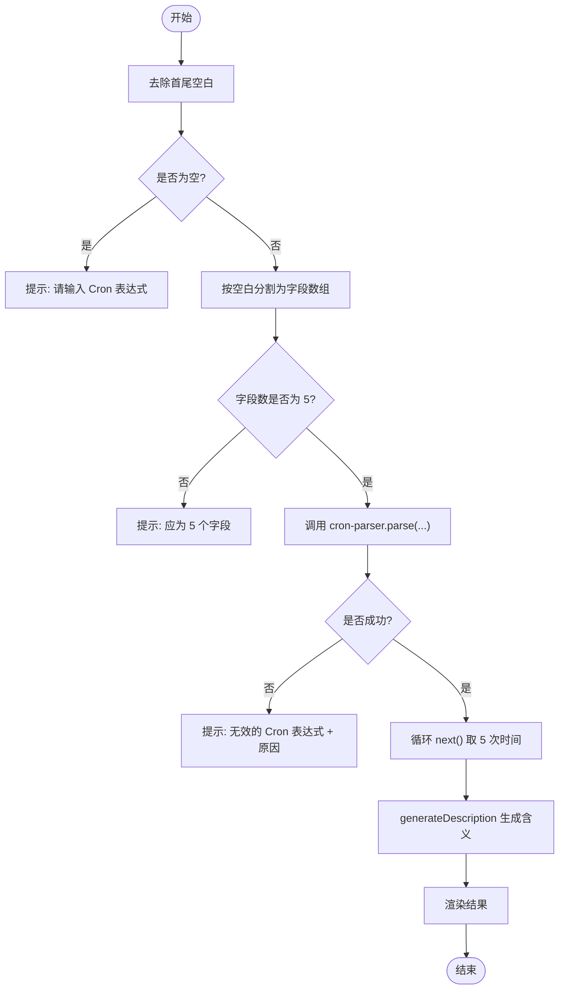

# Cron表达式解析器

<cite>
**本文引用的文件**
- [src/pages/CronParser.tsx](file://src/pages/CronParser.tsx)
- [src/App.tsx](file://src/App.tsx)
- [package-lock.json](file://package-lock.json)
</cite>

## 目录
1. [简介](#简介)
2. [项目结构](#项目结构)
3. [核心组件](#核心组件)
4. [架构总览](#架构总览)
5. [详细组件分析](#详细组件分析)
6. [依赖分析](#依赖分析)
7. [性能考虑](#性能考虑)
8. [故障排查指南](#故障排查指南)
9. [结论](#结论)
10. [附录](#附录)

## 简介
本工具提供“Cron 表达式解析器”功能，支持对标准 5 段式 Cron 表达式进行校验、语义解释与下一次执行时间计算。页面内置常用表达式预设，便于快速体验；同时提供字段取值范围与特殊字符说明，帮助用户理解与编写正确的表达式。

当前实现聚焦于 5 位 Cron（分 时 日 月 周），并基于 cron-parser 库进行时区感知的时间推算。

## 项目结构
Cron 解析器作为独立页面集成在应用路由中，通过侧边栏导航进入。核心逻辑集中在单页组件内，包含输入校验、表达式解析、结果展示与帮助信息。

图表来源
- [src/App.tsx:140-146](file://src/App.tsx#L140-L146)
- [src/pages/CronParser.tsx:1-10](file://src/pages/CronParser.tsx#L1-L10)

章节来源
- [src/App.tsx:1-154](file://src/App.tsx#L1-L154)
- [src/pages/CronParser.tsx:1-232](file://src/pages/CronParser.tsx#L1-L232)

## 核心组件
- 页面组件：负责状态管理、用户交互、调用解析库、生成描述与渲染结果。
- 预置表达式：提供常见调度场景的快捷按钮，降低上手门槛。
- 辅助函数：用于日期格式化与中文星期映射。
- 外部库：使用 cron-parser 完成表达式解析与下次执行时间计算。

章节来源
- [src/pages/CronParser.tsx:25-64](file://src/pages/CronParser.tsx#L25-L64)
- [src/pages/CronParser.tsx:66-119](file://src/pages/CronParser.tsx#L66-L119)
- [src/pages/CronParser.tsx:16-23](file://src/pages/CronParser.tsx#L16-L23)
- [src/pages/CronParser.tsx:1-3](file://src/pages/CronParser.tsx#L1-L3)

## 架构总览
下图展示了从用户输入到结果展示的完整流程，包括校验、解析、错误处理与可视化输出。

图表来源
- [src/pages/CronParser.tsx:31-64](file://src/pages/CronParser.tsx#L31-L64)
- [src/pages/CronParser.tsx:66-119](file://src/pages/CronParser.tsx#L66-L119)
- [src/pages/CronParser.tsx:121-124](file://src/pages/CronParser.tsx#L121-L124)

## 详细组件分析

### 组件职责与数据流
- 输入与状态
  - 表达式文本、错误信息、下 5 次执行时间、自然语言描述。
- 解析流程
  - 先做基础校验（非空、字段数=5）。
  - 调用 cron-parser 解析，设置时区为 Asia/Shanghai。
  - 迭代 next() 获取最近 5 次触发时间。
  - 根据分段生成中文可读描述。
- 展示
  - 错误横幅、表达式含义卡片、执行时间列表、帮助表格与符号说明。

图表来源
- [src/pages/CronParser.tsx:31-64](file://src/pages/CronParser.tsx#L31-L64)
- [src/pages/CronParser.tsx:66-119](file://src/pages/CronParser.tsx#L66-L119)

章节来源
- [src/pages/CronParser.tsx:25-64](file://src/pages/CronParser.tsx#L25-L64)
- [src/pages/CronParser.tsx:66-119](file://src/pages/CronParser.tsx#L66-L119)

### 语法规则与字段含义
- 标准 5 位 Cron 字段顺序：分钟、小时、日、月、星期。
- 取值范围与特殊字符
  - 分钟：0-59，支持 * / - ,
  - 小时：0-23，支持 * / - ,
  - 日：1-31，支持 * / - , ? L
  - 月：1-12，支持 * / - ,
  - 星期：0-7（0 和 7 均为周日），支持 * / - , ? L
- 特殊字符说明
  - * 任意值
  - / 步进值
  - - 范围
  - , 列表
  - L 最后
  - ? 不指定

章节来源
- [src/pages/CronParser.tsx:182-224](file://src/pages/CronParser.tsx#L182-L224)

### 5 位与 6 位表达式的区别与时区
- 当前实现仅支持 5 位 Cron（分 时 日 月 周），并在解析时显式设置时区为 Asia/Shanghai。
- 若需要秒级精度（6 位：秒 分 时 日 月 周），需扩展输入校验与解析配置以接受 6 个字段，并相应调整描述生成与展示逻辑。

章节来源
- [src/pages/CronParser.tsx:42-46](file://src/pages/CronParser.tsx#L42-L46)
- [src/pages/CronParser.tsx:48-52](file://src/pages/CronParser.tsx#L48-L52)

### 常用表达式示例（来自内置预设）
- 每分钟：* * * * *
- 每小时：0 * * * *
- 每天 0 点：0 0 * * *
- 每周一 9 点：0 9 * * 1
- 每月 1 号 0 点：0 0 1 * *
- 工作日 9 点：0 9 * * 1-5
- 每 5 分钟：*/5 * * * *
- 每 2 小时：0 */2 * * *

章节来源
- [src/pages/CronParser.tsx:5-14](file://src/pages/CronParser.tsx#L5-L14)

### 通配符、步长、列表与范围用法
- 通配符 *：表示该字段所有合法值均匹配。
- 步长 /：如 */5 表示每隔 5 个单位触发一次。
- 范围 -：如 1-5 表示从 1 到 5 的连续区间。
- 列表 ,：如 1,3,5 表示多个离散值。
- 特殊 L/?：主要用于日/星期的“最后一天/不指定”等语义（由底层库解析）。

章节来源
- [src/pages/CronParser.tsx:182-224](file://src/pages/CronParser.tsx#L182-L224)

### 表达式验证、错误提示与可视化解释
- 验证规则
  - 非空检查
  - 字段数量必须为 5
  - 交由 cron-parser 进行语法与范围校验
- 错误提示
  - 当表达式无效时，捕获异常并显示“无效的 Cron 表达式: <具体原因>”。
- 可视化解释
  - 根据各字段模式生成自然语言描述，如“每 5 分钟”、“在 9 点”、“在 1 到 5 号之间”等。
  - 展示下 5 次执行时间（北京时间），并以中文星期标注。

章节来源
- [src/pages/CronParser.tsx:31-64](file://src/pages/CronParser.tsx#L31-L64)
- [src/pages/CronParser.tsx:66-119](file://src/pages/CronParser.tsx#L66-L119)
- [src/pages/CronParser.tsx:121-124](file://src/pages/CronParser.tsx#L121-L124)

## 依赖分析
- 运行时依赖
  - cron-parser：表达式解析与时间推算核心库。
  - luxon：时间处理库（cron-parser 的依赖）。
- 版本信息
  - cron-parser 版本锁定在 5.6.1，要求 Node.js >= 18。

图表来源
- [package-lock.json:1922-1933](file://package-lock.json#L1922-L1933)
- [src/pages/CronParser.tsx:1-3](file://src/pages/CronParser.tsx#L1-L3)

章节来源
- [package-lock.json:1922-1933](file://package-lock.json#L1922-L1933)
- [src/pages/CronParser.tsx:1-3](file://src/pages/CronParser.tsx#L1-L3)

## 性能考虑
- 解析复杂度
  - 单次解析与 next() 调用开销较小，页面默认仅计算下 5 次执行时间，整体性能友好。
- 渲染优化
  - 结果集固定长度（5 条），DOM 节点少，无需额外虚拟化或分页。
- 可扩展性
  - 如需支持更多历史/未来时间点，建议增加分页或虚拟滚动策略，避免一次性渲染过多条目。

[本节为通用指导，不涉及具体文件分析]

## 故障排查指南
- 常见问题
  - 未输入表达式：会提示“请输入 Cron 表达式”。
  - 字段数量不为 5：会提示“Cron 表达式应为 5 个字段：分 时 日 月 周”。
  - 表达式语法错误：会提示“无效的 Cron 表达式: <具体原因>”，请根据提示修正。
- 定位方法
  - 打开浏览器控制台查看网络与脚本错误。
  - 核对字段取值范围与特殊字符组合是否符合规范。
  - 确认系统时区与页面设置的 Asia/Shanghai 一致。

章节来源
- [src/pages/CronParser.tsx:36-46](file://src/pages/CronParser.tsx#L36-L46)
- [src/pages/CronParser.tsx:60-63](file://src/pages/CronParser.tsx#L60-L63)

## 结论
本工具提供了直观、易用的 Cron 表达式校验与可视化解释能力，适合日常运维与开发调试。当前版本聚焦 5 位 Cron 与时区感知的执行时间计算。后续可考虑扩展 6 位秒级精度、增强错误定位与提供更多高级特性（如 L/? 的详细语义解释）。

[本节为总结性内容，不涉及具体文件分析]

## 附录

### 字段与取值速查表
- 分钟：0-59，支持 * / - ,
- 小时：0-23，支持 * / - ,
- 日：1-31，支持 * / - , ? L
- 月：1-12，支持 * / - ,
- 星期：0-7（0 和 7 均为周日），支持 * / - , ? L

章节来源
- [src/pages/CronParser.tsx:182-224](file://src/pages/CronParser.tsx#L182-L224)