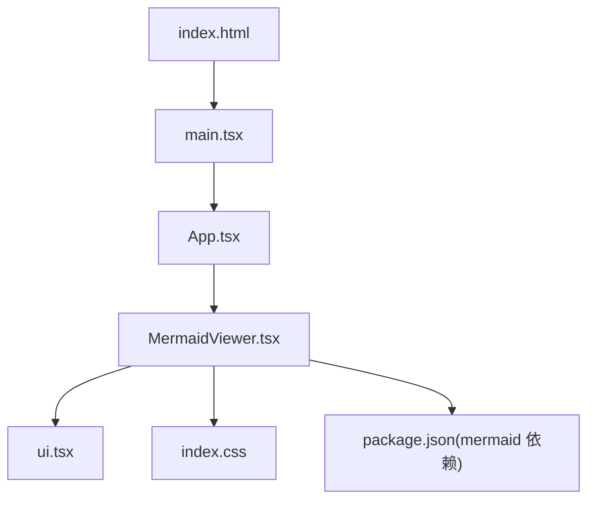
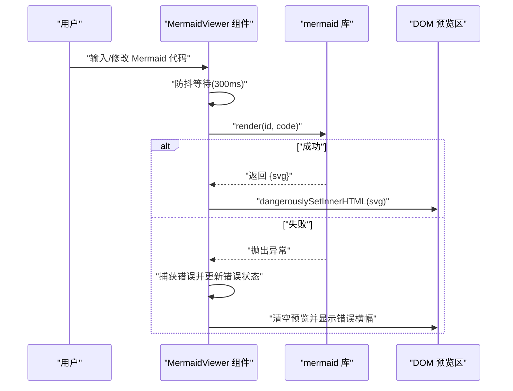
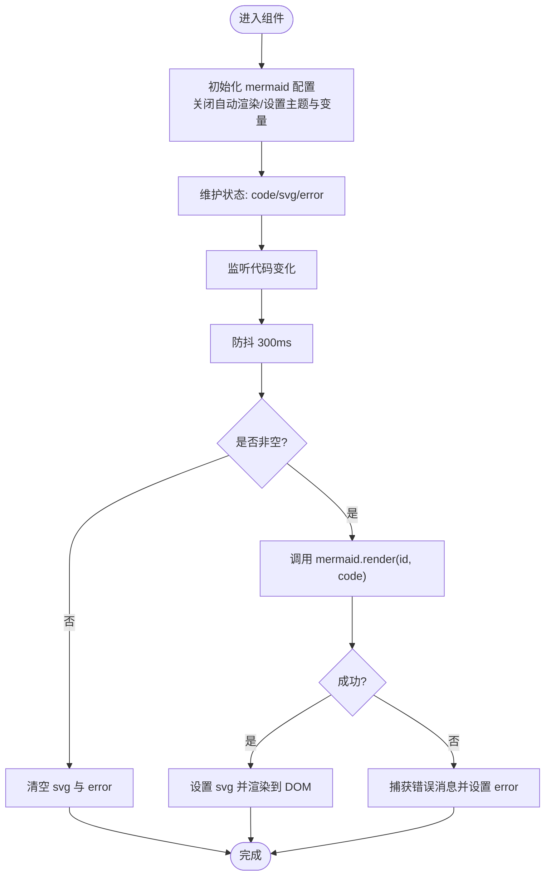
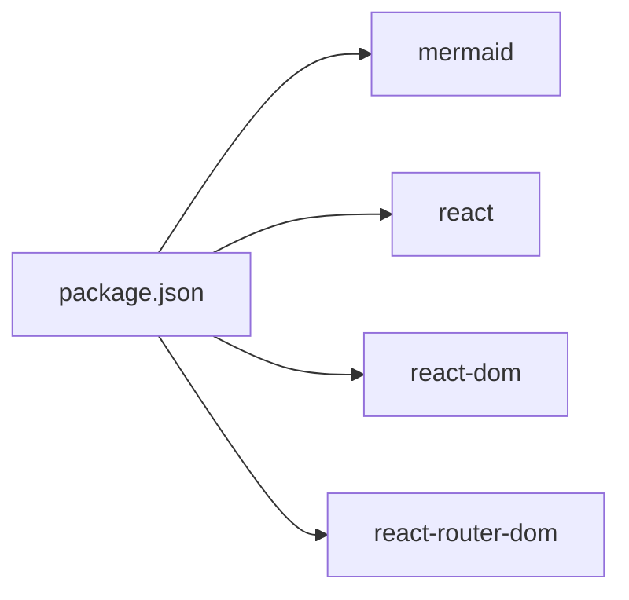

# Mermaid图表查看器

<cite>
**本文引用的文件**   
- [MermaidViewer.tsx](file://src/pages/MermaidViewer.tsx)
- [App.tsx](file://src/App.tsx)
- [ui.tsx](file://src/components/ui.tsx)
- [main.tsx](file://src/main.tsx)
- [index.html](file://index.html)
- [package.json](file://package.json)
- [index.css](file://src/index.css)
</cite>

## 目录
1. [简介](#简介)
2. [项目结构](#项目结构)
3. [核心组件](#核心组件)
4. [架构总览](#架构总览)
5. [详细组件分析](#详细组件分析)
6. [依赖分析](#依赖分析)
7. [性能考虑](#性能考虑)
8. [故障排查指南](#故障排查指南)
9. [结论](#结论)
10. [附录：语法与示例速查](#附录语法与示例速查)

## 简介
本仓库提供了一个基于 React + Vite 的在线工具集合，其中包含“Mermaid 可视化”页面。该页面支持在浏览器端实时渲染 Mermaid 图表，提供代码编辑、错误提示、SVG 下载等能力，并内置深色主题与自定义样式变量。文档将围绕该功能展开，涵盖系统架构、渲染机制、常见图表类型与语法要点、实时预览与调试方法、以及主题与性能优化建议。

## 项目结构
本项目采用按功能页划分的组织方式，Mermaid 查看器位于 pages 目录下，通过路由挂载到应用主入口。UI 组件集中在 components 目录中复用。

图示来源
- [index.html:1-14](file://index.html#L1-L14)
- [main.tsx:1-14](file://src/main.tsx#L1-L14)
- [App.tsx:124-134](file://src/App.tsx#L124-L134)
- [MermaidViewer.tsx:1-119](file://src/pages/MermaidViewer.tsx#L1-L119)
- [ui.tsx:1-142](file://src/components/ui.tsx#L1-L142)
- [index.css:29-33](file://src/index.css#L29-L33)
- [package.json:11-17](file://package.json#L11-L17)

章节来源
- [index.html:1-14](file://index.html#L1-L14)
- [main.tsx:1-14](file://src/main.tsx#L1-L14)
- [App.tsx:1-142](file://src/App.tsx#L1-L142)
- [MermaidViewer.tsx:1-119](file://src/pages/MermaidViewer.tsx#L1-L119)
- [ui.tsx:1-142](file://src/components/ui.tsx#L1-L142)
- [index.css:1-33](file://src/index.css#L1-L33)
- [package.json:1-29](file://package.json#L1-L29)

## 核心组件
- MermaidViewer 页面
  - 负责引入 mermaid 库、初始化配置（关闭自动渲染、设置主题与主题变量）、维护代码/预览/SVG/错误状态、防抖渲染、错误捕获与展示、SVG 下载。
- UI 组件
  - ToolHeader、Card、ErrorBanner 等用于构建页面布局与交互反馈。
- 路由与入口
  - main.tsx 创建根实例并注入 BrowserRouter；App.tsx 定义导航与路由，将 /mermaid 指向 MermaidViewer。
- 样式
  - index.css 为 mermaid-container 中的 SVG 提供响应式缩放与容器样式。

章节来源
- [MermaidViewer.tsx:1-119](file://src/pages/MermaidViewer.tsx#L1-L119)
- [ui.tsx:1-142](file://src/components/ui.tsx#L1-L142)
- [App.tsx:124-134](file://src/App.tsx#L124-L134)
- [main.tsx:1-14](file://src/main.tsx#L1-L14)
- [index.css:29-33](file://src/index.css#L29-L33)

## 架构总览
下图展示了从用户输入到最终渲染的关键流程：用户在编辑器修改 Mermaid 文本后，触发防抖渲染；渲染成功后将 SVG 字符串写入预览区域；若解析失败则显示错误信息。

图示来源
- [MermaidViewer.tsx:32-54](file://src/pages/MermaidViewer.tsx#L32-L54)
- [MermaidViewer.tsx:106-111](file://src/pages/MermaidViewer.tsx#L106-L111)

章节来源
- [MermaidViewer.tsx:32-54](file://src/pages/MermaidViewer.tsx#L32-L54)
- [MermaidViewer.tsx:106-111](file://src/pages/MermaidViewer.tsx#L106-L111)

## 详细组件分析

### MermaidViewer 组件
- 职责
  - 管理 Mermaid 源码与渲染结果的状态。
  - 调用 mermaid.render 进行异步渲染。
  - 处理空输入、错误捕获与提示。
  - 提供重置示例与下载 SVG 的能力。
- 关键实现要点
  - 初始化配置：关闭 startOnLoad，启用 dark 主题，并通过 themeVariables 定制颜色。
  - 防抖渲染：使用 setTimeout 延迟 300ms 执行 render，避免频繁重绘。
  - 错误处理：try/catch 捕获解析异常，提取 message 并展示。
  - 输出渲染：将 SVG 字符串直接注入预览容器。
  - 导出能力：将 SVG Blob 转为下载链接。

图示来源
- [MermaidViewer.tsx:13-24](file://src/pages/MermaidViewer.tsx#L13-L24)
- [MermaidViewer.tsx:32-48](file://src/pages/MermaidViewer.tsx#L32-L48)
- [MermaidViewer.tsx:50-54](file://src/pages/MermaidViewer.tsx#L50-L54)
- [MermaidViewer.tsx:106-111](file://src/pages/MermaidViewer.tsx#L106-L111)

章节来源
- [MermaidViewer.tsx:1-119](file://src/pages/MermaidViewer.tsx#L1-L119)

### UI 组件
- ToolHeader：统一标题与描述展示。
- Card：卡片容器，承载编辑器与预览区。
- ErrorBanner：错误信息横幅，当存在错误时显示。

章节来源
- [ui.tsx:1-142](file://src/components/ui.tsx#L1-L142)

### 路由与入口
- main.tsx：创建 React 根节点并包裹 BrowserRouter。
- App.tsx：定义侧边栏导航与路由映射，/mermaid 对应 MermaidViewer。

章节来源
- [main.tsx:1-14](file://src/main.tsx#L1-L14)
- [App.tsx:124-134](file://src/App.tsx#L124-L134)

### 样式与主题
- 全局样式：index.css 定义了 mermaid-container 内 SVG 的自适应尺寸。
- 主题配置：MermaidViewer 中通过 initialize 设置 theme 为 dark，并使用 themeVariables 覆盖主要颜色变量，如 primaryColor、lineColor 等。

章节来源
- [index.css:29-33](file://src/index.css#L29-L33)
- [MermaidViewer.tsx:13-24](file://src/pages/MermaidViewer.tsx#L13-L24)

## 依赖分析
- 运行时依赖
  - mermaid：提供图表解析与渲染能力。
  - react/react-dom：前端框架。
  - react-router-dom：路由。
- 开发依赖
  - vite、typescript、tailwindcss 等。

图示来源
- [package.json:11-17](file://package.json#L11-L17)

章节来源
- [package.json:1-29](file://package.json#L1-L29)

## 性能考虑
- 防抖渲染：当前实现使用 300ms 延时，减少高频输入导致的重复渲染。
- 按需渲染：仅在代码非空时执行渲染，避免无意义计算。
- 主题与变量：通过 themeVariables 控制颜色，避免额外 CSS 覆盖带来的重排。
- 扩展建议（可选）
  - 对超长代码或复杂图进行增量渲染或分页预览。
  - 缓存最近一次成功渲染结果，切换回相同代码时跳过重新渲染。
  - 在移动端降低动画复杂度或禁用部分特效以提升流畅度。

[本节为通用性能建议，不直接分析具体文件]

## 故障排查指南
- 常见问题
  - 空白预览：检查代码是否为空；确认 mermaid.initialize 已执行且未开启 startOnLoad。
  - 报错信息：查看错误横幅内容，定位语法错误或不支持的节点/连线。
  - 样式异常：确认 mermaid-container 的 CSS 未被覆盖，确保 SVG 可自适应。
- 定位步骤
  - 打开浏览器控制台，观察是否有 JS 异常。
  - 逐步简化代码，缩小问题范围。
  - 验证主题变量是否覆盖了必要属性导致不可见元素。
- 相关实现位置
  - 错误捕获与展示逻辑
  - 预览区域 HTML 注入
  - 主题初始化与变量覆盖

章节来源
- [MermaidViewer.tsx:39-47](file://src/pages/MermaidViewer.tsx#L39-L47)
- [MermaidViewer.tsx:106-111](file://src/pages/MermaidViewer.tsx#L106-L111)
- [MermaidViewer.tsx:13-24](file://src/pages/MermaidViewer.tsx#L13-L24)
- [index.css:29-33](file://src/index.css#L29-L33)

## 结论
本项目的 Mermaid 查看器以最小化依赖实现了“编辑-预览-下载”的核心闭环，具备实时渲染、错误提示与主题定制能力。通过合理的状态管理与防抖策略，保证了良好的交互体验。后续可在语法高亮、更丰富的主题切换、导出多种格式等方面进一步增强。

[本节为总结性内容，不直接分析具体文件]

## 附录：语法与示例速查
说明：以下为常用图表类型的语法要点与示例路径指引，便于快速上手。实际语法请以官方文档为准。

- 流程图（flowchart）
  - 要点：节点声明、连线与分支条件、子图分组。
  - 示例参考：默认示例位于组件内部常量中。
  - 章节来源
    - [MermaidViewer.tsx:5-11](file://src/pages/MermaidViewer.tsx#L5-L11)

- 时序图（sequenceDiagram）
  - 要点：参与者声明、消息发送、激活条、注释。
  - 示例参考：可在编辑器中粘贴标准 sequenceDiagram 片段进行预览。
  - 章节来源
    - [MermaidViewer.tsx:89-91](file://src/pages/MermaidViewer.tsx#L89-L91)

- 甘特图（gantt）
  - 要点：任务、周期、里程碑、依赖关系。
  - 示例参考：可在编辑器中粘贴 gantt 片段进行预览。
  - 章节来源
    - [MermaidViewer.tsx:89-91](file://src/pages/MermaidViewer.tsx#L89-L91)

- 类图（classDiagram）
  - 要点：类、接口、继承与关联、可见性与属性方法。
  - 示例参考：可在编辑器中粘贴 classDiagram 片段进行预览。
  - 章节来源
    - [MermaidViewer.tsx:89-91](file://src/pages/MermaidViewer.tsx#L89-L91)

- 状态图（stateDiagram）
  - 要点：状态、转换、初始/终止状态、条件分支。
  - 示例参考：可在编辑器中粘贴 stateDiagram 片段进行预览。
  - 章节来源
    - [MermaidViewer.tsx:89-91](file://src/pages/MermaidViewer.tsx#L89-L91)

- 其他图表
  - 实体关系图（erDiagram）、饼图（pie）、思维导图（mindmap）等均可在编辑器中尝试粘贴相应语法进行预览。
  - 章节来源
    - [MermaidViewer.tsx:89-91](file://src/pages/MermaidViewer.tsx#L89-L91)

- 实时预览与调试
  - 实时预览：修改代码后等待约 300ms 即可看到结果。
  - 错误调试：错误横幅会显示解析错误信息，结合控制台日志定位问题。
  - 章节来源
    - [MermaidViewer.tsx:50-54](file://src/pages/MermaidViewer.tsx#L50-L54)
    - [MermaidViewer.tsx:39-47](file://src/pages/MermaidViewer.tsx#L39-L47)

- 自定义样式与主题
  - 主题：通过 initialize 设置 theme 与 themeVariables 覆盖颜色。
  - 容器样式：通过 .mermaid-container 控制 SVG 缩放与布局。
  - 章节来源
    - [MermaidViewer.tsx:13-24](file://src/pages/MermaidViewer.tsx#L13-L24)
    - [index.css:29-33](file://src/index.css#L29-L33)