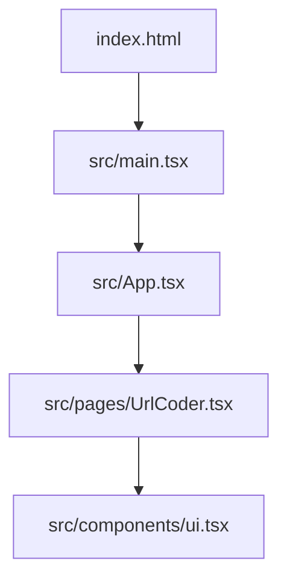
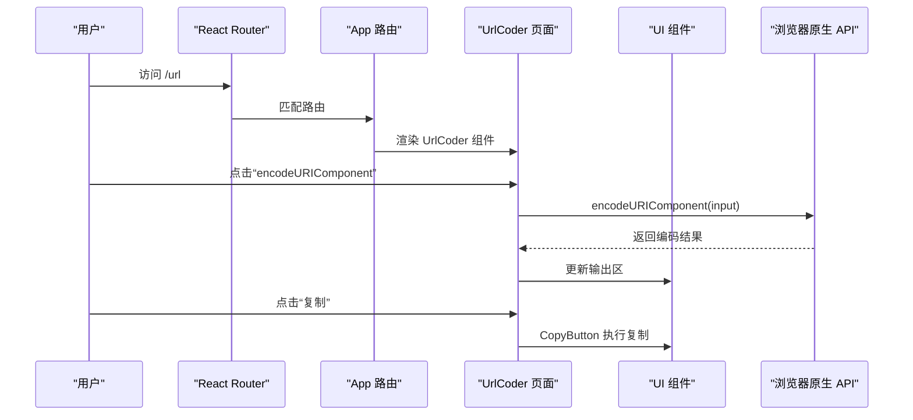
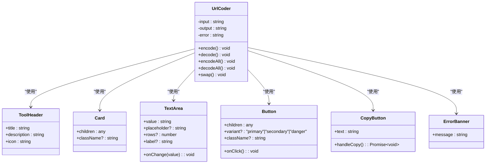
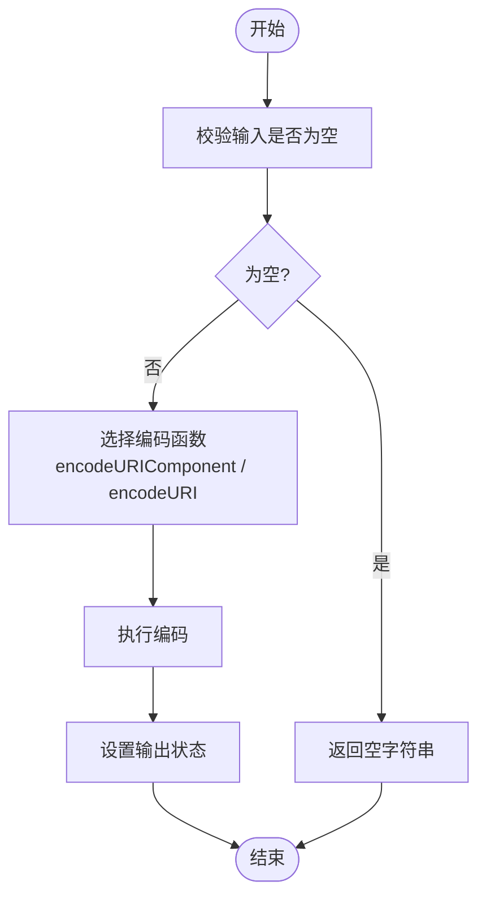
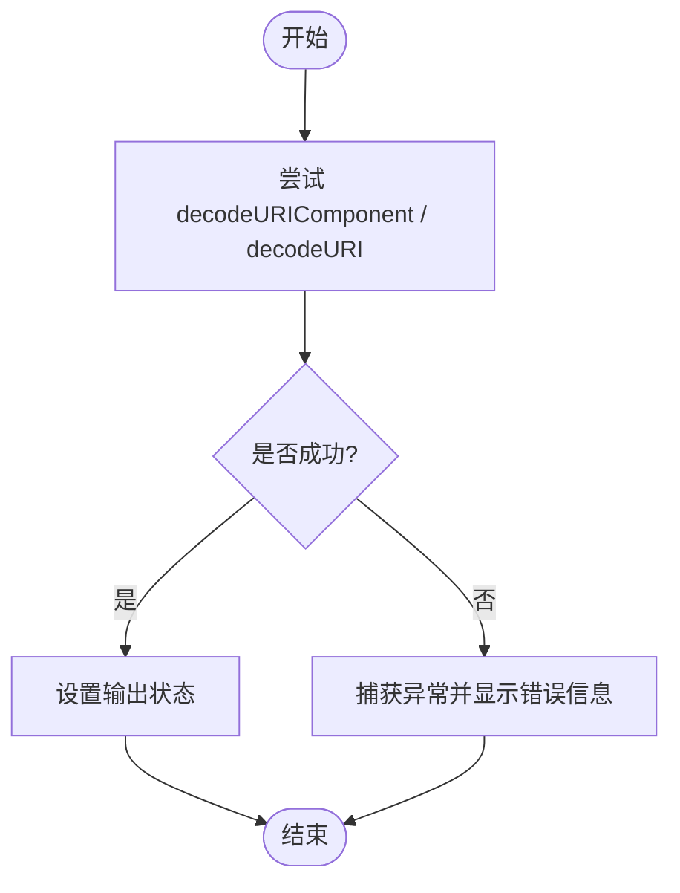
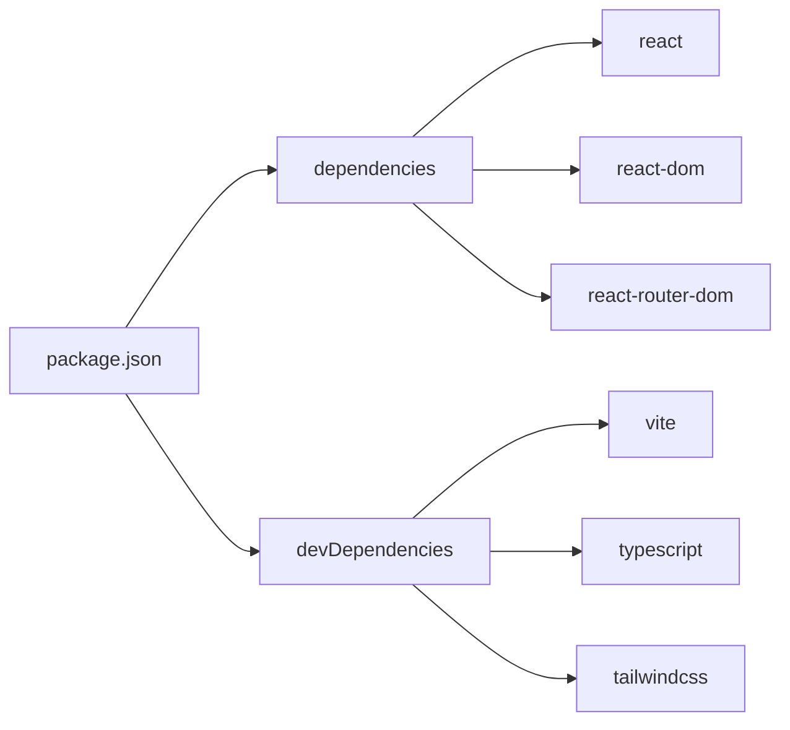

# URL编解码器

<cite>
**本文引用的文件**
- [UrlCoder.tsx](file://src/pages/UrlCoder.tsx)
- [ui.tsx](file://src/components/ui.tsx)
- [App.tsx](file://src/App.tsx)
- [main.tsx](file://src/main.tsx)
- [index.html](file://index.html)
- [package.json](file://package.json)
</cite>

## 目录
1. [简介](#简介)
2. [项目结构](#项目结构)
3. [核心组件](#核心组件)
4. [架构总览](#架构总览)
5. [详细组件分析](#详细组件分析)
6. [依赖关系分析](#依赖关系分析)
7. [性能考量](#性能考量)
8. [故障排查指南](#故障排查指南)
9. [结论](#结论)
10. [附录](#附录)

## 简介
本文件为“URL 编解码”工具提供全面文档，覆盖以下主题：
- URL 编码（encodeURIComponent）与解码（decodeURIComponent）的原理与应用场景
- 特殊字符的编码规则、中文字符处理方式
- 查询参数的格式化方法
- 完整的 URL 构建与解析示例（路径参数、查询字符串、哈希值）
- 与标准 URL 规范的兼容性说明
- 错误处理与安全性最佳实践

该功能基于浏览器原生 API 实现，所有操作在客户端本地完成，不上传数据。

## 项目结构
本项目采用 React + Vite 的前端工程化方案，URL 编解码功能位于页面级组件中，并通过路由挂载到应用入口。

图表来源
- [index.html:1-14](file://index.html#L1-L14)
- [main.tsx:1-14](file://src/main.tsx#L1-L14)
- [App.tsx:1-142](file://src/App.tsx#L1-L142)
- [UrlCoder.tsx:1-93](file://src/pages/UrlCoder.tsx#L1-L93)
- [ui.tsx:1-142](file://src/components/ui.tsx#L1-L142)

章节来源
- [index.html:1-14](file://index.html#L1-L14)
- [main.tsx:1-14](file://src/main.tsx#L1-L14)
- [App.tsx:1-142](file://src/App.tsx#L1-L142)
- [UrlCoder.tsx:1-93](file://src/pages/UrlCoder.tsx#L1-L93)
- [ui.tsx:1-142](file://src/components/ui.tsx#L1-L142)

## 核心组件
- UrlCoder 页面组件：提供输入框、输出框以及四个按钮（encodeURIComponent、decodeURIComponent、encodeURI、decodeURI），并支持一键交换输入输出。
- UI 组件库：包含 ToolHeader、Card、TextArea、Button、CopyButton、ErrorBanner 等基础 UI 元素，用于渲染界面与交互反馈。

章节来源
- [UrlCoder.tsx:1-93](file://src/pages/UrlCoder.tsx#L1-L93)
- [ui.tsx:1-142](file://src/components/ui.tsx#L1-L142)

## 架构总览
URL 编解码功能的调用链从路由到页面组件再到 UI 组件，最终调用浏览器原生 API 完成编解码。

图表来源
- [App.tsx:128-134](file://src/App.tsx#L128-L134)
- [UrlCoder.tsx:9-16](file://src/pages/UrlCoder.tsx#L9-L16)
- [ui.tsx:109-132](file://src/components/ui.tsx#L109-L132)

## 详细组件分析

### 组件类图（代码结构）

图表来源
- [UrlCoder.tsx:1-93](file://src/pages/UrlCoder.tsx#L1-L93)
- [ui.tsx:1-142](file://src/components/ui.tsx#L1-L142)

章节来源
- [UrlCoder.tsx:1-93](file://src/pages/UrlCoder.tsx#L1-L93)
- [ui.tsx:1-142](file://src/components/ui.tsx#L1-L142)

### 编码流程（算法流程图）

图表来源
- [UrlCoder.tsx:9-16](file://src/pages/UrlCoder.tsx#L9-L16)
- [UrlCoder.tsx:27-34](file://src/pages/UrlCoder.tsx#L27-L34)

章节来源
- [UrlCoder.tsx:9-16](file://src/pages/UrlCoder.tsx#L9-L16)
- [UrlCoder.tsx:27-34](file://src/pages/UrlCoder.tsx#L27-L34)

### 解码流程（异常处理）

图表来源
- [UrlCoder.tsx:18-25](file://src/pages/UrlCoder.tsx#L18-L25)
- [UrlCoder.tsx:36-43](file://src/pages/UrlCoder.tsx#L36-L43)

章节来源
- [UrlCoder.tsx:18-25](file://src/pages/UrlCoder.tsx#L18-L25)
- [UrlCoder.tsx:36-43](file://src/pages/UrlCoder.tsx#L36-L43)

### 关键实现要点
- 编码函数
  - encodeURIComponent：对除字母、数字、标点符号外的几乎所有字符进行百分号编码，适合编码查询参数值或片段部分。
  - encodeURI：仅对非转义字符进行编码，保留 URL 结构字符（如 : / ? # 等），适合对整个 URL 进行编码。
- 解码函数
  - decodeURIComponent：对百分号编码进行解码，常用于还原查询参数值。
  - decodeURI：对完整 URL 进行解码，保留结构字符。
- 错误处理
  - 使用 try/catch 捕获非法编码导致的异常，并在界面以错误横幅提示。
- 交互增强
  - 提供“交换”按钮快速互换输入与输出，便于对比验证。
  - 提供“复制”按钮将结果复制到剪贴板，提升易用性。

章节来源
- [UrlCoder.tsx:9-43](file://src/pages/UrlCoder.tsx#L9-L43)
- [ui.tsx:109-132](file://src/components/ui.tsx#L109-L132)

## 依赖关系分析
- 运行时依赖
  - React 与 React DOM：提供组件化 UI 与渲染能力。
  - react-router-dom：提供前端路由，将 /url 映射到 UrlCoder 页面。
- 开发依赖
  - Vite、TypeScript、TailwindCSS、PostCSS、Autoprefixer：构建与样式处理。

图表来源
- [package.json:1-29](file://package.json#L1-L29)

章节来源
- [package.json:1-29](file://package.json#L1-L29)

## 性能考量
- 编解码操作均为 O(n) 时间复杂度，n 为输入字符串长度；对于常规文本量级，性能开销可忽略。
- 避免在高频事件中进行重复计算，当前实现通过按钮触发，符合预期。
- 大文本建议分页或分块处理（若未来扩展为批量处理）。

[本节为通用指导，无需源码引用]

## 故障排查指南
- 常见问题
  - 解码失败：输入不是有效的 URL 编码格式，会抛出异常。界面已捕获并展示错误信息。
  - 复制失败：现代浏览器可能限制剪贴板权限，组件已提供降级方案（document.execCommand('copy')）。
- 定位步骤
  - 检查输入内容是否符合目标函数的期望格式（例如 decodeURIComponent 需要合法的 %XX 序列）。
  - 查看错误横幅提示信息，确认具体异常原因。
  - 在控制台查看是否有未捕获异常或权限相关警告。

章节来源
- [UrlCoder.tsx:18-25](file://src/pages/UrlCoder.tsx#L18-L25)
- [UrlCoder.tsx:36-43](file://src/pages/UrlCoder.tsx#L36-L43)
- [ui.tsx:109-132](file://src/components/ui.tsx#L109-L132)

## 结论
本工具基于浏览器原生 API 实现了简洁可靠的 URL 编解码功能，具备清晰的错误处理与友好的交互体验。通过合理选择 encodeURIComponent/encodeURI 与对应的解码函数，可满足大多数 URL 处理需求。建议在复杂场景中结合 URL 对象与查询字符串解析策略，以获得更稳健的兼容性与安全性。

[本节为总结性内容，无需源码引用]

## 附录

### 特殊字符编码规则与中文字符处理
- 特殊字符
  - 空格通常被编码为 %20（encodeURIComponent）或 +（application/x-www-form-urlencoded 表单提交时）。
  - 中文等非 ASCII 字符会被转换为 UTF-8 字节序列后再进行百分号编码。
- 中文字符
  - 浏览器内部统一按 UTF-8 处理，因此中文在编码后表现为多个 %XX 序列。
- 参考实现位置
  - 编码与解码逻辑由浏览器原生 API 提供，页面组件直接调用。

章节来源
- [UrlCoder.tsx:9-16](file://src/pages/UrlCoder.tsx#L9-L16)
- [UrlCoder.tsx:18-25](file://src/pages/UrlCoder.tsx#L18-L25)

### 查询参数格式化方法
- 推荐做法
  - 使用 URLSearchParams 构建查询字符串，确保键值正确编码与拼接。
  - 示例思路：创建 URLSearchParams 实例，逐个 append(key, value)，再 toString() 得到查询串。
- 注意事项
  - 键与值都应使用 encodeURIComponent 保证安全与合规。
  - 空值与数组需根据业务约定决定序列化方式（如逗号分隔或重复键）。

[本节为通用指导，无需源码引用]

### 完整的 URL 构建与解析示例
- 构建 URL
  - 使用 new URL(base, relative) 合并基础地址与相对路径。
  - 使用 URL.searchParams 添加查询参数，自动处理编码。
  - 使用 URL.hash 设置哈希值。
- 解析 URL
  - 使用 new URL(location.href) 解析当前地址。
  - 读取 URL.pathname、URL.search、URL.hash 获取各段。
  - 使用 URL.searchParams.get(key) 获取单个查询参数。
- 适用场景
  - 动态生成分享链接、带参数的跳转、服务端回调地址组装等。

[本节为通用指导，无需源码引用]

### 与标准 URL 规范的兼容性
- 遵循 WHATWG URL 规范与 RFC 3986 的语义。
- 不同浏览器对边缘情况（如非法百分号序列）的处理一致，均抛出异常。
- 建议优先使用 URL 对象与 URLSearchParams 进行组合与解析，以获得更好的跨平台一致性。

[本节为通用指导，无需源码引用]

### 安全性考虑与最佳实践
- 输入校验
  - 对用户输入进行白名单校验或最小化允许字符集，防止注入风险。
- 输出净化
  - 在插入到 HTML 上下文前进行转义，避免 XSS。
- 权限与安全上下文
  - 剪贴板写入需在安全上下文（HTTPS）下可用，否则回退方案可能失效。
- 日志与敏感信息
  - 避免记录包含个人信息的 URL 片段（如 token、密码）。

[本节为通用指导，无需源码引用]