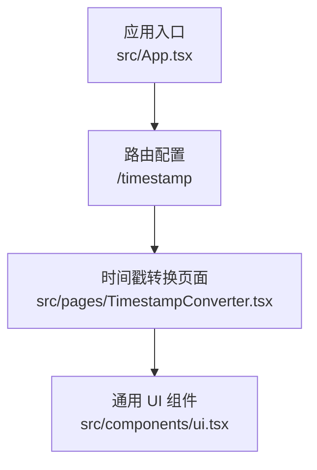
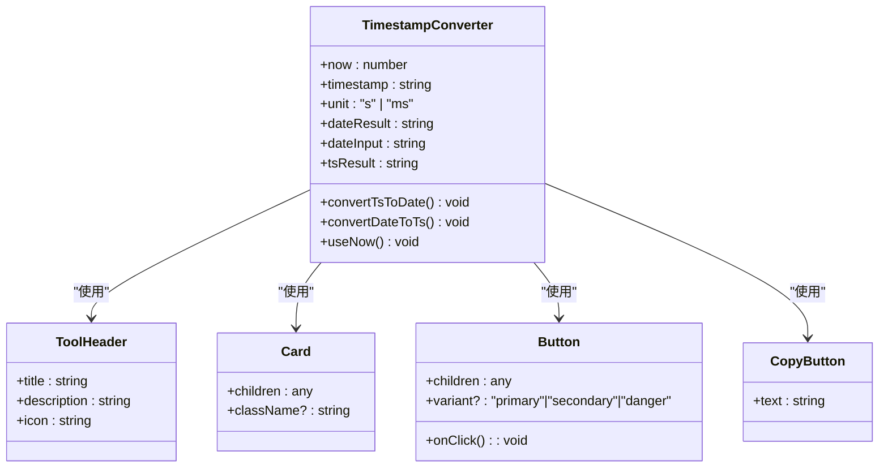
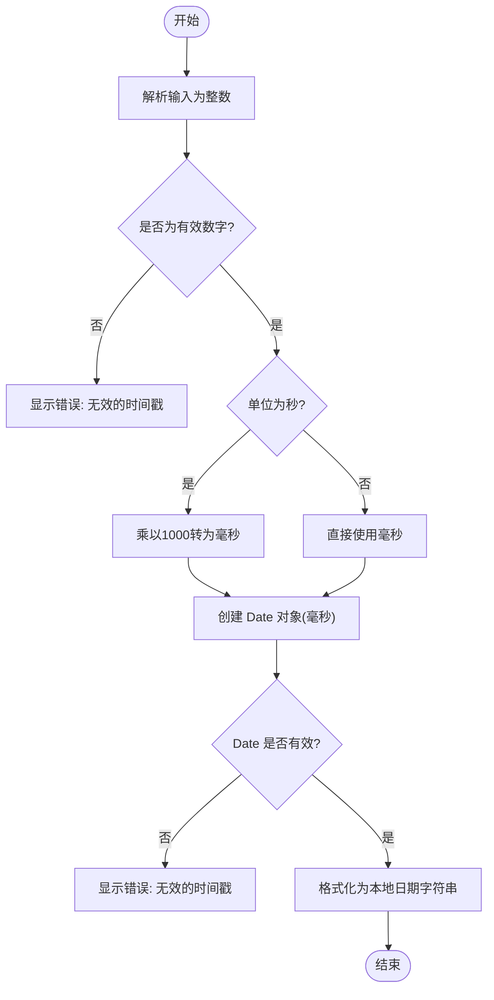
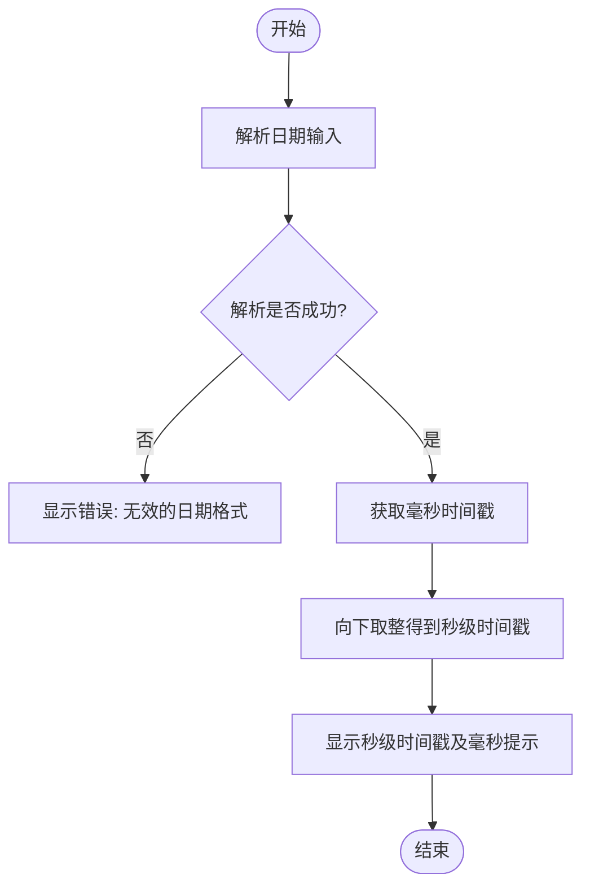
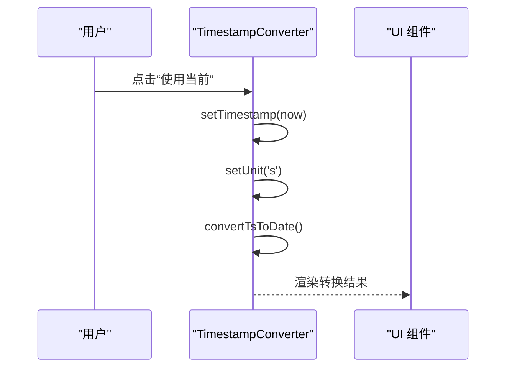
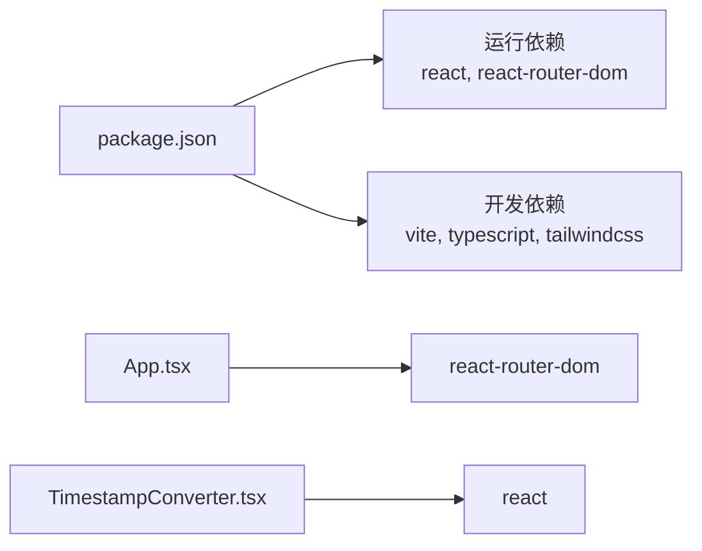

# 时间戳转换器

<cite>
**本文引用的文件**   
- [src/pages/TimestampConverter.tsx](file://src/pages/TimestampConverter.tsx)
- [src/components/ui.tsx](file://src/components/ui.tsx)
- [src/App.tsx](file://src/App.tsx)
- [package.json](file://package.json)
</cite>

## 目录
1. [简介](#简介)
2. [项目结构](#项目结构)
3. [核心组件](#核心组件)
4. [架构总览](#架构总览)
5. [详细组件分析](#详细组件分析)
6. [依赖分析](#依赖分析)
7. [性能考虑](#性能考虑)
8. [故障排查指南](#故障排查指南)
9. [结论](#结论)
10. [附录](#附录)

## 简介
本工具提供 Unix 时间戳与可读日期时间的双向转换，支持秒级与毫秒级输入，并内置“当前时间”快速填充功能。界面简洁直观，适合日常开发、运维与数据分析场景中的时间处理需求。

## 项目结构
时间戳转换器作为工具箱中的一个页面模块，通过路由挂载到应用主入口中。整体采用 React + Vite 的前端工程化方案，UI 组件统一封装在公共 UI 库中。

图表来源
- [src/App.tsx:126-134](file://src/App.tsx#L126-L134)
- [src/pages/TimestampConverter.tsx:1-10](file://src/pages/TimestampConverter.tsx#L1-L10)
- [src/components/ui.tsx:1-20](file://src/components/ui.tsx#L1-L20)

章节来源
- [src/App.tsx:126-134](file://src/App.tsx#L126-L134)
- [src/pages/TimestampConverter.tsx:1-10](file://src/pages/TimestampConverter.tsx#L1-L10)
- [src/components/ui.tsx:1-20](file://src/components/ui.tsx#L1-L20)

## 核心组件
- 时间戳转日期：接收文本输入的时间戳与单位（秒或毫秒），转换为本地时区的格式化日期字符串。
- 日期转时间戳：使用浏览器原生日期选择器输入本地时间，输出秒级 Unix 时间戳，并附带对应的毫秒值提示。
- 实时时钟：每秒刷新一次当前秒级时间戳，并提供“使用当前”快捷操作。
- 复制结果：一键复制转换结果到剪贴板。

章节来源
- [src/pages/TimestampConverter.tsx:28-56](file://src/pages/TimestampConverter.tsx#L28-L56)
- [src/pages/TimestampConverter.tsx:58-146](file://src/pages/TimestampConverter.tsx#L58-L146)
- [src/components/ui.tsx:109-132](file://src/components/ui.tsx#L109-L132)

## 架构总览
时间戳转换器由单一页面组件构成，内部维护若干状态变量以驱动视图更新；UI 组件负责渲染按钮、卡片、输入框与复制按钮等基础交互元素。

图表来源
- [src/pages/TimestampConverter.tsx:12-56](file://src/pages/TimestampConverter.tsx#L12-L56)
- [src/components/ui.tsx:9-21](file://src/components/ui.tsx#L9-L21)
- [src/components/ui.tsx:28-34](file://src/components/ui.tsx#L28-L34)
- [src/components/ui.tsx:89-103](file://src/components/ui.tsx#L89-L103)
- [src/components/ui.tsx:109-132](file://src/components/ui.tsx#L109-L132)

## 详细组件分析

### 时间戳 → 日期（流程）
该流程负责将用户输入的数值型时间戳按所选单位（秒或毫秒）解析为本地日期时间，并进行格式化为“年-月-日 时:分:秒”。

图表来源
- [src/pages/TimestampConverter.tsx:28-41](file://src/pages/TimestampConverter.tsx#L28-L41)
- [src/pages/TimestampConverter.tsx:8-10](file://src/pages/TimestampConverter.tsx#L8-L10)

章节来源
- [src/pages/TimestampConverter.tsx:28-41](file://src/pages/TimestampConverter.tsx#L28-L41)
- [src/pages/TimestampConverter.tsx:8-10](file://src/pages/TimestampConverter.tsx#L8-L10)

### 日期 → 时间戳（流程）
该流程从浏览器日期选择器获取本地时间，计算其对应的秒级 Unix 时间戳，并在界面展示对应毫秒值。

图表来源
- [src/pages/TimestampConverter.tsx:43-50](file://src/pages/TimestampConverter.tsx#L43-L50)
- [src/pages/TimestampConverter.tsx:127-131](file://src/pages/TimestampConverter.tsx#L127-L131)

章节来源
- [src/pages/TimestampConverter.tsx:43-50](file://src/pages/TimestampConverter.tsx#L43-L50)
- [src/pages/TimestampConverter.tsx:127-131](file://src/pages/TimestampConverter.tsx#L127-L131)

### 实时时钟与“使用当前”
- 实时时钟：每秒钟读取系统当前时间并更新秒级时间戳显示。
- “使用当前”：将当前秒级时间戳填入输入框，自动切换单位为秒，并立即执行转换。

图表来源
- [src/pages/TimestampConverter.tsx:21-26](file://src/pages/TimestampConverter.tsx#L21-L26)
- [src/pages/TimestampConverter.tsx:52-56](file://src/pages/TimestampConverter.tsx#L52-L56)
- [src/pages/TimestampConverter.tsx:28-41](file://src/pages/TimestampConverter.tsx#L28-L41)

章节来源
- [src/pages/TimestampConverter.tsx:21-26](file://src/pages/TimestampConverter.tsx#L21-L26)
- [src/pages/TimestampConverter.tsx:52-56](file://src/pages/TimestampConverter.tsx#L52-L56)

### 复制结果
- 点击复制按钮后，优先调用现代浏览器的剪贴板 API；若失败则回退至 textarea 方式完成复制。

章节来源
- [src/components/ui.tsx:109-132](file://src/components/ui.tsx#L109-L132)

## 依赖分析
- 运行时依赖：React、react-router-dom 用于页面路由与组件渲染。
- 构建与开发：Vite、TypeScript、TailwindCSS 等。
- 时间戳转换器未引入第三方时间库，完全基于浏览器原生 Date API 实现。

图表来源
- [package.json:11-17](file://package.json#L11-L17)
- [package.json:18-27](file://package.json#L18-L27)
- [src/App.tsx:1-10](file://src/App.tsx#L1-L10)
- [src/pages/TimestampConverter.tsx:1-2](file://src/pages/TimestampConverter.tsx#L1-L2)

章节来源
- [package.json:11-17](file://package.json#L11-L17)
- [package.json:18-27](file://package.json#L18-L27)
- [src/App.tsx:1-10](file://src/App.tsx#L1-L10)
- [src/pages/TimestampConverter.tsx:1-2](file://src/pages/TimestampConverter.tsx#L1-L2)

## 性能考虑
- 实时时钟使用定时器每秒更新一次，避免频繁重绘带来的开销。
- 转换逻辑均为 O(1) 的简单算术与日期构造，无额外 I/O 或复杂计算。
- 建议：如需批量转换，可考虑增加防抖/节流策略以减少重复渲染。

[本节为通用指导，不直接分析具体文件]

## 故障排查指南
- 输入非数字：当时间戳输入无法解析为整数时，会返回“无效的时间戳”提示。
- 非法时间范围：即使能解析为数字，若超出 Date 可表示范围，也会返回“无效的时间戳”。
- 日期格式错误：日期选择器输入为空或格式不正确时，会返回“无效的日期格式”。
- 复制失败：剪贴板权限受限或环境不支持时，会自动回退到兼容方案。

章节来源
- [src/pages/TimestampConverter.tsx:28-41](file://src/pages/TimestampConverter.tsx#L28-L41)
- [src/pages/TimestampConverter.tsx:43-50](file://src/pages/TimestampConverter.tsx#L43-L50)
- [src/components/ui.tsx:109-132](file://src/components/ui.tsx#L109-L132)

## 结论
时间戳转换器以最小依赖实现了秒/毫秒级时间戳与本地日期时间的双向转换，具备实时时钟与一键复制能力，满足常见的时间处理需求。由于未引入外部时间库，所有时间均基于浏览器本地时区进行解析与展示。

[本节为总结性内容，不直接分析具体文件]

## 附录

### 概念与规则
- Unix 时间戳定义：自 1970-01-01 00:00:00 UTC 起经过的秒数。
- 秒级与毫秒级：秒级通常为 10 位数字，毫秒级为 13 位数字。
- 输入输出规范：
  - 时间戳 → 日期：支持秒或毫秒两种单位输入，输出本地时区的“年-月-日 时:分:秒”格式。
  - 日期 → 时间戳：输入本地时间，输出秒级时间戳，同时显示对应的毫秒值。

章节来源
- [src/pages/TimestampConverter.tsx:136-143](file://src/pages/TimestampConverter.tsx#L136-L143)

### 时区与本地时间说明
- 当前实现基于浏览器本地时区进行解析与展示，未提供显式的 UTC 切换选项。
- 若需严格 UTC 语义，可在现有基础上扩展：
  - 在“时间戳 → 日期”分支中，将 Date 对象按 UTC 方法格式化输出。
  - 在“日期 → 时间戳”分支中，使用 UTC 相关方法计算时间戳。
  - 在界面增加“UTC/本地”切换开关，并联动上述逻辑。

[本节为扩展建议，不直接分析具体文件]

### 常见时间计算场景
- 相对时间差：给定两个时间戳，计算相差秒数/分钟/小时/天。
- 周期边界：根据某个基准时间戳，计算当天/本周/本月/本年的起止时间戳。
- 定时任务：结合 Cron 表达式（本项目另含 Cron 解析工具）生成下一次执行时间戳。

[本节为通用指导，不直接分析具体文件]

### 批量转换使用方法（建议）
- 输入：多行时间戳（每行一个），可选择单位（秒/毫秒）。
- 处理：逐行解析并转换，收集结果列表。
- 输出：表格形式展示原始输入、转换结果、错误信息（如有）。
- 交互：支持全选复制、导出 CSV、清空输入等。

[本节为扩展建议，不直接分析具体文件]