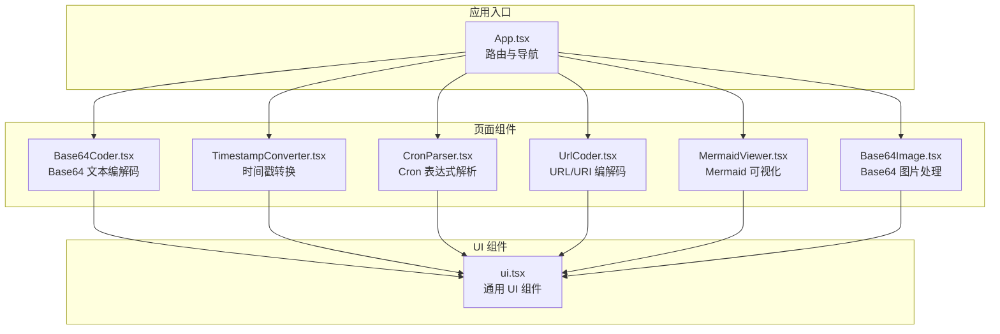
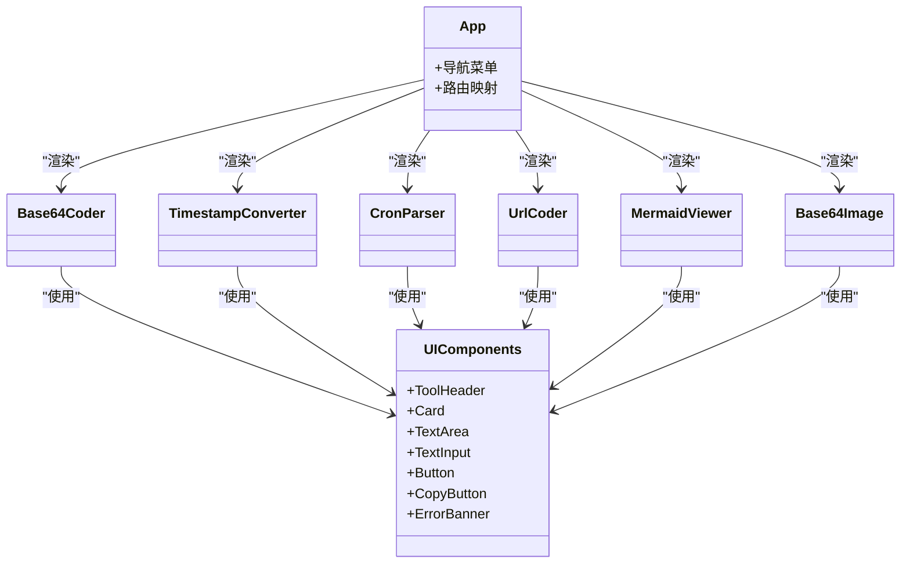
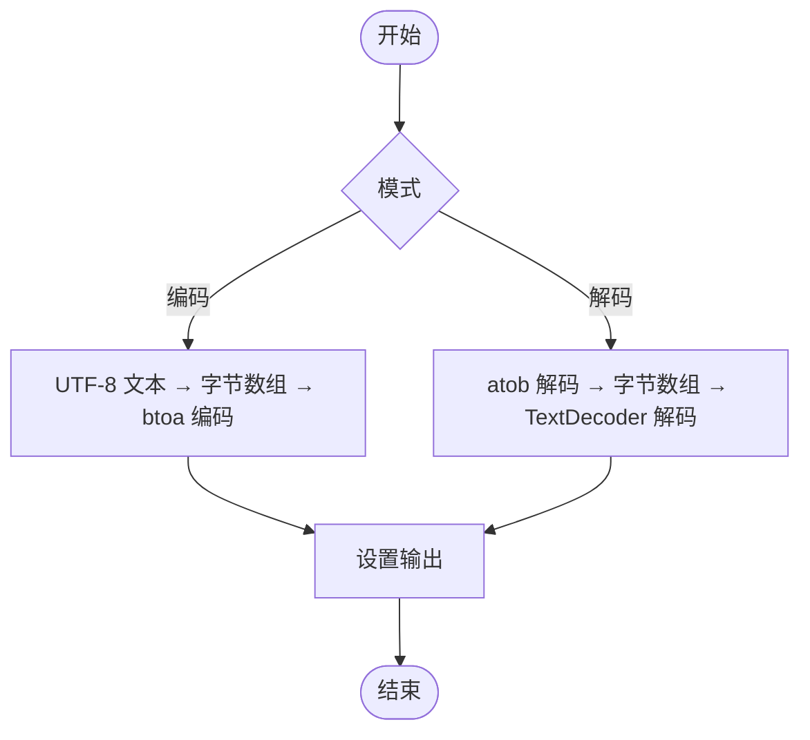
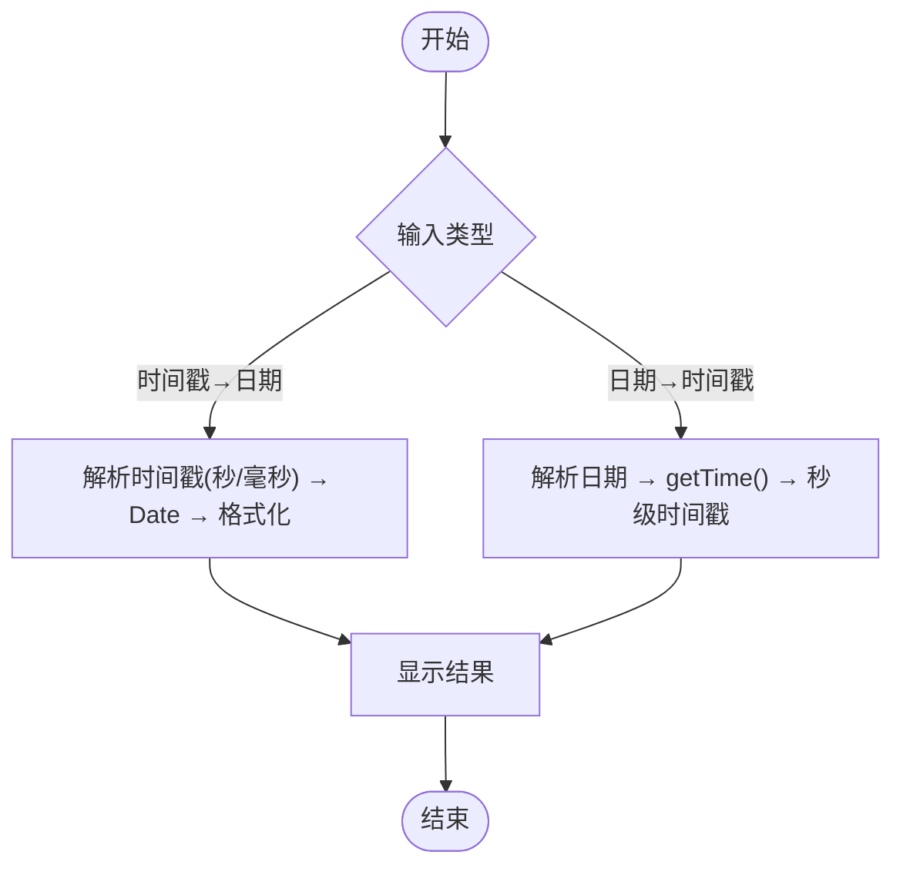
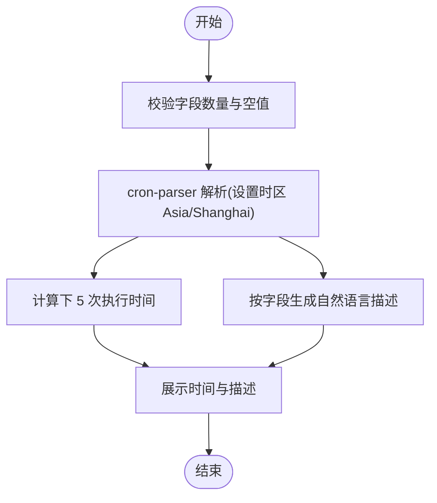
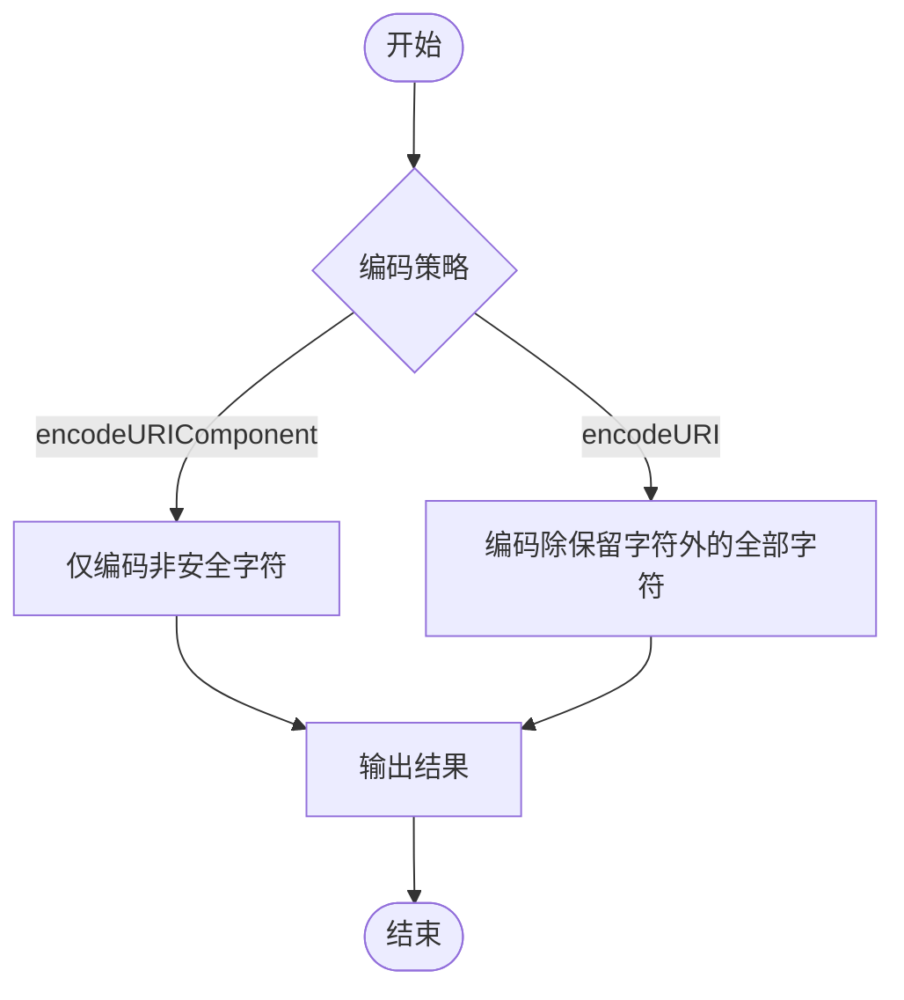
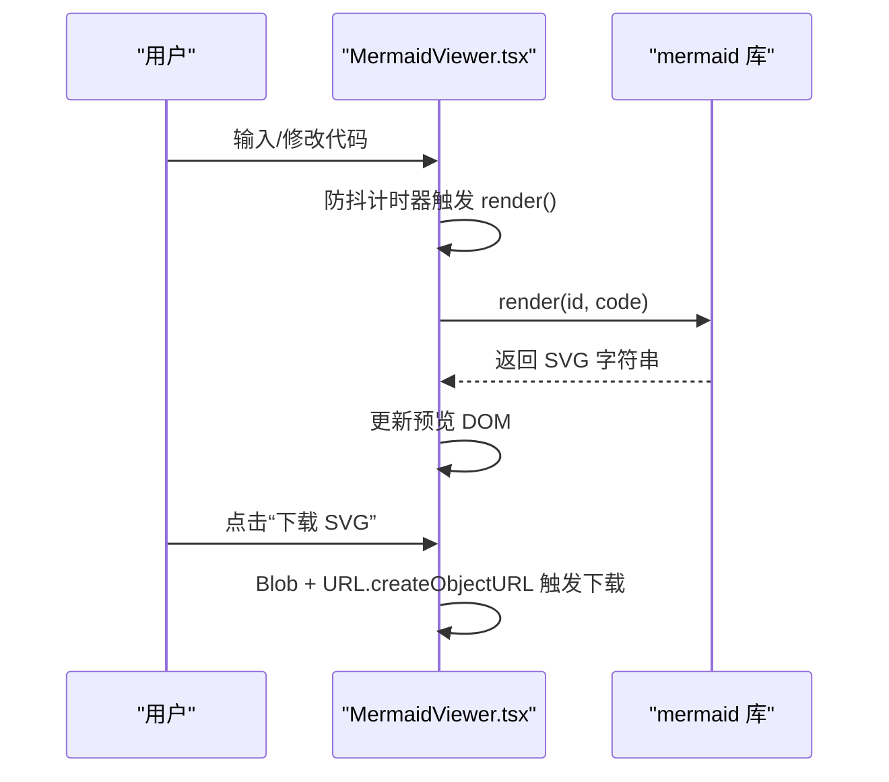
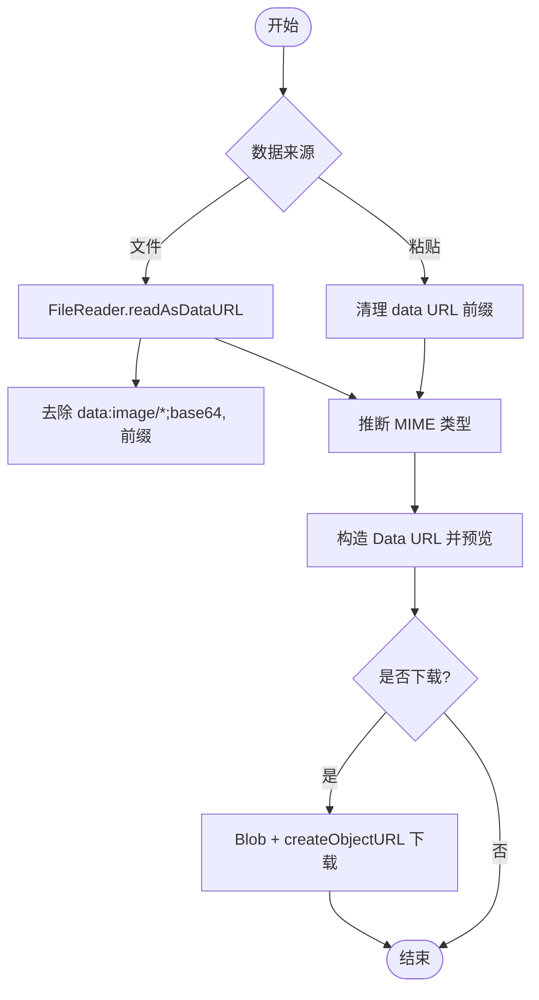
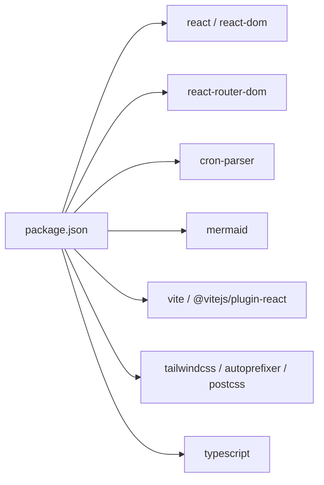

# 核心功能

<cite>
**本文引用的文件**   
- [src/App.tsx](file://src/App.tsx)
- [src/components/ui.tsx](file://src/components/ui.tsx)
- [src/pages/Base64Coder.tsx](file://src/pages/Base64Coder.tsx)
- [src/pages/TimestampConverter.tsx](file://src/pages/TimestampConverter.tsx)
- [src/pages/CronParser.tsx](file://src/pages/CronParser.tsx)
- [src/pages/UrlCoder.tsx](file://src/pages/UrlCoder.tsx)
- [src/pages/MermaidViewer.tsx](file://src/pages/MermaidViewer.tsx)
- [src/pages/Base64Image.tsx](file://src/pages/Base64Image.tsx)
- [package.json](file://package.json)
</cite>

## 目录
1. [简介](#简介)
2. [项目结构](#项目结构)
3. [核心组件](#核心组件)
4. [架构总览](#架构总览)
5. [详细组件分析](#详细组件分析)
6. [依赖关系分析](#依赖关系分析)
7. [性能与体验优化建议](#性能与体验优化建议)
8. [故障排查指南](#故障排查指南)
9. [结论](#结论)

## 简介
本仓库是一个基于 React + Vite 的在线工具箱 Web 应用，提供六大常用工具：Base64 文本编解码、时间戳转换、Cron 表达式解析、URL/URI 编解码、Mermaid 图表可视化、Base64 图片处理。所有数据处理均在浏览器端完成，不上传服务器，适合开发者日常调试与快速验证。

## 项目结构
- 路由与导航由 App 统一管理，左侧侧边栏展示各工具入口，右侧主区域根据路由渲染对应页面组件。
- 每个工具以独立页面组件实现，复用统一的 UI 组件库（卡片、按钮、输入框、错误提示等）。
- 第三方能力通过 npm 包引入：cron-parser 用于 Cron 解析，mermaid 用于图表渲染。

图示来源
- [src/App.tsx:1-142](file://src/App.tsx#L1-L142)
- [src/components/ui.tsx:1-142](file://src/components/ui.tsx#L1-L142)

章节来源
- [src/App.tsx:1-142](file://src/App.tsx#L1-L142)
- [src/components/ui.tsx:1-142](file://src/components/ui.tsx#L1-L142)

## 核心组件
本节概述各工具的功能特性、使用方式与关键实现要点。

- Base64 文本编解码器
  - 功能：支持 UTF-8 文本编码为 Base64，以及从 Base64 还原文本；提供“交换”一键反转输入输出。
  - 用法：在输入区粘贴文本或 Base64，点击“编码 →”或“解码 →”，结果在输出区显示并可复制。
  - 关键点：使用 TextEncoder/TextDecoder 确保中文与 emoji 正确处理；btoa/atob 进行二进制到 Base64 的转换。
  - 参考路径
    - [src/pages/Base64Coder.tsx:10-37](file://src/pages/Base64Coder.tsx#L10-L37)
    - [src/pages/Base64Coder.tsx:39-43](file://src/pages/Base64Coder.tsx#L39-L43)

- 时间戳转换器
  - 功能：Unix 秒级/毫秒级时间戳与本地日期互转；实时显示当前时间戳；支持“使用当前”快捷填充。
  - 用法：选择单位（秒/毫秒），输入时间戳后点击“转换”；或在日期控件中选择时间点后点击“转换”。
  - 关键点：统一输出为秒级时间戳；内部对无效输入进行校验并给出友好提示。
  - 参考路径
    - [src/pages/TimestampConverter.tsx:28-50](file://src/pages/TimestampConverter.tsx#L28-L50)
    - [src/pages/TimestampConverter.tsx:52-56](file://src/pages/TimestampConverter.tsx#L52-L56)

- Cron 表达式解析器
  - 功能：校验标准 5 段式 Cron 表达式，生成自然语言描述，计算接下来 5 次执行时间（北京时间）。
  - 用法：输入表达式，点击“校验并计算”；也可使用内置预设快速填入。
  - 关键点：使用 cron-parser 解析；按分/时/日/月/周字段生成可读描述；错误信息清晰提示。
  - 参考路径
    - [src/pages/CronParser.tsx:31-64](file://src/pages/CronParser.tsx#L31-L64)
    - [src/pages/CronParser.tsx:66-119](file://src/pages/CronParser.tsx#L66-L119)

- URL/URI 编解码器
  - 功能：提供 encodeURIComponent/decodeURIComponent 与 encodeURI/decodeURI 两组操作，支持“交换”反转输入输出。
  - 用法：输入字符串，按需点击相应按钮；结果可复制。
  - 关键点：区分“仅参数部分”和“整条 URI”的编码策略，避免破坏协议与路径分隔符。
  - 参考路径
    - [src/pages/UrlCoder.tsx:9-43](file://src/pages/UrlCoder.tsx#L9-L43)
    - [src/pages/UrlCoder.tsx:45-48](file://src/pages/UrlCoder.tsx#L45-L48)

- Mermaid 可视化查看器
  - 功能：实时渲染 Mermaid 代码为 SVG 图表，支持下载 SVG；内置默认示例便于上手。
  - 用法：在左侧编辑器编写 Mermaid 语法，右侧即时预览；点击“下载 SVG”导出矢量图。
  - 关键点：异步渲染 mermaid.render；错误捕获并展示；主题与变量配置适配深色界面。
  - 参考路径
    - [src/pages/MermaidViewer.tsx:32-48](file://src/pages/MermaidViewer.tsx#L32-L48)
    - [src/pages/MermaidViewer.tsx:56-65](file://src/pages/MermaidViewer.tsx#L56-L65)

- Base64 图片处理器
  - 功能：将图片转为 Base64 字符串，或将 Base64 字符串预览/下载为图片；支持拖拽与文件选择；自动识别常见图片类型。
  - 用法：拖拽或选择图片文件，自动生成 Base64 与预览；也可直接粘贴 Base64 字符串进行预览与下载。
  - 关键点：清理 data URL 前缀；基于首字节特征推断 MIME；Blob + URL.createObjectURL 触发下载。
  - 参考路径
    - [src/pages/Base64Image.tsx:16-30](file://src/pages/Base64Image.tsx#L16-L30)
    - [src/pages/Base64Image.tsx:44-67](file://src/pages/Base64Image.tsx#L44-L67)
    - [src/pages/Base64Image.tsx:69-75](file://src/pages/Base64Image.tsx#L69-L75)

章节来源
- [src/pages/Base64Coder.tsx:1-96](file://src/pages/Base64Coder.tsx#L1-L96)
- [src/pages/TimestampConverter.tsx:1-150](file://src/pages/TimestampConverter.tsx#L1-L150)
- [src/pages/CronParser.tsx:1-232](file://src/pages/CronParser.tsx#L1-L232)
- [src/pages/UrlCoder.tsx:1-93](file://src/pages/UrlCoder.tsx#L1-L93)
- [src/pages/MermaidViewer.tsx:1-119](file://src/pages/MermaidViewer.tsx#L1-L119)
- [src/pages/Base64Image.tsx:1-180](file://src/pages/Base64Image.tsx#L1-L180)

## 架构总览
应用采用单页应用（SPA）架构，路由层负责页面切换，页面组件各自封装业务逻辑，UI 组件提供一致的交互与样式。

图示来源
- [src/App.tsx:1-142](file://src/App.tsx#L1-L142)
- [src/components/ui.tsx:1-142](file://src/components/ui.tsx#L1-L142)

## 详细组件分析

### Base64 文本编解码器
- 数据流
  - 用户输入 → 编码/解码函数 → 输出结果 → 复制到剪贴板
- 算法流程

图示来源
- [src/pages/Base64Coder.tsx:10-37](file://src/pages/Base64Coder.tsx#L10-L37)

- 使用示例
  - 编码：输入“你好世界”，点击“编码 →”，得到对应的 Base64 字符串。
  - 解码：粘贴 Base64 字符串，点击“解码 →”，恢复原始文本。
  - 交换：点击“交换 ↔”，互换输入与输出内容并切换模式。
- 输入/输出格式
  - 输入：任意 UTF-8 文本或 Base64 字符串
  - 输出：Base64 字符串或原始文本
- 选项与参数
  - 无额外参数，纯前端操作，无需网络请求。
- 最佳实践
  - 大文本建议分批处理或分页展示，避免阻塞 UI。
  - 注意 Base64 字符串末尾可能包含换行，解码前可先 trim。

章节来源
- [src/pages/Base64Coder.tsx:1-96](file://src/pages/Base64Coder.tsx#L1-L96)

### 时间戳转换器
- 数据流
  - 输入时间戳/日期 → 转换函数 → 格式化输出 → 复制
- 算法流程

图示来源
- [src/pages/TimestampConverter.tsx:28-50](file://src/pages/TimestampConverter.tsx#L28-L50)

- 使用示例
  - 时间戳转日期：输入“1710000000”，单位选“秒”，点击“转换”，得到本地日期时间。
  - 日期转时间戳：在日期控件选择时间，点击“转换”，得到秒级时间戳。
  - 使用当前：点击“使用当前”，自动填充当前时间戳并转换。
- 输入/输出格式
  - 输入：数字时间戳（秒/毫秒）或日期时间字符串
  - 输出：格式化后的本地日期时间或秒级时间戳
- 选项与参数
  - 单位选择：秒 / 毫秒
- 最佳实践
  - 跨时区场景建议在服务端统一为 UTC 后再展示。
  - 注意闰秒与夏令时差异，必要时显式指定时区。

章节来源
- [src/pages/TimestampConverter.tsx:1-150](file://src/pages/TimestampConverter.tsx#L1-L150)

### Cron 表达式解析器
- 数据流
  - 输入 Cron 表达式 → 校验与解析 → 生成描述与下次执行时间 → 展示
- 算法流程

图示来源
- [src/pages/CronParser.tsx:31-64](file://src/pages/CronParser.tsx#L31-L64)
- [src/pages/CronParser.tsx:66-119](file://src/pages/CronParser.tsx#L66-L119)

- 使用示例
  - 输入“*/5 * * * *”，点击“校验并计算”，得到每 5 分钟执行的描述与下 5 次执行时间。
  - 使用预设：点击“每分钟/每小时/每天 0 点/每周一 9 点/每月 1 号 0 点/工作日 9 点/每 5 分钟/每 2 小时”快速填入。
- 输入/输出格式
  - 输入：标准 5 段式 Cron 表达式（分 时 日 月 周）
  - 输出：自然语言描述与未来 5 次执行时间（北京时间）
- 选项与参数
  - 内置预设表达式，便于快速体验。
- 最佳实践
  - 复杂表达式建议拆分为多个简单规则组合。
  - 生产环境需考虑时区与夏令时影响。

章节来源
- [src/pages/CronParser.tsx:1-232](file://src/pages/CronParser.tsx#L1-L232)

### URL/URI 编解码器
- 数据流
  - 输入字符串 → 选择编码策略 → 输出结果 → 复制
- 算法流程

图示来源
- [src/pages/UrlCoder.tsx:9-43](file://src/pages/UrlCoder.tsx#L9-L43)

- 使用示例
  - 参数编码：输入“name=张三&age=20”，点击“encodeURIComponent”，得到安全的查询串片段。
  - 整链编码：输入完整 URL，点击“encodeURI”，保留协议与路径分隔符。
  - 交换：点击“交换 ↔”，反转输入与输出。
- 输入/输出格式
  - 输入：任意文本或 URL/URI
  - 输出：编码或解码后的字符串
- 选项与参数
  - 四种操作：encodeURIComponent、decodeURIComponent、encodeURI、decodeURI
- 最佳实践
  - 构建查询参数时使用 encodeURIComponent，拼接后再整体 encodeURI。
  - 注意空格在不同 API 中的处理方式差异。

章节来源
- [src/pages/UrlCoder.tsx:1-93](file://src/pages/UrlCoder.tsx#L1-L93)

### Mermaid 可视化查看器
- 数据流
  - 编辑 Mermaid 代码 → 防抖渲染 → 生成 SVG → 预览/下载
- 序列图（渲染流程）

图示来源
- [src/pages/MermaidViewer.tsx:32-48](file://src/pages/MermaidViewer.tsx#L32-L48)
- [src/pages/MermaidViewer.tsx:56-65](file://src/pages/MermaidViewer.tsx#L56-L65)

- 使用示例
  - 打开页面即可看到默认流程图；修改节点或连线，右侧实时更新。
  - 点击“下载 SVG”保存矢量图用于文档或演示。
- 输入/输出格式
  - 输入：Mermaid 语法（flowchart、sequenceDiagram、gantt、classDiagram、stateDiagram 等）
  - 输出：SVG 预览与可下载的 SVG 文件
- 选项与参数
  - 主题与颜色变量可在初始化时配置，适配深色界面。
- 最佳实践
  - 大型图表建议拆分模块，减少单次渲染开销。
  - 若出现渲染失败，检查语法与节点 ID 唯一性。

章节来源
- [src/pages/MermaidViewer.tsx:1-119](file://src/pages/MermaidViewer.tsx#L1-L119)

### Base64 图片处理器
- 数据流
  - 选择/拖拽图片 → FileReader 读取为 Data URL → 提取 Base64 → 预览/下载
  - 或直接粘贴 Base64 → 清理前缀 → 推断 MIME → 构造 Data URL → 预览/下载
- 算法流程

图示来源
- [src/pages/Base64Image.tsx:16-30](file://src/pages/Base64Image.tsx#L16-L30)
- [src/pages/Base64Image.tsx:44-67](file://src/pages/Base64Image.tsx#L44-L67)
- [src/pages/Base64Image.tsx:69-75](file://src/pages/Base64Image.tsx#L69-L75)

- 使用示例
  - 拖拽一张 PNG 图片到上传区，自动生成 Base64 与预览；点击“下载图片”保存。
  - 粘贴一段 Base64 字符串（可带或不带 data:image 前缀），点击“预览图片”查看效果。
- 输入/输出格式
  - 输入：图片文件或 Base64 字符串
  - 输出：Base64 字符串、图片预览、可下载的图片文件
- 选项与参数
  - 支持常见图片类型：PNG/JPEG/GIF/WebP/BMP/SVG
- 最佳实践
  - 超大图片可能导致内存占用较高，建议限制文件大小或进行压缩。
  - 下载文件名可根据业务需求动态命名。

章节来源
- [src/pages/Base64Image.tsx:1-180](file://src/pages/Base64Image.tsx#L1-L180)

## 依赖关系分析
- 运行时依赖
  - react、react-dom：UI 框架与渲染引擎
  - react-router-dom：客户端路由与导航
  - cron-parser：Cron 表达式解析
  - mermaid：图表渲染
- 开发依赖
  - vite、@vitejs/plugin-react：构建与热更新
  - tailwindcss、autoprefixer、postcss：样式与构建
  - typescript：类型检查与编译

图示来源
- [package.json:1-29](file://package.json#L1-L29)

章节来源
- [package.json:1-29](file://package.json#L1-L29)

## 性能与体验优化建议
- 防抖与节流
  - Mermaid 渲染已使用定时器防抖，避免频繁重绘；对于大量文本的 Base64 编解码，可考虑分段处理或 Web Worker。
- 内存管理
  - 图片预览使用 URL.createObjectURL 后应及时 revoke，避免内存泄漏。
- 渲染性能
  - 大型 Mermaid 图可拆分为多张子图；Base64 图片过大时可提示用户压缩。
- 用户体验
  - 增加加载状态与错误重试机制；为长耗时操作提供取消按钮。

[本节为通用建议，不直接分析具体文件]

## 故障排查指南
- Base64 解码失败
  - 现象：提示“不是有效的 Base64 字符串”
  - 排查：确认输入不含多余空白或非 Base64 字符；必要时先 trim 再解码。
  - 参考路径
    - [src/pages/Base64Coder.tsx:24-37](file://src/pages/Base64Coder.tsx#L24-L37)
- URL 编解码异常
  - 现象：提示“不是有效的 URL 编码/URI 编码”
  - 排查：确认输入符合对应函数的期望格式；优先使用 encodeURIComponent 处理参数片段。
  - 参考路径
    - [src/pages/UrlCoder.tsx:18-43](file://src/pages/UrlCoder.tsx#L18-L43)
- Cron 表达式无效
  - 现象：提示“无效的 Cron 表达式”
  - 排查：检查是否为 5 段式；确认取值范围与特殊字符使用正确；尝试使用内置预设对比。
  - 参考路径
    - [src/pages/CronParser.tsx:31-64](file://src/pages/CronParser.tsx#L31-L64)
- Mermaid 渲染失败
  - 现象：预览区报错
  - 排查：检查语法是否正确；节点 ID 是否重复；简化图结构定位问题。
  - 参考路径
    - [src/pages/MermaidViewer.tsx:32-48](file://src/pages/MermaidViewer.tsx#L32-L48)
- Base64 图片无法预览
  - 现象：预览区空白或报错
  - 排查：确认 Base64 前缀与 MIME 匹配；检查首字节特征；尝试重新粘贴或从文件导入。
  - 参考路径
    - [src/pages/Base64Image.tsx:44-67](file://src/pages/Base64Image.tsx#L44-L67)

章节来源
- [src/pages/Base64Coder.tsx:24-37](file://src/pages/Base64Coder.tsx#L24-L37)
- [src/pages/UrlCoder.tsx:18-43](file://src/pages/UrlCoder.tsx#L18-L43)
- [src/pages/CronParser.tsx:31-64](file://src/pages/CronParser.tsx#L31-L64)
- [src/pages/MermaidViewer.tsx:32-48](file://src/pages/MermaidViewer.tsx#L32-L48)
- [src/pages/Base64Image.tsx:44-67](file://src/pages/Base64Image.tsx#L44-L67)

## 结论
该工具箱以模块化页面组件组织，复用统一 UI 组件，结合 cron-parser 与 mermaid 等成熟库，提供了稳定易用的在线工具集。所有数据处理均在浏览器端完成，具备隐私与安全优势。初学者可通过内置示例快速上手，高级用户可在此基础上扩展更多实用工具与高级选项。