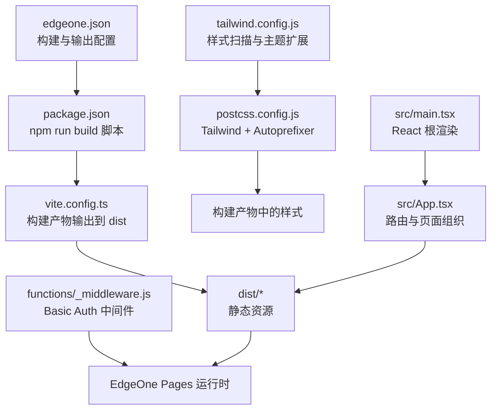
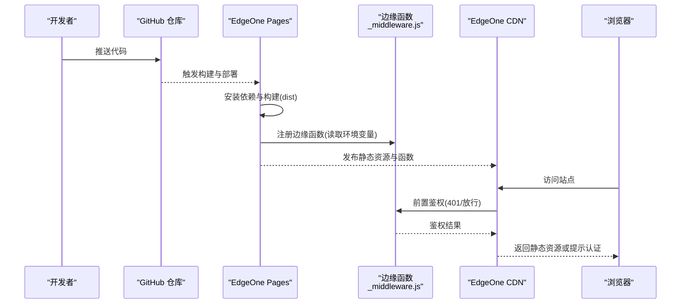
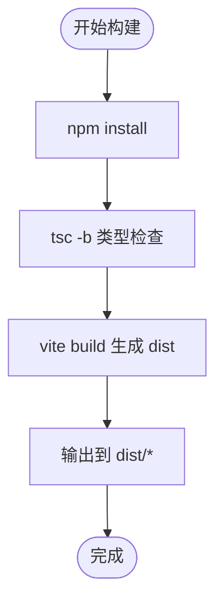
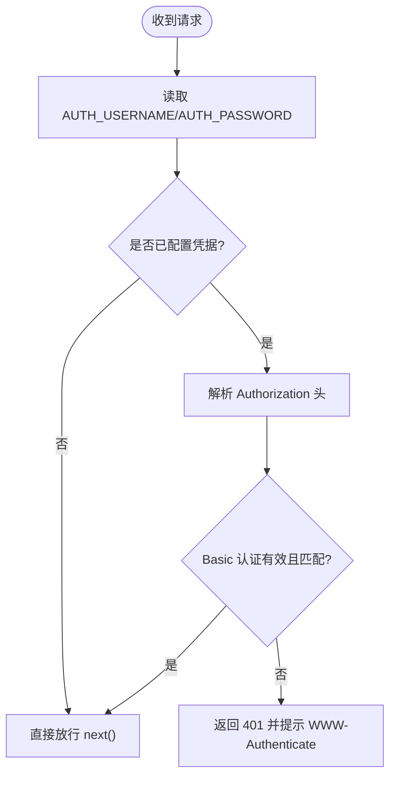
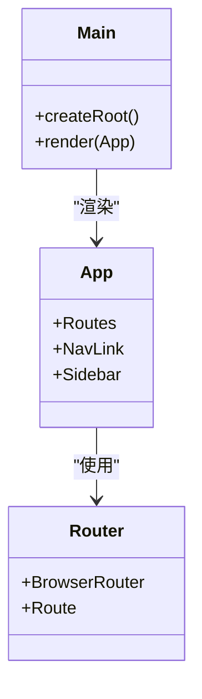
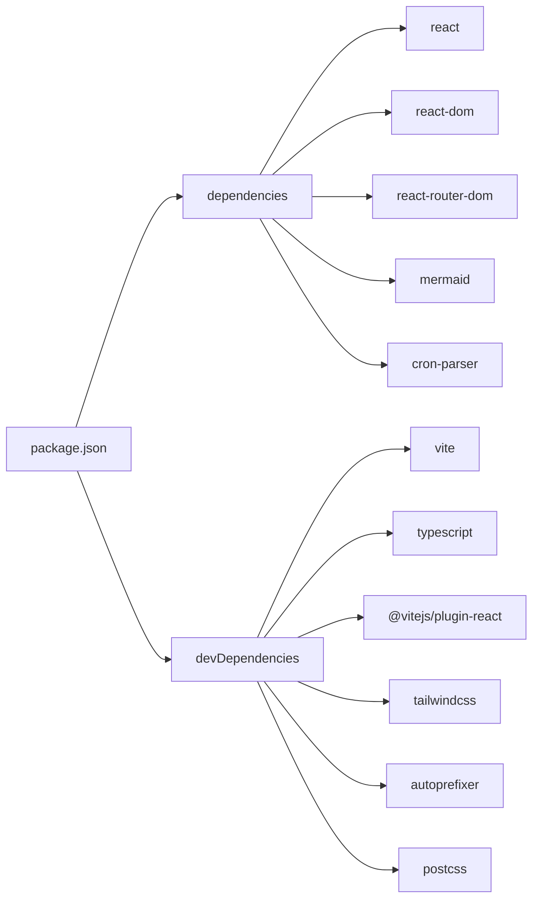

# 部署指南

<cite>
**本文引用的文件**   
- [edgeone.json](file://edgeone.json)
- [package.json](file://package.json)
- [vite.config.ts](file://vite.config.ts)
- [DEPLOYMENT.md](file://DEPLOYMENT.md)
- [functions/_middleware.js](file://functions/_middleware.js)
- [src/main.tsx](file://src/main.tsx)
- [src/App.tsx](file://src/App.tsx)
- [tailwind.config.js](file://tailwind.config.js)
- [postcss.config.js](file://postcss.config.js)
</cite>

## 目录
1. [简介](#简介)
2. [项目结构](#项目结构)
3. [核心组件](#核心组件)
4. [架构总览](#架构总览)
5. [详细组件分析](#详细组件分析)
6. [依赖分析](#依赖分析)
7. [性能考虑](#性能考虑)
8. [故障排查指南](#故障排查指南)
9. [结论](#结论)
10. [附录](#附录)

## 简介
本指南面向运维与 DevOps 工程师，提供基于 Cloudflare EdgeOne Pages 的完整部署参考。内容涵盖：
- 构建与输出配置、环境变量管理、域名绑定与 HTTPS
- 生产环境构建优化与静态资源策略
- CI/CD 流水线示例（GitHub Actions）与自动化部署流程
- 版本管理与发布策略
- 监控日志、错误追踪与性能监控方案
- 常见问题排查与调优建议

## 项目结构
本项目采用 Vite + React + TypeScript 的前端工程化方案，使用 Tailwind CSS 进行样式构建，并通过 EdgeOne Pages 的边缘函数实现访问控制。关键配置文件如下：
- edgeone.json：EdgeOne Pages 构建与运行参数
- vite.config.ts：Vite 构建输出目录等
- package.json：脚本命令与依赖声明
- tailwind.config.js / postcss.config.js：样式构建链
- functions/_middleware.js：边缘函数 Basic Auth 中间件
- src/main.tsx / src/App.tsx：应用入口与路由布局



图示来源
- [edgeone.json:1-7](file://edgeone.json#L1-L7)
- [package.json:1-29](file://package.json#L1-L29)
- [vite.config.ts:1-10](file://vite.config.ts#L1-L10)
- [functions/_middleware.js:1-56](file://functions/_middleware.js#L1-L56)
- [tailwind.config.js:1-25](file://tailwind.config.js#L1-L25)
- [postcss.config.js:1-7](file://postcss.config.js#L1-L7)
- [src/main.tsx:1-14](file://src/main.tsx#L1-L14)
- [src/App.tsx:1-142](file://src/App.tsx#L1-L142)

章节来源
- [edgeone.json:1-7](file://edgeone.json#L1-L7)
- [package.json:1-29](file://package.json#L1-L29)
- [vite.config.ts:1-10](file://vite.config.ts#L1-L10)
- [tailwind.config.js:1-25](file://tailwind.config.js#L1-L25)
- [postcss.config.js:1-7](file://postcss.config.js#L1-L7)
- [functions/_middleware.js:1-56](file://functions/_middleware.js#L1-L56)
- [src/main.tsx:1-14](file://src/main.tsx#L1-L14)
- [src/App.tsx:1-142](file://src/App.tsx#L1-L142)

## 核心组件
- 构建与打包
  - 通过 npm run build 执行 TypeScript 类型检查与 Vite 构建，产物输出至 dist 目录。
  - EdgeOne Pages 根据 edgeone.json 自动识别框架为 Vite，并调用对应构建命令。
- 边缘函数鉴权
  - functions/_middleware.js 在请求到达静态资源前执行，读取 AUTH_USERNAME/AUTH_PASSWORD 环境变量，校验 Authorization 头，未通过则返回 401 触发浏览器 Basic Auth 弹窗。
- 前端应用
  - src/main.tsx 初始化 React 根节点与路由；src/App.tsx 定义导航与页面路由映射。
- 样式与主题
  - tailwind.config.js 定义品牌色与扫描路径；postcss.config.js 启用 Tailwind 与 Autoprefixer。

章节来源
- [package.json:6-10](file://package.json#L6-L10)
- [edgeone.json:1-7](file://edgeone.json#L1-L7)
- [functions/_middleware.js:11-55](file://functions/_middleware.js#L11-L55)
- [src/main.tsx:1-14](file://src/main.tsx#L1-L14)
- [src/App.tsx:1-142](file://src/App.tsx#L1-L142)
- [tailwind.config.js:1-25](file://tailwind.config.js#L1-L25)
- [postcss.config.js:1-7](file://postcss.config.js#L1-L7)

## 架构总览
下图展示了从代码提交到用户访问的端到端流程，包括 GitHub 仓库、EdgeOne Pages 构建与部署、边缘函数鉴权以及最终静态资源分发。



图示来源
- [edgeone.json:1-7](file://edgeone.json#L1-L7)
- [functions/_middleware.js:11-55](file://functions/_middleware.js#L11-L55)
- [DEPLOYMENT.md:62-104](file://DEPLOYMENT.md#L62-L104)

## 详细组件分析

### 构建与输出配置
- 构建命令与输出目录
  - edgeone.json 指定构建命令、输出目录与框架类型，确保 EdgeOne 正确识别 Vite 项目。
  - vite.config.ts 将 outDir 设置为 dist，与 edgeone.json 保持一致。
- 脚本与依赖
  - package.json 中 build 脚本先执行 tsc -b 进行类型检查，再执行 vite build。
  - 依赖包含 React、Router、Mermaid、Cron Parser 等运行时库，开发依赖包含 Vite、TypeScript、Tailwind、PostCSS 等。



图示来源
- [edgeone.json:1-7](file://edgeone.json#L1-L7)
- [vite.config.ts:1-10](file://vite.config.ts#L1-L10)
- [package.json:6-10](file://package.json#L6-L10)

章节来源
- [edgeone.json:1-7](file://edgeone.json#L1-L7)
- [vite.config.ts:1-10](file://vite.config.ts#L1-L10)
- [package.json:6-10](file://package.json#L6-L10)

### 环境变量与访问控制
- 环境变量
  - AUTH_USERNAME、AUTH_PASSWORD 需在 EdgeOne 控制台的项目设置中配置，不会进入代码仓库。
- 鉴权逻辑
  - 边缘函数 onRequest 读取环境变量，若未配置则放行（便于本地开发）。
  - 若存在 Authorization 头且为 Basic 模式，解析用户名与密码并与环境变量比对，匹配则放行，否则返回 401 触发浏览器登录框。



图示来源
- [functions/_middleware.js:11-55](file://functions/_middleware.js#L11-L55)
- [DEPLOYMENT.md:81-104](file://DEPLOYMENT.md#L81-L104)

章节来源
- [functions/_middleware.js:11-55](file://functions/_middleware.js#L11-L55)
- [DEPLOYMENT.md:81-104](file://DEPLOYMENT.md#L81-L104)

### 前端应用与路由
- 入口与渲染
  - src/main.tsx 创建 React 根节点并注入 BrowserRouter。
- 路由与布局
  - src/App.tsx 定义侧边栏导航与 Routes 映射，覆盖首页与各工具页。
- 样式系统
  - tailwind.config.js 定义 brand 色系与扫描路径；postcss.config.js 启用 Tailwind 与 Autoprefixer。



图示来源
- [src/main.tsx:1-14](file://src/main.tsx#L1-L14)
- [src/App.tsx:1-142](file://src/App.tsx#L1-L142)

章节来源
- [src/main.tsx:1-14](file://src/main.tsx#L1-L14)
- [src/App.tsx:1-142](file://src/App.tsx#L1-L142)
- [tailwind.config.js:1-25](file://tailwind.config.js#L1-L25)
- [postcss.config.js:1-7](file://postcss.config.js#L1-L7)

### 域名绑定与 HTTPS
- 自定义域名
  - 在 EdgeOne 控制台添加自定义域名并按提示配置 DNS CNAME 记录。
- SSL 证书
  - EdgeOne 自动处理 HTTPS 与证书续期，无需手动维护。
- 安全传输
  - 所有流量默认加密，配合 Basic Auth 保证访问安全。

章节来源
- [DEPLOYMENT.md:122-128](file://DEPLOYMENT.md#L122-L128)

### 生产环境构建优化与静态资源管理
- 构建优化
  - 使用 Vite 的生产构建模式，自动进行代码分割、压缩与缓存友好命名。
  - 保持 outDir 与 edgeone.json 一致，避免部署后找不到产物。
- 静态资源
  - 将 favicon 等公共资源放入 public 目录，构建时会被复制到 dist。
- 样式优化
  - Tailwind 仅扫描 src 与 index.html 中的类名，减少无用样式体积。

章节来源
- [vite.config.ts:1-10](file://vite.config.ts#L1-L10)
- [tailwind.config.js:1-25](file://tailwind.config.js#L1-L25)

### CI/CD 流水线配置示例（GitHub Actions）
以下提供一个最小可用的 GitHub Actions 示例，用于在 push 到 main 分支时自动构建并部署到 EdgeOne Pages。请根据实际仓库与 EdgeOne 集成方式调整。

```yaml
name: 部署到 EdgeOne Pages

on:
  push:
    branches: [main]

jobs:
  deploy:
    runs-on: ubuntu-latest
    steps:
      - uses: actions/checkout@v4

      - name: 设置 Node.js
        uses: actions/setup-node@v4
        with:
          node-version: 20
          cache: npm

      - name: 安装依赖
        run: npm ci

      - name: 构建
        run: npm run build

      - name: 部署到 EdgeOne Pages
        # 使用官方 CLI 或 EdgeOne 提供的部署方式
        # 请替换为你的令牌与项目标识
        run: |
          echo "部署步骤：使用 EdgeOne CLI 或 API 上传 dist 目录"
```

说明
- 该示例仅展示构建阶段与部署占位步骤，具体部署命令需依据 EdgeOne 官方 CLI 或 API 文档补充。
- 如需在 Actions 中配置环境变量（如令牌），请在 GitHub Secrets 中管理，不要写入代码。

章节来源
- [package.json:6-10](file://package.json#L6-L10)

### 自动化部署流程与版本管理策略
- 自动化部署
  - 推荐以 main 分支作为稳定发布分支，push 后触发构建与部署。
  - 预发环境可使用 feature 分支或标签触发预览部署。
- 版本管理
  - 使用语义化版本号（SemVer）标记 tag，结合 Git 标签与 EdgeOne 部署历史进行回溯。
  - 在 EdgeOne 控制台查看每次部署的变更与回滚能力。

章节来源
- [DEPLOYMENT.md:108-128](file://DEPLOYMENT.md#L108-L128)

### 监控日志、错误追踪与性能监控
- 日志与监控
  - EdgeOne Pages 提供访问日志与基础指标，可在控制台查看。
  - 对于前端错误追踪，可接入第三方服务（如 Sentry）并在应用中上报异常。
- 性能监控
  - 利用浏览器 Performance API 采集关键指标（FCP、LCP、CLS 等）。
  - 关注静态资源体积与缓存命中情况，结合 CDN 缓存策略提升首屏速度。

[本节为通用指导，不直接分析具体文件]

## 依赖分析
- 运行时依赖
  - react、react-dom、react-router-dom：前端框架与路由
  - mermaid、cron-parser：工具功能依赖
- 开发依赖
  - vite、typescript、@vitejs/plugin-react：构建与类型检查
  - tailwindcss、autoprefixer、postcss：样式构建链



图示来源
- [package.json:11-27](file://package.json#L11-L27)

章节来源
- [package.json:11-27](file://package.json#L11-L27)

## 性能考虑
- 构建产物
  - 保持 Vite 生产构建开启代码分割与压缩，避免引入不必要的重型依赖。
- 样式优化
  - 使用 Tailwind 按需生成样式，减少 CSS 体积。
- 缓存策略
  - 利用 CDN 缓存静态资源，合理设置 Cache-Control 与文件名哈希。
- 首屏加载
  - 对大型库（如 Mermaid）进行懒加载或按需引入，降低初始包体。

[本节为通用指导，不直接分析具体文件]

## 故障排查指南
- 无法访问或反复弹出登录框
  - 确认已在 EdgeOne 控制台配置 AUTH_USERNAME 与 AUTH_PASSWORD，并重新部署使变量生效。
  - 检查浏览器是否正确发送 Authorization 头（Basic 模式）。
- 本地开发未触发鉴权
  - 当环境变量未配置时，边缘函数会放行请求，这是预期行为。
- 构建失败
  - 检查 Node 版本与依赖安装是否成功；确认 TypeScript 类型检查无错误。
- 自定义域名无法访问
  - 确认 DNS CNAME 记录已正确配置并生效；等待证书签发。

章节来源
- [DEPLOYMENT.md:81-104](file://DEPLOYMENT.md#L81-L104)
- [functions/_middleware.js:11-55](file://functions/_middleware.js#L11-L55)

## 结论
本项目通过 EdgeOne Pages 实现了零服务器托管与边缘函数鉴权，具备快速部署、自动 HTTPS 与全球加速的优势。遵循本指南的环境变量管理、CI/CD 流水线与性能优化建议，可显著提升稳定性与用户体验。

## 附录
- 本地开发
  - 安装依赖、启动开发服务器、构建与预览生产版本。
- 更新与维护
  - 推送代码后自动触发部署；修改密码仅需更新环境变量并重新部署。

章节来源
- [DEPLOYMENT.md:177-194](file://DEPLOYMENT.md#L177-L194)