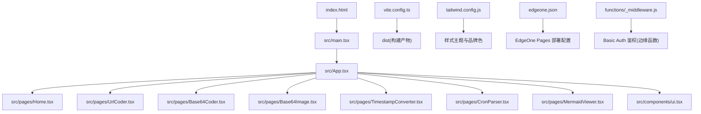
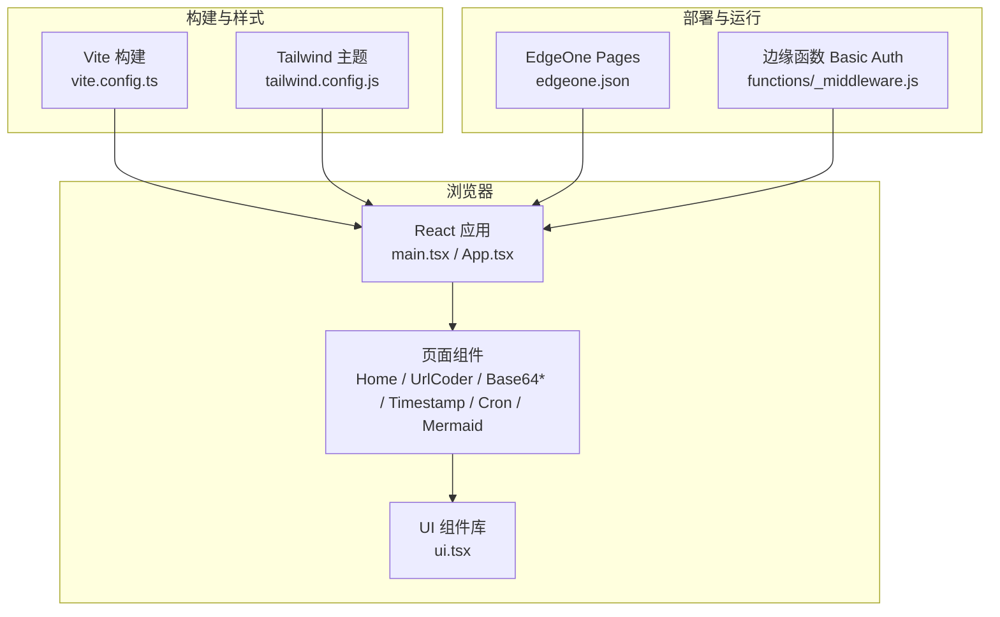
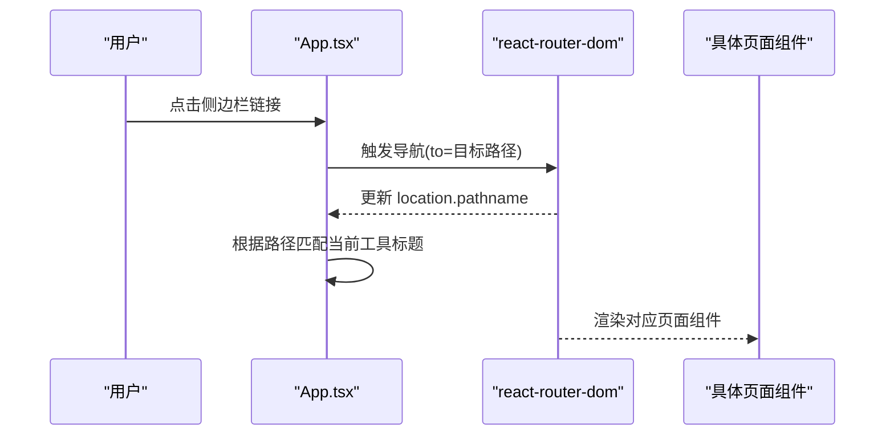
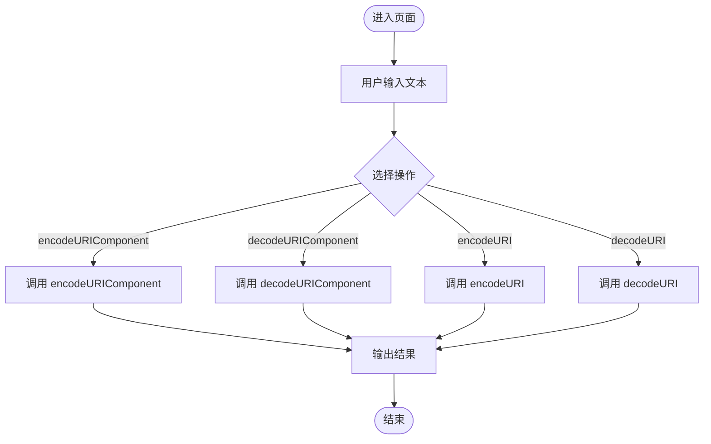
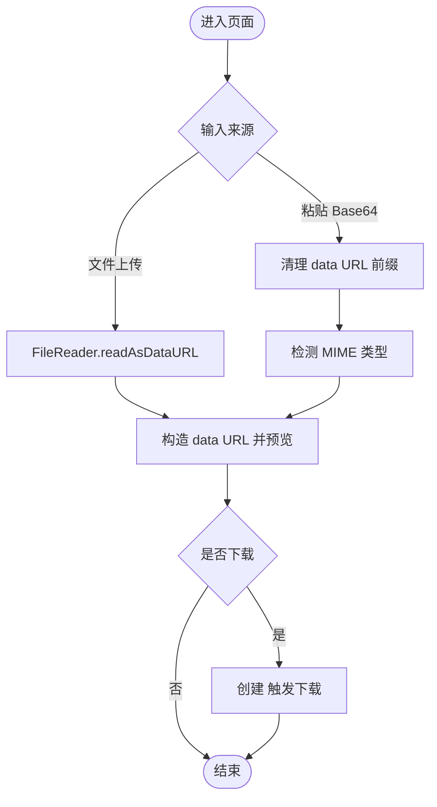
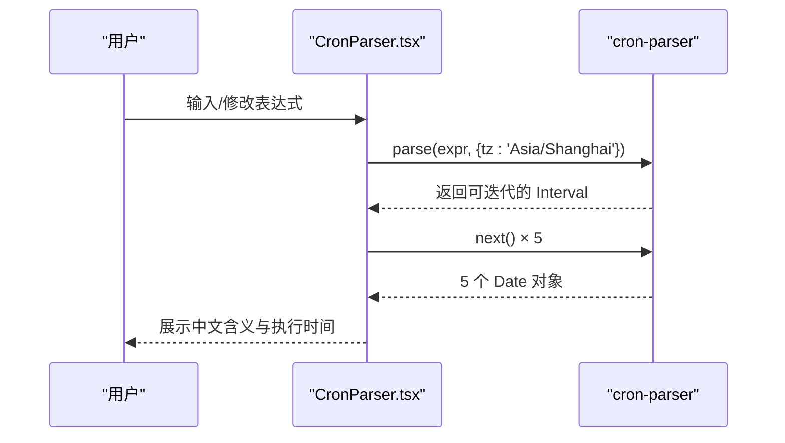
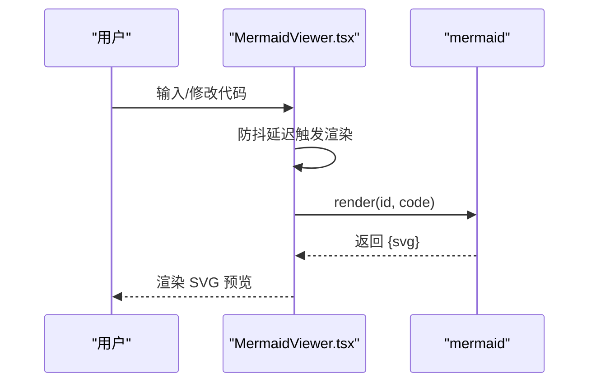
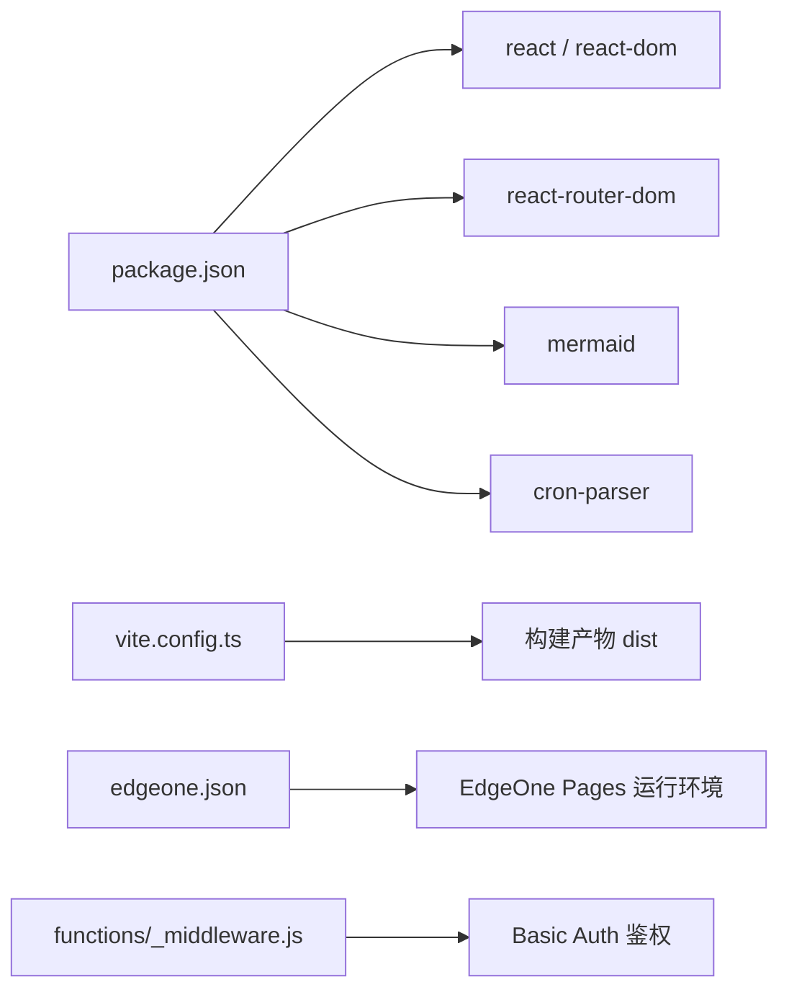

# 项目概览

<cite>
**本文引用的文件**   
- [package.json](file://package.json)
- [vite.config.ts](file://vite.config.ts)
- [tailwind.config.js](file://tailwind.config.js)
- [index.html](file://index.html)
- [src/main.tsx](file://src/main.tsx)
- [src/App.tsx](file://src/App.tsx)
- [src/components/ui.tsx](file://src/components/ui.tsx)
- [src/pages/Home.tsx](file://src/pages/Home.tsx)
- [src/pages/UrlCoder.tsx](file://src/pages/UrlCoder.tsx)
- [src/pages/Base64Coder.tsx](file://src/pages/Base64Coder.tsx)
- [src/pages/Base64Image.tsx](file://src/pages/Base64Image.tsx)
- [src/pages/TimestampConverter.tsx](file://src/pages/TimestampConverter.tsx)
- [src/pages/CronParser.tsx](file://src/pages/CronParser.tsx)
- [src/pages/MermaidViewer.tsx](file://src/pages/MermaidViewer.tsx)
- [functions/_middleware.js](file://functions/_middleware.js)
- [edgeone.json](file://edgeone.json)
- [DEPLOYMENT.md](file://DEPLOYMENT.md)
</cite>

## 目录
1. [简介](#简介)
2. [项目结构](#项目结构)
3. [核心组件](#核心组件)
4. [架构总览](#架构总览)
5. [详细组件分析](#详细组件分析)
6. [依赖关系分析](#依赖关系分析)
7. [性能与体验考量](#性能与体验考量)
8. [故障排查指南](#故障排查指南)
9. [结论](#结论)
10. [附录](#附录)

## 简介
本项目是一个基于 React 与 Vite 构建的开发者工具箱 Web 应用，提供一系列纯浏览器端运行的实用工具：URL 编解码、Base64 文本编解码、Base64 图片处理、时间戳转换、Cron 表达式解析与可视化、Mermaid 图表实时渲染等。整体设计强调“开箱即用、数据不上传”，所有计算均在客户端完成，适合本地开发、内网使用或对外公开访问（可通过边缘函数开启 Basic Auth）。

技术选型要点：
- React + TypeScript：类型安全与组件化开发
- Vite：快速开发与构建
- Tailwind CSS：原子化样式与品牌色扩展
- react-router-dom：前端路由与导航
- mermaid：流程图与时序图等可视化
- cron-parser：标准 Cron 表达式解析与下次执行时间计算

## 项目结构
项目采用按功能页面组织的结构，UI 组件独立复用，路由集中在 App 中管理，构建与部署配置清晰。

图示来源
- [index.html:1-14](file://index.html#L1-L14)
- [src/main.tsx:1-14](file://src/main.tsx#L1-L14)
- [src/App.tsx:1-142](file://src/App.tsx#L1-L142)
- [src/pages/Home.tsx:1-37](file://src/pages/Home.tsx#L1-L37)
- [src/pages/UrlCoder.tsx:1-93](file://src/pages/UrlCoder.tsx#L1-L93)
- [src/pages/Base64Coder.tsx:1-96](file://src/pages/Base64Coder.tsx#L1-L96)
- [src/pages/Base64Image.tsx:1-180](file://src/pages/Base64Image.tsx#L1-L180)
- [src/pages/TimestampConverter.tsx:1-150](file://src/pages/TimestampConverter.tsx#L1-L150)
- [src/pages/CronParser.tsx:1-232](file://src/pages/CronParser.tsx#L1-L232)
- [src/pages/MermaidViewer.tsx:1-119](file://src/pages/MermaidViewer.tsx#L1-L119)
- [src/components/ui.tsx:1-142](file://src/components/ui.tsx#L1-L142)
- [vite.config.ts:1-10](file://vite.config.ts#L1-L10)
- [tailwind.config.js:1-25](file://tailwind.config.js#L1-L25)
- [edgeone.json:1-7](file://edgeone.json#L1-L7)
- [functions/_middleware.js:1-56](file://functions/_middleware.js#L1-L56)

章节来源
- [index.html:1-14](file://index.html#L1-L14)
- [src/main.tsx:1-14](file://src/main.tsx#L1-L14)
- [src/App.tsx:1-142](file://src/App.tsx#L1-L142)
- [vite.config.ts:1-10](file://vite.config.ts#L1-L10)
- [tailwind.config.js:1-25](file://tailwind.config.js#L1-L25)
- [edgeone.json:1-7](file://edgeone.json#L1-L7)

## 核心组件
- 应用壳与路由
  - 入口 main.tsx 初始化 React 根节点并包裹 BrowserRouter
  - App.tsx 负责侧边栏导航、移动端遮罩、路由映射与当前工具标题展示
- 通用 UI 组件
  - ToolHeader、Card、TextArea、TextInput、Button、CopyButton、ErrorBanner 统一交互与样式风格
- 页面级工具
  - Home 首页卡片导航
  - UrlCoder URL/URI 编码与解码
  - Base64Coder 文本 Base64 编解码（UTF-8）
  - Base64Image 图片与 Base64 互转、预览与下载
  - TimestampConverter 时间戳与日期互转，支持秒/毫秒
  - CronParser Cron 表达式校验与下 5 次执行时间计算
  - MermaidViewer 代码编辑与实时渲染、SVG 下载

章节来源
- [src/main.tsx:1-14](file://src/main.tsx#L1-L14)
- [src/App.tsx:1-142](file://src/App.tsx#L1-L142)
- [src/components/ui.tsx:1-142](file://src/components/ui.tsx#L1-L142)
- [src/pages/Home.tsx:1-37](file://src/pages/Home.tsx#L1-L37)
- [src/pages/UrlCoder.tsx:1-93](file://src/pages/UrlCoder.tsx#L1-L93)
- [src/pages/Base64Coder.tsx:1-96](file://src/pages/Base64Coder.tsx#L1-L96)
- [src/pages/Base64Image.tsx:1-180](file://src/pages/Base64Image.tsx#L1-L180)
- [src/pages/TimestampConverter.tsx:1-150](file://src/pages/TimestampConverter.tsx#L1-L150)
- [src/pages/CronParser.tsx:1-232](file://src/pages/CronParser.tsx#L1-L232)
- [src/pages/MermaidViewer.tsx:1-119](file://src/pages/MermaidViewer.tsx#L1-L119)

## 架构总览
应用采用单页应用（SPA）架构，Vite 作为构建与开发服务器，Tailwind 提供样式能力，React Router 管理页面路由，各工具以独立页面组件实现，通过 App 统一挂载。部署到 EdgeOne Pages，可选启用边缘函数 Basic Auth 进行访问控制。

图示来源
- [src/main.tsx:1-14](file://src/main.tsx#L1-L14)
- [src/App.tsx:1-142](file://src/App.tsx#L1-L142)
- [src/components/ui.tsx:1-142](file://src/components/ui.tsx#L1-L142)
- [vite.config.ts:1-10](file://vite.config.ts#L1-L10)
- [tailwind.config.js:1-25](file://tailwind.config.js#L1-L25)
- [edgeone.json:1-7](file://edgeone.json#L1-L7)
- [functions/_middleware.js:1-56](file://functions/_middleware.js#L1-L56)

## 详细组件分析

### 应用壳与路由（App.tsx）
- 职责
  - 维护侧边栏导航项与描述
  - 根据当前路径高亮对应菜单项
  - 在移动端显示顶部栏与遮罩层
  - 注册各工具页面的路由映射
- 关键流程
  - 使用 useLocation 获取当前路径，匹配当前工具标签
  - NavLink 驱动导航与激活态样式
  - Routes/Route 将路径映射到具体页面组件

图示来源
- [src/App.tsx:1-142](file://src/App.tsx#L1-L142)

章节来源
- [src/App.tsx:1-142](file://src/App.tsx#L1-L142)

### 通用 UI 组件（ui.tsx）
- 组件清单
  - ToolHeader：页面标题与图标
  - Card：内容容器
  - TextArea/TextInput：输入控件
  - Button：按钮（主/次/危险）
  - CopyButton：剪贴板复制（含降级方案）
  - ErrorBanner：错误提示条
- 设计要点
  - 统一的深色主题与品牌色
  - 可复用的表单与反馈组件，降低页面样板代码

章节来源
- [src/components/ui.tsx:1-142](file://src/components/ui.tsx#L1-L142)

### URL 编解码（UrlCoder.tsx）
- 功能
  - 提供 encodeURIComponent/decodeURIComponent 与 encodeURI/decodeURI 四种操作
  - 支持一键交换输入输出
- 错误处理
  - 捕获非法输入并展示友好错误信息
- 交互
  - 输入区、操作按钮、结果区与复制按钮

图示来源
- [src/pages/UrlCoder.tsx:1-93](file://src/pages/UrlCoder.tsx#L1-L93)

章节来源
- [src/pages/UrlCoder.tsx:1-93](file://src/pages/UrlCoder.tsx#L1-L93)

### Base64 文本编解码（Base64Coder.tsx）
- 功能
  - 文本 → Base64：使用 TextEncoder 转为字节序列后 btoa 编码
  - Base64 → 文本：atob 解码为二进制后用 TextDecoder 还原 UTF-8
  - 支持模式切换与输入输出交换
- 错误处理
  - 捕获无效 Base64 字符串并提示
- 说明
  - 明确标注 UTF-8 支持与本地运行特性

章节来源
- [src/pages/Base64Coder.tsx:1-96](file://src/pages/Base64Coder.tsx#L1-L96)

### Base64 图片处理（Base64Image.tsx）
- 功能
  - 拖拽/选择图片文件，读取为 data URL 并提取纯 Base64
  - 粘贴 Base64（带或不带 data:image 前缀），自动识别 MIME 类型并生成预览
  - 支持预览与下载
- 算法要点
  - 清理 data URL 前缀
  - 从 base64 头部特征推断常见图片格式（JPEG/PNG/GIF/WebP/BMP）
  - 估算原始大小用于提示

图示来源
- [src/pages/Base64Image.tsx:1-180](file://src/pages/Base64Image.tsx#L1-L180)

章节来源
- [src/pages/Base64Image.tsx:1-180](file://src/pages/Base64Image.tsx#L1-L180)

### 时间戳转换（TimestampConverter.tsx）
- 功能
  - 秒/毫秒时间戳 ↔ 本地日期时间
  - 实时时钟显示当前秒级时间戳
  - 一键使用当前时间
- 细节
  - 格式化输出为可读字符串
  - 提供复制按钮

章节来源
- [src/pages/TimestampConverter.tsx:1-150](file://src/pages/TimestampConverter.tsx#L1-L150)

### Cron 表达式解析（CronParser.tsx）
- 功能
  - 校验标准 5 段式 Cron 表达式
  - 计算并展示接下来 5 次执行时间（北京时间）
  - 自动生成中文含义描述
  - 提供常用预设表达式
- 依赖
  - 使用 cron-parser 进行解析与迭代

图示来源
- [src/pages/CronParser.tsx:1-232](file://src/pages/CronParser.tsx#L1-L232)
- [package.json:11-17](file://package.json#L11-L17)

章节来源
- [src/pages/CronParser.tsx:1-232](file://src/pages/CronParser.tsx#L1-L232)
- [package.json:11-17](file://package.json#L11-L17)

### Mermaid 可视化（MermaidViewer.tsx）
- 功能
  - 左侧编辑 Mermaid 源码，右侧实时渲染 SVG
  - 支持下载 SVG 文件
  - 内置默认示例与重置按钮
- 集成
  - 初始化 mermaid 实例，设置暗色主题变量
  - 使用 render(id, code) 异步渲染

图示来源
- [src/pages/MermaidViewer.tsx:1-119](file://src/pages/MermaidViewer.tsx#L1-L119)
- [package.json:11-17](file://package.json#L11-L17)

章节来源
- [src/pages/MermaidViewer.tsx:1-119](file://src/pages/MermaidViewer.tsx#L1-L119)
- [package.json:11-17](file://package.json#L11-L17)

## 依赖关系分析
- 运行时依赖
  - react、react-dom：UI 框架与渲染
  - react-router-dom：前端路由
  - mermaid：图表渲染
  - cron-parser：Cron 表达式解析
- 开发时依赖
  - vite、@vitejs/plugin-react：构建与 React 支持
  - tailwindcss、autoprefixer、postcss：样式与兼容
  - typescript、@types/*：类型定义
- 构建与部署
  - vite.config.ts 指定插件与输出目录
  - edgeone.json 声明框架与构建命令
  - functions/_middleware.js 提供 Basic Auth 边缘函数

图示来源
- [package.json:1-29](file://package.json#L1-L29)
- [vite.config.ts:1-10](file://vite.config.ts#L1-L10)
- [edgeone.json:1-7](file://edgeone.json#L1-L7)
- [functions/_middleware.js:1-56](file://functions/_middleware.js#L1-L56)

章节来源
- [package.json:1-29](file://package.json#L1-L29)
- [vite.config.ts:1-10](file://vite.config.ts#L1-L10)
- [edgeone.json:1-7](file://edgeone.json#L1-L7)
- [functions/_middleware.js:1-56](file://functions/_middleware.js#L1-L56)

## 性能与体验考量
- 首屏与体积
  - 按需引入 mermaid 与 cron-parser，避免不必要的包体积
  - 使用 Vite 的按需加载与缓存策略提升开发体验
- 渲染性能
  - Mermaid 渲染使用防抖延迟，避免频繁重绘
  - 大文本 Base64 处理注意内存占用，必要时分块或限制长度
- 用户体验
  - 统一的深色主题与品牌色，减少视觉疲劳
  - 复制与清空等快捷操作，提升效率
  - 移动端侧边栏折叠与遮罩，适配小屏设备

[本节为通用建议，无需特定文件引用]

## 故障排查指南
- 无法访问（Basic Auth）
  - 检查 EdgeOne 控制台环境变量 AUTH_USERNAME 与 AUTH_PASSWORD 是否正确配置并已重新部署
  - 确认浏览器请求携带了正确的 Authorization 头
- 构建失败
  - 确认 Node 版本与依赖安装正常
  - 检查 vite.config.ts 与 tailwind.config.js 配置是否被误改
- Mermaid 渲染异常
  - 检查语法是否符合 Mermaid 规范
  - 查看控制台错误信息，确认 themeVariables 未覆盖必要属性
- Base64 解码失败
  - 确认输入是否为合法 Base64 字符串，且无多余空白字符
- 时间戳转换异常
  - 确认输入为数字且单位正确（秒/毫秒）
  - 注意本地时区影响，如需 UTC 可在业务逻辑中调整

章节来源
- [functions/_middleware.js:1-56](file://functions/_middleware.js#L1-L56)
- [DEPLOYMENT.md:81-105](file://DEPLOYMENT.md#L81-L105)
- [src/pages/MermaidViewer.tsx:1-119](file://src/pages/MermaidViewer.tsx#L1-L119)
- [src/pages/Base64Coder.tsx:1-96](file://src/pages/Base64Coder.tsx#L1-L96)
- [src/pages/TimestampConverter.tsx:1-150](file://src/pages/TimestampConverter.tsx#L1-L150)

## 结论
本项目以 React + Vite 为核心，结合 Tailwind 与 React Router，提供了多类高频开发者工具的集合。所有数据处理均在浏览器端完成，具备隐私与安全优势；通过 EdgeOne Pages 与边缘函数可实现便捷的部署与访问控制。组件化与页面化的组织结构使新增工具成本低、可维护性强，适合持续扩展更多实用工具。

[本节为总结性内容，无需特定文件引用]

## 附录
- 本地开发
  - 安装依赖：npm install
  - 启动开发服务：npm run dev
  - 构建生产版本：npm run build
  - 预览生产版本：npm run preview
- 部署参考
  - 参见 DEPLOYMENT.md 中的完整步骤与环境变量配置说明

章节来源
- [DEPLOYMENT.md:177-194](file://DEPLOYMENT.md#L177-L194)